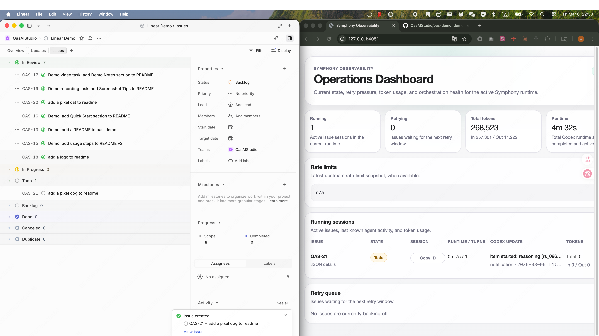

# Symphony-ts

**This project is an unofficial TypeScript implementation of [OpenAI Symphony](https://github.com/openai/symphony).**

Symphony-ts turns project work into isolated, autonomous implementation runs: it reads work from
your tracker, creates a dedicated workspace for each issue, runs a coding agent inside that
boundary, and gives operators a clean surface for runtime visibility, retries, and control.

> [!WARNING]
> Symphony is intended for trusted environments.



## Running Symphony

### Requirements

- Node.js `>= 22`
- a repository with a valid `WORKFLOW.md`
- tracker credentials such as `LINEAR_API_KEY`
- a coding agent runtime that supports app-server mode, such as `codex app-server`

### Install

```bash
npm install -g symphony-ts
```

Verify the CLI is available:

```bash
symphony --help
```

### Quickstart

1. Go to the repository you want Symphony to operate on.
2. Create `WORKFLOW.md` in that repository.
3. Export `LINEAR_API_KEY`.
4. Start Symphony from that repository root.

```bash
cd /path/to/your-repo
export LINEAR_API_KEY=your-linear-token
symphony ./WORKFLOW.md --acknowledge-high-trust-preview --port 4321
```

If you do not pass a path, Symphony defaults to `./WORKFLOW.md`:

```bash
symphony --acknowledge-high-trust-preview --port 4321
```

You can also run without global install:

```bash
npx symphony-ts ./WORKFLOW.md --acknowledge-high-trust-preview --port 4321
```

Symphony does not generate `WORKFLOW.md` for you. It expects a repository-owned workflow file and,
by default, reads `./WORKFLOW.md` from the current working directory.

<details>
<summary>Agent setup prompt</summary>

```text
Set up and start Symphony in this repository.

Requirements:
- create or update WORKFLOW.md for Linear
- use LINEAR_API_KEY from the environment or tell me exactly which variable is missing
- install symphony-ts and start Symphony with the required --acknowledge-high-trust-preview flag
- if startup fails, stop and report the exact failing step and command
```

</details>

### `WORKFLOW.md` template

```md
---
tracker:
  kind: linear
  api_key: $LINEAR_API_KEY
  project_slug: your-linear-project-slug
workspace:
  root: ~/code/symphony-workspaces
codex:
  command: codex app-server
server:
  port: 4321
---

You are working on Linear issue {{ issue.identifier }}.
Implement the task, validate the result, and stop at the required handoff state.
```

This is the only example `WORKFLOW.md` you need to get started. Copy it into your repository root
as `WORKFLOW.md`, then change these fields before starting Symphony:

- `tracker.project_slug`
- `workspace.root`
- `codex.command`

If you want the dashboard, keep `server.port` in the workflow or pass `--port` on the CLI.

### What You Get

Once Symphony is running, it will:

- poll your tracker for eligible work
- create a dedicated workspace per issue
- run your coding agent inside that workspace
- expose a local dashboard and JSON API when `--port` or `server.port` is set
- keep retry, reconciliation, and cleanup state visible to operators

### Develop

If you are developing Symphony itself rather than using the published CLI, you will also need `pnpm >= 10`.

```bash
pnpm install
pnpm build
pnpm test
pnpm lint
pnpm format
```

### Run From Source

If you are developing Symphony itself rather than using the published CLI:

```bash
pnpm install
pnpm build
node dist/src/cli/main.js --acknowledge-high-trust-preview
```

## Roadmap

| Item | Status |
| --- | --- |
| Implement Symphony and Linear integration | ✅ Complete |
| Support more platforms such as GitHub Projects | 🟡 Planned |
| Support a local board GUI | 🟡 Planned |
| Support more coding agents such as Claude Code scheduling | 🟡 Planned |

If there is a platform you want Symphony to support, open an issue and let us know.

## What Symphony Does

Symphony is a long-running service that:

- monitors your tracker for eligible work
- creates deterministic, per-issue workspaces
- renders repository-owned workflow prompts from `WORKFLOW.md`
- runs coding agents in isolated execution contexts
- handles retries, reconciliation, and cleanup
- exposes structured logs and an operator-facing status surface

In a typical setup, Symphony watches a Linear board, dispatches agent runs for ready tickets, and
lets the agents produce proof of work such as CI status, review feedback, and pull requests. Human
operators stay focused on the work itself instead of supervising every agent turn.

## Why Teams Use It

- to turn tracker tickets into autonomous implementation runs
- to isolate agent work by issue instead of sharing one mutable directory
- to keep workflow policy inside the repository
- to operate multiple concurrent agents without losing observability
- to introduce a higher-level operating model for AI-assisted engineering

## Contributing

If you are extending this TypeScript implementation, keep changes aligned with the upstream product
model in [`SPEC.upstream.md`](SPEC.upstream.md) and follow the repository workflow documented in
[`AGENTS.md`](AGENTS.md).
