# refactor: Align Symphony review to crucible's crabbox-council deterministic spine

**Target repos:** primarily `symphony-ts` (this repo). Two units touch `crucible` (carve-out + contract superset) and are explicitly deferred to follow-ups. All `symphony-ts` paths below are repo-relative to this repo; the few `crucible` references are labeled and repo-relative to that repo.

---

## Summary

Symphony's headless review gate and crucible's crabbox-council reviewer lanes have diverged on the reviewer-artifact contract (the drift surfaced in [SYMPH-908](https://linear.app/mobilyze-llc/issue/SYMPH-908)). The gap analysis (2026-06-23) showed the divergence is the tip of a larger opportunity: Symphony's review loop is already deterministic *except* for one stage — an unconditional per-round **LLM "Codex-lead" triage call** — while crucible made triage, cross-exam selection, and convergence **pure deterministic code**, reserving the LLM for reviewing and judging only a small escalate bucket (zero LLM triage calls in a clean round).

This plan aligns Symphony to crucible's contract and consumes crucible's deterministic spine via a fail-closed subprocess client, eliminating the per-round LLM lead call and adopting crucible's `N=2` frozen-diff convergence. It **keeps** Symphony's richer severity bucketing (P1/P2/Track/Dismissed), automated Track→Linear filing, and telemetry — mapping them onto the new contract. It also makes reviewer lanes a declarative registry so models can be added/swapped/repriced by config. The result: fewer LLM calls per round, faster convergence, a testable deterministic core, a single source of review truth, and a smaller `headless-council-gate.ts`.

---

## Problem Frame

**Current state.** Per review round Symphony dispatches 3–4 reviewer LLM lanes (Opus + Pi/DeepSeek + optional Codex-excavation + optional Kimi shadow) **plus one LLM Codex-lead triage call** that cross-examines, dedups, assigns dispositions, and produces the merge-authoritative verdict ([src/review/headless-council-gate.ts:1285](src/review/headless-council-gate.ts:1285), [:6427](src/review/headless-council-gate.ts:6427)). The lead call fires every round, even a clean one. Termination is a deterministic FSM with `roundCap=3` and a same-family-reopen tripwire. The reviewer prompt and parser expect `## Verdict (PASS|FINDINGS|FAIL)` + four severity sections; the parser is brittle (must lead with `## Verdict` or the artifact is `malformed_artifact`).

**Crucible's state.** Reviewer lanes emit `## Verdict (PASS|CHANGES_REQUESTED|BLOCKED)` + a single `## Findings` section with inline severity and `evidence:`/`failure:`/`test:` sub-fields. Three pure subcommands in `crucible` `skills/session-orchestrator/scripts/production-rollout.mjs` — `council-triage`, `cross-exam-select`, `convergence-decision` — do triage, cross-exam gating, and convergence deterministically (JSON in/out, versioned schemas, fixture-tested). The LLM judges only the escalate bucket. This is the harness-agnostic single source (MOB-352, merged).

**Why now / why this shape.** The optimization lenses are token burn (direct + indirect), software quality, wall-clock, measurability, dead-code removal, and architectural simplicity. Crucible's deterministic spine advances all six; Symphony's per-round LLM triage is the principal token/measurability regression. Re-porting crucible's logic into Symphony TS would re-introduce the exact drift that started this — so Symphony consumes the spine rather than copying it.

**Non-goals.** Not changing how reviewer lanes physically execute (crabrunner dispatch stays). Not moving review intelligence *into* the orchestrator (it stays in the review/agent layer per repo scope rules). Not touching crucible's spine internals in the core units (consume as-is; improvements are deferred follow-ups).

---

## Requirements

- **R1.** Symphony's reviewer prompt emits crucible's contract: `## Verdict (PASS|CHANGES_REQUESTED|BLOCKED)` + single `## Findings` with inline `[P1|P2|P3|Track]` severity and optional `evidence:`/`failure:`/`test:` sub-fields, the six defect classes, and the sharp P1/P2 bar. Symphony's untrusted-data fencing is preserved.
- **R2.** Symphony parses reviewer artifacts via crucible's lenient contract (verdict found anywhere, preamble tolerated) — a valid `CHANGES_REQUESTED`/`BLOCKED` verdict must never be misclassified as `malformed_artifact`.
- **R3.** The per-round LLM Codex-lead triage call is removed. Triage/track-escalate bucketing is deterministic (crucible `council-triage`); an LLM judge runs **only** on a non-empty escalate bucket when cross-exam is required.
- **R4.** Convergence uses crucible `convergence-decision` (N=2 frozen-diff + rigor gate, K=3 stuck-fingerprint, backstop). Symphony's now-redundant termination branches and same-family tripwire are deleted.
- **R5.** Symphony's downstream behavior is preserved on the new contract: P1/P2/Track/Dismissed structured findings, automated Track→Linear filing ([SYMPH-760](https://linear.app/mobilyze-llc/issue/SYMPH-760)), confidence, journal/telemetry, routing-guarantee/decorrelation checks.
- **R6.** Reviewer lanes are a declarative registry resolved from config/env (`{agent, model, provider, role, reasoningEffort, mergeAuthoritative, independentReviewer}`); adding/swapping/repricing a lane requires no code change.
- **R7.** The spine subprocess client fails closed: schema-version assertion on every call, fail-closed preflight smoke check, and a degraded-review path (never a silent pass) when the spine is unavailable or returns malformed JSON.
- **R8.** Net reduction in `headless-council-gate.ts` size and exported surface; the orphaned lead-prompt/verdict/section-synthesis code is removed, not left dead.

---

## High-Level Technical Design

New per-round control flow (Symphony dispatches lanes; crucible spine does deterministic triage/convergence; LLM scoped to review + escalate-judge):

```mermaid
flowchart TD
    A[Dispatch reviewer lanes<br/>declarative registry, crabrunner] -->|"&#35;&#35; Verdict / &#35;&#35; Findings markdown"| B[Collect lane artifacts]
    B --> C{spine: council-triage<br/>DETERMINISTIC}
    C -->|track bucket| T[Map to Track findings<br/>Symphony filer to Linear]
    C -->|escalate bucket + fp| D{spine: cross-exam-select<br/>DETERMINISTIC}
    D -->|cross_exam_required=false| F[Build round record]
    D -->|cross_exam_required=true<br/>escalate non-empty| E[LLM escalate-judge<br/>SCOPED: only escalate bucket]
    E --> F
    F --> G{spine: convergence-decision<br/>DETERMINISTIC<br/>N=2 / K=3 / backstop}
    G -->|converged| H[Pass: continue pipeline]
    G -->|continue| I[Rework loop next round]
    G -->|escalate| J[Operator brief]
    C -.->|malformed JSON / spine down| K[Degraded: fail closed]
```

Deterministic/LLM boundary, before vs after:

| Stage | Before (Symphony) | After |
|---|---|---|
| Reviewer lanes | 3–4 LLM | 2 LLM decorrelated (config-driven count) |
| Triage / cross-exam | **1 LLM lead, every round** | Deterministic spine (0 LLM) |
| Escalate judgment | (folded into lead) | LLM, only on non-empty escalate bucket |
| Convergence | Deterministic FSM, roundCap=3 | Deterministic spine, N=2 frozen-diff |
| LLM calls / clean round | ~5 | ~2 |

---

## Architectural Alignment & Consolidation Trajectory

This plan is one step in a larger convergence. Symphony already moved **investigate/implement** onto a uniform lane substrate: `createStageExecutionJobSpec` → `StageExecutionBackendRunner.execute()` → one crabrunner job → one result ([src/stage-execution/job-spec.ts](src/stage-execution/job-spec.ts), [src/stage-execution/crabrunner-backend.ts](src/stage-execution/crabrunner-backend.ts)). Crucible's substrate is the same shape in three layers: a phase-opaque **lane worker** (`crucible` `lane_workers/run.ts` — `--phase review` is just another phase, identical `.md`+sidecar contract as implement), the **crabrunner** durable job substrate (versioned `crucible.crabrunner.scheduler.jobs.v1`), and an **orchestrator** where review is simply *"fan out N review lanes + run the deterministic spine over their artifacts."*

**Review is Symphony's lone holdout.** It reuses the backend seam per lane, but wraps it in a bespoke fan-out ([src/review/crabrunner-review-job-group.ts](src/review/crabrunner-review-job-group.ts), [src/review/crabrunner-review-dispatcher.ts](src/review/crabrunner-review-dispatcher.ts)) that synthesizes a fake per-lane `StageDefinition`, loops lanes, and hand-aggregates verdicts — duplicating generic stage-execution concerns *and* reimplementing (via the LLM lead) what crucible's deterministic spine already does.

**End-state:** review = "dispatch N review lanes on the **common** stage-execution substrate + deterministic spine post-processing," structurally identical to investigate/implement. Symphony's review layer shrinks to: lane registry + spine client + finding mapping + Track→Linear filer.

**Boundary constraint (load-bearing).** Crucible's `crabrunner-execution-contract.md` names Symphony (SYMPH-774) as an external orchestrator and directs callers to "consume versioned JSON schemas and CLI/API-shaped commands, **not** `session-orchestrator` or `crabbox-council` internals." Lane dispatch already honors this (crabrunner execution contract). The spine subcommands emit versioned schemas but currently live *inside* the session-orchestrator skill — so consuming them is a temporary internal coupling. The sanctioned surface is the carved-out narrow spine CLI ([SYMPH-909](https://linear.app/mobilyze-llc/issue/SYMPH-909)); this plan's spine client is written to target that surface and tolerate the interim location behind one seam (KTD1).

**What this plan does now vs. defers:** Now — adopt the contract, consume the spine, delete the LLM lead + redundant FSM, declarative lane registry. This already removes the largest bespoke pieces. Deferred — migrating review's *dispatch* onto a generic stage-execution multi-lane primitive (retiring the synthetic-per-lane-stage construction) and emitting review lanes through the lane-worker `--phase review` contract so the producer is literally the shared lane worker. Those are tracked as follow-ups so the architecture converges without one oversized change.

---

## Key Technical Decisions

- **KTD1 — Consume crucible's spine, do not port it; isolate the consumption surface behind one seam.** Symphony shells out to the existing `production-rollout.mjs` subcommands (JSON in/out, `crucible.session-orchestrator.*.v1` schemas) rather than reimplementing them in TS. Rationale: porting duplicates logic and re-introduces drift (the originating bug); shelling out keeps one source and lets crucible iterate independently. Mirrors Symphony's existing subprocess pattern in [src/stage-execution/crabrunner-scheduler-client.ts](src/stage-execution/crabrunner-scheduler-client.ts). **Boundary caveat:** crucible's `crabrunner-execution-contract.md` directs external callers (Symphony, SYMPH-774) to consume versioned schemas/CLI commands, **not** `session-orchestrator`/`crabbox-council` internals. The subcommands are versioned but skill-housed today, so this is a deliberate interim coupling — the spine client confines the entrypoint path + argv shape to a single module so the sanctioned narrow CLI ([SYMPH-909](https://linear.app/mobilyze-llc/issue/SYMPH-909)) is a one-seam swap. Trade-off: runtime coupling to crucible's bun runtime, bounded by R7's fail-closed guards.
- **KTD2 — Crucible's contract is the base; Symphony's extensions go upstream, later.** Adopt crucible's verdict vocabulary, single `## Findings` layout, and lenient parse now. Symphony's two superior ideas — the `Dismissed Or Theoretical` audit bucket and the family-synthesis trailer — are expressed as backward-compatible optional fields and contributed to crucible's contract as a follow-up, not maintained as a Symphony fork.
- **KTD3 — Map, don't replace, severity bucketing.** Crucible emits track/escalate + inline P1/P2/P3/Track; Symphony's downstream keys on P1/P2/Track/Dismissed + leadDisposition. A deterministic mapping layer translates spine output into Symphony's existing `StructuredReviewFinding` shape so the Track→Linear filer, confidence, and telemetry are untouched. Severity is the union (P3→Track, escalate-confirmed→P1/P2 per inline tag).
- **KTD4 — Fingerprints come from the spine.** To let `council-triage`/`convergence-decision` dedup correctly, Symphony adopts crucible's `fp` (region :: contract-hash) as the finding identity and retires `fingerprintFinding()` for triage purposes. Crucible's K=3 stuck-fingerprint subsumes Symphony's same-family-reopen tripwire, which is deleted (R4, R8).
- **KTD5 — Declarative lane registry replaces bespoke builders.** A config/env-resolved array of lane specs replaces `defaultReviewerLanes()` and the per-lane builder functions, decoupling lane composition from code (R6).
- **KTD6 — Fail closed, always.** Any spine unavailability, non-zero exit, schema-version mismatch, or malformed JSON yields a degraded review outcome that blocks merge — never a silent pass (R7). Reuses Symphony's existing degraded-reason vocabulary in [src/review/review-verdict.ts](src/review/review-verdict.ts).

---

## Execution Sequencing (one-night A→B run)

When this plan (A) and the substrate migration ([SYMPH-912](https://linear.app/mobilyze-llc/issue/SYMPH-912), B) are executed in one session, order to **commit A green before starting B** — B touches the shared `stage-execution` substrate (investigate/implement ride it too; whole-pipeline blast radius), so A must be independently shippable first. Make the rework cost of A-first trivial by writing U3+U4+U5 as a **standalone aggregator module** with interface `{laneSpecs, collectedArtifacts} → {verdict, mappedFindings, convergenceDecision}`, fixture-tested, **not** embedded in the `crabrunner-review-job-group` loop — so B *relocates* the aggregator call (~one seam) instead of rewriting it.

1. U2 (spine client) + U6 (lane registry) — parallel, standalone; U6 is also B's lane-spec source.
2. U1 (contract).
3. Aggregator module (U3+U4+U5), wired into the existing dispatcher's post-collection point.
4. **Commit A; full verify.** Safe stopping point — review is aligned and shippable even if B is not started.
5. U7 **scoped to A's orphans only** (old lead prompt, redundant FSM, same-family tripwire, triage-fingerprint). The bespoke-loop / synthetic-per-lane-stage deletion belongs to B, not here.
6. B (SYMPH-912): extract the generic multi-lane primitive, relocate the aggregator into it, delete the synthetic stage + bespoke loop.
7. Final verify — smoke an investigate/implement lane too, since B touched the shared substrate.

Anti-patterns: do **not** build B's primitive first against the old LLM-lead aggregator (throwaway adapter + imports bespoke complexity A removes); do **not** bury the aggregator inside the bespoke loop (turns B's relocation into a rewrite).

**PR mapping (3 PRs across 2 tickets):**
- **PR-1 (SYMPH-908) — foundations, inert:** U2 spine client + schemas, U6 lane registry (same default lanes → no behavior change). Mergeable on its own; live gate unchanged.
- **PR-2 (SYMPH-908) — cutover:** U1 contract + the standalone aggregator (U3+U4+U5) + **U7 A-orphan sweep folded in** (deleting the old lead in the same PR makes it a clean replacement, not dangling dead code). This is the behavior flip → **commit A**.
- **PR-3 (SYMPH-912) — substrate migration (B):** generic multi-lane primitive + relocate aggregator + delete synthetic-stage/bespoke loop. Smoke an investigate/implement lane too.

**Parallel track:** the smoke harness (SYMPH-915, under SYMPH-914) runs concurrently — Phase A (canned fixtures + deterministic spine-conformance runner) starts immediately with zero dependency on integration code; Phase B (consumer replay through the new aggregator) wires in after PR-1+PR-2 and is the **cutover gate** before any full-pipeline ticket run.

---

## Implementation Units

### U1. Reviewer prompt → crucible contract

**Goal:** Symphony's reviewer prompt instructs lanes to emit crucible's `## Verdict`/`## Findings` contract.
**Requirements:** R1.
**Dependencies:** none.
**Files:** `src/review/headless-council-gate.ts` (the `buildHeadlessReviewerPrompt` output spec, ~[:6355–6424](src/review/headless-council-gate.ts:6355)); `tests/review/headless-council-gate.test.ts`.
**Approach:** Replace the `PASS|FINDINGS` + `## P1/## P2/## Track/## Dismissed` output spec with crucible's verdict vocabulary, single `## Findings` section, inline `[severity]` bullets, optional `evidence:`/`failure:`/`test:` sub-fields, the six defect classes, and the sharp P1/P2 bar (quote crucible `skills/session-orchestrator/references/worker-prompts.md:36–46` as the source). Preserve the untrusted-data fence and `DIFF_DATA` prefixing. Drop the brittle "must start with `## Verdict` at first non-whitespace line" instruction (R2 makes parsing lenient).
**Patterns to follow:** existing prompt-block composition in the same function.
**Test scenarios:** rendered prompt contains crucible verdict tokens and single `## Findings` header; retains the untrusted-data fence line; names the six defect classes; does not emit the four severity-section headers. `Covers R1.`
**Verification:** prompt snapshot matches crucible's contract; existing fence tests still pass.

### U2. Spine subprocess client

**Goal:** A fail-closed TypeScript client wrapping crucible's three subcommands.
**Requirements:** R7.
**Dependencies:** none.
**Files:** `src/review/spine/crabbox-spine-client.ts` (new); `src/review/spine/schemas.ts` (new, Zod for `crucible.session-orchestrator.council-triage.v1` / `cross-exam-select.v1` / `convergence-decision.v1`); `tests/review/spine/crabbox-spine-client.test.ts`.
**Approach:** Spawn `production-rollout.mjs <subcommand>` with the documented flags (`council-triage --review-file/--reviewer`, `cross-exam-select --triage-file/--prior-diff-hash/--current-diff-hash/--fix-size-lines`, `convergence-decision --rounds-file`). Resolve the crucible runtime path from config/env. Validate every response against its versioned schema; assert the `schema` field. On spawn failure, non-zero exit, timeout, or schema mismatch, throw a typed `SpineUnavailableError`. Add a preflight smoke check (a trivial `council-triage` over a known fixture) callable at gate start.
**Patterns to follow:** subprocess + Zod + timeout/abort handling in [src/stage-execution/crabrunner-scheduler-client.ts](src/stage-execution/crabrunner-scheduler-client.ts).
**Verified contract notes (live smoke 2026-06-23, `node production-rollout.mjs <subcommand>`):** (a) `cross-exam-select` rejects the literal string `null` — unknown `--fix-size-lines`/`--prior-diff-hash` must be **omitted from argv**, not passed as `"null"`; (b) `council-triage` flags `--review-file`/`--reviewer` are repeatable and order-paired; (c) confirmed output schemas: `crucible.session-orchestrator.{council-triage,cross-exam-select,convergence-decision}.v1`; (d) fingerprints are summary-wording-sensitive — the same `file:line` worded differently across lanes yields different `fp` (fails toward over-escalation; watch K=3 convergence on reworded repeats across rounds).
**Execution note:** Start with a failing test for the schema-mismatch → `SpineUnavailableError` path. Tier-0 smoke (pipe a canned crucible-format artifact through the three subcommands, assert schemas) before writing the client.
**Test scenarios:** valid JSON per schema parses to typed result (happy path, each subcommand); unknown `schema` value → `SpineUnavailableError`; non-zero exit → `SpineUnavailableError`; timeout → `SpineUnavailableError`; malformed JSON → `SpineUnavailableError`; preflight smoke check passes on the bundled fixture and fails closed when the binary is absent. `Covers R7.`
**Verification:** client returns typed results for real spine output and never returns a partial/untyped object.

### U3. Replace LLM lead-triage with deterministic gate + scoped escalate-judge

**Goal:** Remove the unconditional per-round LLM lead; triage deterministically and judge only the escalate bucket.
**Requirements:** R3.
**Dependencies:** U1, U2.
**Files:** `src/review/headless-council-gate.ts` (remove `buildCodexLeadPrompt` ~[:6427](src/review/headless-council-gate.ts:6427) and the lead-lane orchestration ~[:1285–1350](src/review/headless-council-gate.ts:1285)); `src/review/crabrunner-review-dispatcher.ts` (collection → triage handoff); `tests/review/headless-council-gate.test.ts`.
**Approach:** Implement as a **standalone aggregator module** (interface `{laneSpecs, collectedArtifacts} → {verdict, mappedFindings, convergenceDecision}`, fixture-tested) so the substrate migration (SYMPH-912, B) relocates the call rather than rewriting it — do **not** embed this in the `crabrunner-review-job-group` loop. After lanes complete, write each lane's markdown to a temp file and call `council-triage` → `{track, escalate, fp}`. Call `cross-exam-select`. If `cross_exam_required` and the escalate bucket is non-empty, run **one** scoped LLM judge over only the escalate findings (reuse a lane-runner with a narrow judge prompt); otherwise skip the LLM entirely. The judge's confirm/refute/extend output feeds the verdict. Delete the lead prompt builder and lead-lane code paths.
**Patterns to follow:** existing lane-runner dispatch (`runReviewerLane`) for the scoped judge; crucible `docs/crabbox-council-review-loop.md` for the gate semantics.
**Execution note:** Characterization test of the current lead-triage verdict on a fixture artifact set first, so the new deterministic+scoped path can be compared against known outcomes.
**Test scenarios:** clean round (all lanes PASS) → zero LLM judge calls, verdict pass; escalate bucket present + cross-exam required → exactly one judge call scoped to escalate findings only; escalate present but `cross_exam_required=false` → no judge call; judge refutes all escalations → pass; judge confirms a P1 → fail. `Covers R3.`
**Verification:** no code path constructs or dispatches the old Codex-lead prompt; clean rounds make 0 triage LLM calls (assert via the lane-runner spy).

### U4. Map spine output → Symphony structured findings + Track→Linear

**Goal:** Translate spine track/escalate/fp + judge output into Symphony's `StructuredReviewFinding` and preserve downstream behavior.
**Requirements:** R5, KTD3, KTD4.
**Dependencies:** U2, U3.
**Files:** `src/review/spine/finding-mapping.ts` (new); `src/review/headless-council-gate.ts` (synthesizer call sites ~[:4810–4899](src/review/headless-council-gate.ts:4810)); `src/review/review-track-findings.ts` (unchanged interface, verify); `tests/review/spine/finding-mapping.test.ts`.
**Approach:** Map inline `[P1|P2|P3|Track]` + escalate/track bucket + judge disposition into Symphony severity (P1/P2/Track/Dismissed) and `leadDisposition`. Carry the spine `fp` as the finding fingerprint. Preserve `evidence`/`failure`/`test` into Symphony's evidence/title fields. Route track findings through the existing Track→Linear filer ([SYMPH-760](https://linear.app/mobilyze-llc/issue/SYMPH-760)) unchanged. Compute confidence from judge agreement as today.
**Patterns to follow:** existing `StructuredReviewFinding` construction and `collectTrackFindings` in [src/review/review-track-findings.ts](src/review/review-track-findings.ts).
**Test scenarios:** track-bucket finding → severity Track, routed to filer, non-blocking; escalate finding judge-confirmed P1 → severity P1, blocking; P3 inline → mapped to Track; spine `fp` preserved onto the mapped finding; `evidence:`/`failure:` carried into evidence fields; Track→Linear filer invoked with the mapped track findings (mock filer). `Covers R5.`
**Verification:** Track→Linear filing behavior and structured-artifact shape are unchanged for equivalent findings.

### U5. Adopt spine convergence; delete redundant termination logic

**Goal:** Drive convergence from `convergence-decision`; remove Symphony's now-redundant FSM branches and same-family tripwire.
**Requirements:** R4, R8.
**Dependencies:** U2, U4.
**Files:** `src/review/headless-council-gate.ts` (`assessCouncilTermination` ~[:5695–5851](src/review/headless-council-gate.ts:5695), `sameFamilyReopenNames`); `tests/review/headless-council-gate.test.ts`; reuse crucible convergence fixtures.
**Approach:** Build per-round records `{diff_hash, blocking:[{fp}], cross_examined}` and call `convergence-decision` → `converged|continue|escalate`, mapping to Symphony's pipeline outcomes (pass / rework / operator brief). Delete the same-family-reopen tripwire and the termination branches now owned by the spine (K=3 subsumes the tripwire). Keep the degraded-substrate branch (fail-closed, R6/R7).
**Patterns to follow:** crucible `tests/fixtures/convergence/*.json` for expected state transitions (port the fixtures into Symphony's test suite).
**Test scenarios:** two clean frozen-diff rounds with `cross_examined=true` → converged → pass; same `fp` blocking 3 rounds → escalate → operator brief; clean rounds without a rigorous look → continue (rigor gate); backstop ceiling → escalate; spine returns malformed convergence JSON → degraded/fail-closed. `Covers R4.`
**Verification:** Symphony's convergence outcomes match crucible's fixture expectations on the ported fixtures; `sameFamilyReopenNames` and its callers are gone.

### U6. Declarative reviewer-lane registry

**Goal:** Lane composition becomes config, not code.
**Requirements:** R6.
**Dependencies:** none (independent; can land first).
**Files:** `src/review/lane-registry.ts` (new); `src/review/headless-council-gate.ts` (`defaultReviewerLanes` + per-lane builders ~[:1701–1961](src/review/headless-council-gate.ts:1701)); `src/config/types.ts` (lane-spec schema); `tests/review/lane-registry.test.ts`.
**Approach:** Define a Zod lane-spec (`{agent, model, provider, role, reasoningEffort, mergeAuthoritative, independentReviewer}`) resolved from WORKFLOW config and/or env, with a sane default set (2 decorrelated lanes). Replace `defaultReviewerLanes()` and the bespoke `opusReviewerLane`/`piReviewerLane`/`codexExcavationLane`/`kimiReviewerLane` builders with a single registry resolver. Validate decorrelation invariants (at least one non-author-family merge-authoritative lane) against the resolved set.
**Patterns to follow:** Zod-at-the-boundary config validation in [src/config](src/config); existing env-override reads (`SYMPHONY_COUNCIL_*`).
**Test scenarios:** default registry resolves the 2 decorrelated lanes; adding a lane via config adds it without code change; an invalid lane spec (missing agent) → validation error; decorrelation invariant rejects a registry with no non-author-family merge-authoritative lane; env override swaps a lane's model. `Covers R6.`
**Verification:** lanes are constructed solely from the registry; no bespoke per-lane builder functions remain.

### U7. Dead-code sweep (A's orphans) and module split

**Goal:** Remove code orphaned by U1–U6 and reduce the monolith. **Scope:** A's orphans only — the bespoke fan-out loop and synthetic-per-lane-`StageDefinition` construction are deleted by the substrate migration (SYMPH-912, B), not here.
**Requirements:** R8.
**Dependencies:** U3, U4, U5, U6.
**Files:** `src/review/headless-council-gate.ts`; new focused modules under `src/review/` (e.g. `termination.ts` is removed/absorbed, `reviewer-prompt.ts`, `escalate-judge.ts`); `src/review/review-artifacts.ts` (retire `PASS|FINDINGS|FAIL`-only verdict tokens or extend per R2); update barrels/imports.
**Approach:** After U1–U6, delete now-unreachable code: the lead prompt builder, the four-section synthesizer paths superseded by U4, `fingerprintFinding` (triage use), `sameFamilyReopenNames`, redundant termination helpers. Leave the dispatcher's lane loop / synthetic-stage code in place for B (SYMPH-912) to remove. Run the repo's grep-based reference checks (direct calls, type refs, string literals, re-exports, test mocks) before each deletion. Extract the remaining gate into focused modules to shrink `headless-council-gate.ts`.
**Patterns to follow:** existing module boundaries in `src/review/`.
**Test scenarios:** `Test expectation: none -- structural; covered by the suite compiling green and U1–U6 behavior tests passing.` Add no new behavior; rely on full-suite green + typecheck + lint.
**Verification:** `pnpm test`, `pnpm typecheck`, `pnpm lint`, `pnpm build` all pass; `headless-council-gate.ts` line count and exported-symbol count are materially reduced; no dead exports (verify with a reference scan).

---

## Scope Boundaries

**In scope:** Symphony-side contract alignment, deterministic-spine consumption (existing subcommands), removal of the per-round LLM lead, convergence adoption, severity mapping preserving Track→Linear, declarative lane registry, dead-code/monolith reduction, fail-closed guards.

### Deferred to Follow-Up Work (file as Linear before/at execution)
- **Migrate review dispatch onto the generic stage-execution multi-lane substrate** — the architectural end-state. Extract a generic multi-lane fan-out primitive in `src/stage-execution/` and migrate review onto it, retiring the synthetic-per-lane-`StageDefinition` construction in [src/review/crabrunner-review-dispatcher.ts](src/review/crabrunner-review-dispatcher.ts) and the bespoke loop in [src/review/crabrunner-review-job-group.ts](src/review/crabrunner-review-job-group.ts). Optionally emit review lanes through the crucible lane-worker `--phase review` contract so the producer is the shared lane worker. This makes review structurally identical to investigate/implement. Symphony-side, large; tracked as SYMPH-912.
- **Carve out a narrow spine CLI in crucible** (the sanctioned surface per `crabrunner-execution-contract.md`, vs. shelling into the 8k-line `production-rollout.mjs`). One-seam swap for KTD1's spine client. Crucible-side. SYMPH-909.
- **Contribute Symphony's contract extensions upstream into crucible** (the `Dismissed Or Theoretical` audit bucket + family-synthesis trailer as backward-compatible optional fields), per KTD2. Crucible-side.
- **Pre-review functional/smoke gate** — cheap deterministic verify (typecheck/lint/build/tests) + a bounded cheap fix loop *before* the decorrelated council dispatches, so the most expensive stage never runs on a red diff. Token-gates the council; fail-closed; report-only metrics. Sequence after this plan's review path is on the new spine; parallelizable with the substrate migration. Tracked as SYMPH-913.
- **Reviewer-lane-count tuning** (drop Codex-excavation / Kimi-shadow vs. keep for edge-case coverage) — a token-vs-quality call to make from observed spend after the registry lands, not a guessed cap.

### Out of scope / non-goals
- Changing crabrunner lane execution or the workspace lifecycle.
- Moving review intelligence into the orchestrator.
- Modifying crucible's spine internals in the core units.

---

## Risks & Dependencies

- **Runtime coupling (KTD1).** Symphony's gate depends on crucible's bun runtime + `production-rollout.mjs`. Mitigation: R7 fail-closed guards + schema-version assertion + preflight smoke check; the crabbox runtime is already materialized on the controller.
- **Big-script coupling.** Shelling into a multi-purpose 8k-line script is fragile. Mitigation: pin/assert the subcommand schema version; prioritize the deferred carve-out if churn appears.
- **Behavioral parity of the verdict.** Replacing the LLM lead with deterministic gate + scoped judge could shift edge-case verdicts. Mitigation: U3 characterization test against current lead outcomes on a fixture set before switching.
- **Fingerprint swap (KTD4).** Adopting crucible `fp` changes dedup identity; mismatched fingerprints would break convergence dedup. Mitigation: U5 ports crucible's convergence fixtures as the oracle.
- **Measurement-first.** Land the change report-only on token/round metrics before tuning lane count (deferred); do not add caps from guessed numbers.

---

## Open Questions

- **Q1 (execution-time).** Exact resolution of the crucible runtime path on the controller for the subprocess client (env var vs config) — confirm against the live materialized layout during U2.
- **Q2 (execution-time).** Whether the scoped escalate-judge should reuse a full reviewer lane runner or a lighter single-shot agent call — decide when wiring U3 against real latency.
- **Q3 (deferred).** Final home of the contract extensions (upstream crucible now vs. Symphony-local optional fields until the carve-out) — gated on the upstream follow-up.

---

## Sources & Research

- Gap analysis, 2026-06-23 (this session): two-sided control-flow map of Symphony review vs. crucible crabbox-council spine.
- Symphony consumer: [src/review/headless-council-gate.ts](src/review/headless-council-gate.ts), [src/review/crabrunner-review-dispatcher.ts](src/review/crabrunner-review-dispatcher.ts), [src/review/review-artifacts.ts](src/review/review-artifacts.ts), [src/review/review-verdict.ts](src/review/review-verdict.ts), [src/review/review-track-findings.ts](src/review/review-track-findings.ts), [src/stage-execution/crabrunner-scheduler-client.ts](src/stage-execution/crabrunner-scheduler-client.ts).
- Crucible producer/spine (repo `crucible` @ `6c80eb1`): `skills/session-orchestrator/scripts/production-rollout.mjs` (`council-triage`/`cross-exam-select`/`convergence-decision`, `parseReviewerVerdict`, `applyEvidenceGate`, fingerprinting), `skills/session-orchestrator/references/worker-prompts.md:36–46`, `docs/crabbox-council-review-loop.md`, `tests/fixtures/convergence/*.json`.
- Linear: [SYMPH-908](https://linear.app/mobilyze-llc/issue/SYMPH-908) (originating drift), SYMPH-774 (crabrunner durable stage execution), MOB-347/348/349/352 (crucible deterministic spine + single source), SYMPH-760 (Track→Linear filing).
