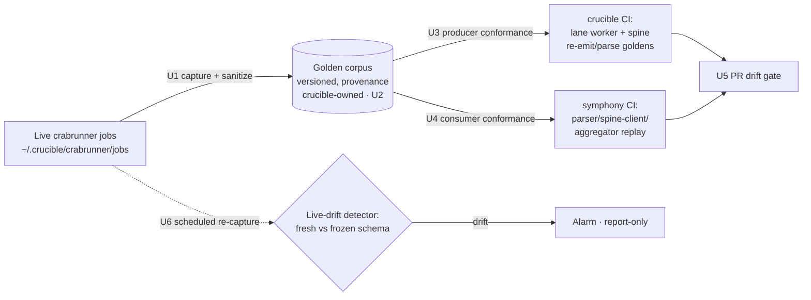

# feat: Automated golden-corpus contract testing (crucible/crabrunner ↔ Symphony)

**Target repos:** `crucible` (capture + producer conformance + corpus home) and `symphony-ts` (consumer conformance). Paths are repo-relative and labeled per unit. This doc lives in `symphony-ts` because Symphony is the consumer that drift breaks.

---

## Summary

A golden artifact captured from live crucible/crabrunner sessions was used **once, by hand** today to test the substrate. This plan automates that into a **golden-corpus contract-testing pipeline**: capture representative real-session artifacts from live crabrunner jobs into a sanitized, versioned, single-source corpus; replay that corpus through **both** the producer (crucible lane worker + spine subcommands) and the consumer (Symphony parser/spine-client/aggregator) in CI on every change; and run a scheduled live-drift detector that re-captures from production and alarms when the live artifact shape diverges from the frozen contract. The pin this creates is exactly what would have caught SYMPH-908 — MOB-348's reviewer-contract change landing while Symphony's consumer lagged — automatically, before it reached a real ticket.

---

## Problem Frame

**What exists.** Crucible has deterministic substrate smoke (`production-rollout.mjs smoke` — a canned echo that proves submit/run/collect plumbing, not contract content), a real-LLM canary (haiku), convergence fixtures (`crucible` `tests/fixtures/convergence/*.json`), and hand-captured job fixtures (`crucible` `dashboard/fixtures/jobs/symphony-412-implementer/status.json`). Symphony has a calibration corpus (`tests/fixtures/review-calibration/corpus.json`), a replay CLI ([src/cli/kimi-council-replay.ts](src/cli/kimi-council-replay.ts)), and a conformance-test matrix ([docs/conformance-test-matrix.md](docs/conformance-test-matrix.md)).

**The gap.** (1) Capture from live sessions is manual and ad hoc. (2) No corpus is replayed through **both** sides of the contract, so producer↔consumer agreement is never asserted end-to-end. (3) No drift alarm: when the producer changes artifact shape (MOB-348 did), nothing fails until a consumer breaks in production. SYMPH-908 is the proof: the drift sat undetected until a human noticed it.

**Why a golden corpus.** The artifacts crossing the seam — `crucible.crabrunner.status.v1`, the lane-worker `.md` + `crucible.lane-worker.closeout.v1`, the reviewer `## Verdict`/`## Findings` markdown, and `crucible.session-orchestrator.{council-triage,cross-exam-select,convergence-decision}.v1` — are all versioned, deterministic-to-parse shapes. Freezing real instances of each and replaying them on both sides turns contract drift from a production incident into a failing test.

**Non-goals.** Not testing model *quality* (a reviewer's judgment); this tests artifact *shape/contract* conformance. Not replacing the real-LLM canary (it stays as a live end-to-end check). Not capturing PII/secret-bearing production content into shareable fixtures (U1 sanitizes).

---

## Architecture

The corpus is the single contract source; both sides test against it; the detector watches live for divergence from it.

---

## Key Technical Decisions

- **KTD1 — Single-source corpus, crucible-owned.** The golden corpus lives in one place (crucible, the producer/contract owner); Symphony consumes it via the existing controller→workspace materialization (or a pinned sync). Same single-source lesson as SYMPH-909 — duplicating the corpus per repo would re-introduce the drift the corpus exists to catch.
- **KTD2 — Capture is sanitized, versioned, and provenance-stamped.** Each golden carries a manifest (source job id, phase, model, schema version, capture date) and is redacted (secrets/PII/absolute paths) with volatile fields (timestamps, pids, host, job ids) normalized to placeholders so diffs are semantic, not noise.
- **KTD3 — Both-sides conformance, not one.** A golden is only a contract pin if both producer and consumer assert against it. Producer-side proves the lane/spine still emit the shape; consumer-side proves Symphony still parses it. Either side breaking the contract fails CI.
- **KTD4 — Drift detection is scheduled and report-only first.** A periodic job re-captures from live sessions and validates against frozen schemas; it alarms but does not gate at first (measure before enforcing), per measure-before-caps. Promote to a hard gate once the signal is calibrated.
- **KTD5 — Refresh is a reviewed PR, never silent.** Updating a golden IS a contract change; it lands via a PR whose diff is reviewed. No auto-regeneration that masks drift.

---

## Implementation Units

### U1. Golden capture script (crucible)

**Goal:** Scripted, sanitized capture of representative live artifacts into golden bundles.
**Repo/Files:** `crucible` `scripts/golden/capture.mjs` (new); `crucible` `scripts/golden/sanitize.mjs` (new).
**Approach:** Read from `~/.crucible/crabrunner/jobs/<jobId>/` (status.json, attempts/*/artifact/*.md, *.usage.json, *.closeout.json) and review artifact dirs. Select representative cases across phases (investigate/implement/review) and verdict classes (PASS / CHANGES_REQUESTED / BLOCKED / track-only / malformed-preamble). Redact secrets/PII/absolute paths; normalize volatile fields to placeholders; emit a per-bundle provenance manifest.
**Test scenarios:** captured bundle round-trips through its own schema validator; sanitization removes a planted secret and absolute path; volatile fields replaced by placeholders; a malformed/preamble lane is captured verbatim (it's a valid golden case). `Covers KTD2.`
**Verification:** running capture against a real job dir yields a deterministic, secret-free bundle + manifest.

### U2. Versioned golden corpus + schema registry (crucible)

**Goal:** The single-source corpus with every artifact tagged to its schema.
**Repo/Files:** `crucible` `tests/fixtures/golden-corpus/` (new tree); `crucible` `tests/fixtures/golden-corpus/INDEX.json` (manifest: case → {schema, version, provenance}).
**Approach:** Lay out bundles by case; index each to its schema id (`crucible.crabrunner.status.v1`, `crucible.lane-worker.closeout.v1`, reviewer-markdown-contract, `crucible.session-orchestrator.*.v1`). Define how Symphony consumes it (materialization path or pinned sync, per KTD1).
**Test scenarios:** every corpus entry has a manifest entry with a known schema id; no orphan files; schema ids resolve to a validator. `Covers KTD1.`
**Verification:** corpus index is complete and each entry validates against its declared schema.

### U3. Producer conformance tests (crucible)

**Goal:** Assert the lane worker + spine still emit/parse the golden shapes.
**Repo/Files:** `crucible` `tests/golden/producer-conformance.test.*`.
**Approach:** Feed golden reviewer markdown → `council-triage`/`cross-exam-select`/`convergence-decision`, assert outputs match the golden JSON (modulo placeholders) and the schema version is unchanged. Assert the lane worker writes the golden `.md`+sidecar shapes. Extend the existing convergence fixtures into this harness.
**Test scenarios:** each golden review case reproduces its frozen triage/convergence JSON; a deliberately bumped schema version fails; lane-worker output matches the golden closeout shape. `Covers KTD3.`
**Verification:** producer CI is red if any subcommand/lane output diverges from the corpus.

### U4. Consumer conformance tests (symphony-ts)

**Goal:** Replay the golden corpus through Symphony's parse/spine-client/aggregator — the SYMPH-908 regression gate.
**Repo/Files:** `tests/review/golden-conformance.test.ts` (new); reuse [src/cli/kimi-council-replay.ts](src/cli/kimi-council-replay.ts) replay pattern + [src/review/calibration/fixtures.ts](src/review/calibration/fixtures.ts).
**Approach:** Point the replay harness at the consumed golden corpus; run each golden through the new parser + spine client + aggregator; assert verdict, severity bucketing, Track→Linear mapping, fp, and degraded-not-silent-pass on malformed. This is the test that would have failed on MOB-348's contract change.
**Test scenarios:** CHANGES_REQUESTED golden → correct verdict + escalate findings (not `malformed_artifact`); track-only golden → non-blocking + filer invoked; malformed/preamble golden → degraded, fail-closed; a golden with an unexpected schema version → explicit failure. `Covers KTD3, regresses SYMPH-908.`
**Verification:** consumer CI is red if Symphony can no longer parse a frozen producer shape.

### U5. CI drift gates (both repos)

**Goal:** Run the corpus on every PR in both repos.
**Repo/Files:** `crucible` CI config; `symphony-ts` CI config + `package.json` script (`golden:verify`).
**Approach:** Wire U3 (crucible) and U4 (symphony) into each repo's PR CI. A schema bump or parse failure fails the build. Add `golden:verify` as a fast local command.
**Test scenarios:** `Test expectation: none -- CI wiring; proven by U3/U4 running in CI and a deliberate contract break failing the gate.`
**Verification:** a PR that changes an artifact shape without refreshing goldens fails CI in the owning repo.

### U6. Scheduled live-drift detector (crucible)

**Goal:** Catch producer drift in production before a consumer breaks.
**Repo/Files:** `crucible` `scripts/golden/drift-detect.mjs` (new); scheduled via the existing ops scheduling (cron/launchd or the rollout scheduler).
**Approach:** Periodically re-capture fresh artifacts from live jobs (reuse U1), validate against the frozen golden schemas, and emit a drift signal (which schema, which field, producer vs consumer expectation). Report-only first (KTD4); promote to alarm/gate once calibrated.
**Test scenarios:** a fresh artifact matching the frozen schema → no drift; a fresh artifact with an added/removed/renamed contract field → drift signal naming the field; signal is emitted to the ops report channel, report-only. `Covers KTD4.`
**Verification:** injecting a shape change into a captured sample produces a precise drift signal.

### U7. Refresh workflow + docs

**Goal:** A reviewed, deliberate golden-refresh path and operator docs.
**Repo/Files:** `crucible` `scripts/golden/` (a `golden:capture` entry); `crucible` docs under `docs/` (capture/refresh runbook); update [docs/conformance-test-matrix.md](docs/conformance-test-matrix.md) (symphony) to reference the golden gate.
**Approach:** `golden:capture` regenerates candidate goldens; the diff is reviewed in a PR (a golden change = a contract change). Document selection criteria, sanitization, and the refresh cadence.
**Test scenarios:** `Test expectation: none -- workflow/docs; validated by a dry-run capture producing a reviewable diff.`
**Verification:** an operator can refresh the corpus via a documented, reviewable PR flow.

---

## Scope Boundaries

**In scope:** capture pipeline, single-source versioned corpus, both-sides conformance tests, CI gates, scheduled live-drift detector (report-only), refresh workflow.

### Deferred to Follow-Up Work
- Promote the drift detector from report-only to a hard gate once the signal is calibrated (measure first).
- Extend the corpus beyond the crabrunner/lane/review seam to other versioned cross-repo schemas (usage rows, monitor) if drift appears there.

### Out of scope / non-goals
- Testing model judgment quality (this is shape/contract conformance only).
- Replacing the real-LLM canary (it remains the live end-to-end check).

---

## Relationship to other work

- **Seeds from tonight.** The hand-authored canned artifacts and any live artifacts pulled during the SYMPH-908 alignment build become **corpus v0**; this plan wraps and scales them. Tonight's Tier-1/Tier-4 fixtures (alignment plan) are the consumer-side seed for U4.
- **Regresses SYMPH-908.** U4 is the automated form of SYMPH-908's "add a fixture-backed test" AC, generalized to a continuous gate.
- **Pairs with the pre-review gate ([SYMPH-913](https://linear.app/mobilyze-llc/issue/SYMPH-913)).** That gate smoke-tests *a build*; this corpus smoke-tests *the contract*. Complementary: SYMPH-913 catches "this diff is broken," the golden corpus catches "the producer changed shape."
- **Single-source discipline mirrors [SYMPH-909](https://linear.app/mobilyze-llc/issue/SYMPH-909).** Corpus and spine both live once, in crucible, consumed by Symphony.

---

## Open Questions

- **Q1 (decision).** Corpus home + consumption mechanism: crucible-owned + materialized to Symphony (recommended, KTD1) vs. a small shared package vs. pinned git sync. Confirm the materialization path Symphony's CI can read.
- **Q2 (scope).** Breadth of the first corpus: review/crabbox-council seam only (the acute SYMPH-908 pain) vs. the full lane/crabrunner contract surface (status/closeout/usage across all phases). Recommend starting with the review seam + status/closeout, expanding via the deferred item.
- **Q3 (execution-time).** Which live jobs are "representative" enough to freeze — define selection criteria in U1 against the real job history on the controller.

---

## Sources & Research

- Investigation 2026-06-23 (this session). Existing pieces: `crucible` `production-rollout.mjs` (`smoke` flow, `smokeWorkerArgv`, schemas `crucible.session-orchestrator.production-rollout.smoke{,-result}.v1`), `crucible` `tests/fixtures/convergence/*.json`, `crucible` `dashboard/fixtures/jobs/symphony-412-implementer/status.json`, `crucible` `lane_workers/run.ts` (artifact + closeout contract).
- Symphony: [src/cli/kimi-council-replay.ts](src/cli/kimi-council-replay.ts), [src/review/calibration/fixtures.ts](src/review/calibration/fixtures.ts), `tests/fixtures/review-calibration/corpus.json`, [docs/conformance-test-matrix.md](docs/conformance-test-matrix.md).
- Live artifacts: `~/.crucible/crabrunner/jobs/<jobId>/` (status.json `crucible.crabrunner.status.v1`, `<name>.md`, `<name>.closeout.json` `crucible.lane-worker.closeout.v1`).
- Linear: [SYMPH-908](https://linear.app/mobilyze-llc/issue/SYMPH-908) (drift root), [SYMPH-909](https://linear.app/mobilyze-llc/issue/SYMPH-909), [SYMPH-913](https://linear.app/mobilyze-llc/issue/SYMPH-913), MOB-348 (the contract change that drifted).
