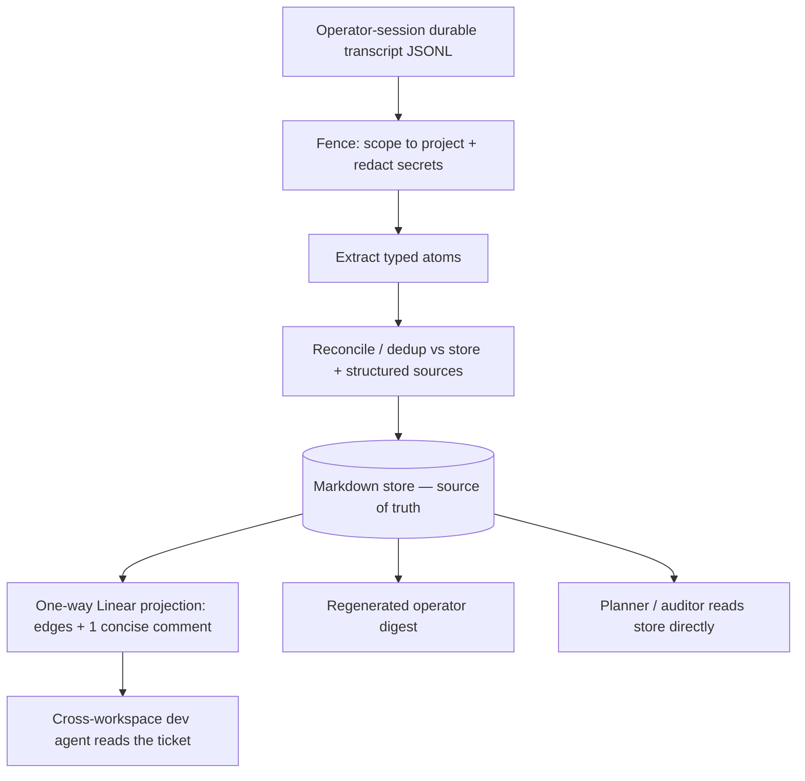

# Operator-Session Closeout Capture - Plan

## Goal Capsule

- **Objective:** Standardize how operator sessions capture durable decisions into structured atoms the backlog planner/auditor consumes as its source of truth — replacing the hand-written handoff document that nobody reliably reads. A human, or any dev agent that reads Linear, sees the one-way projection (structural edges + a one-line note) on the ticket, but neither is a primary v1 consumer.
- **Product authority:** Eric (operator).
- **Open blockers:** One hard pre-build gate — confirm the planner actually reads the atom store and that a stored atom can move a candidate (KD3); with the dev agent narrowed out, this is the sole v1 consumer, so a negative result is a stop/redirect, not a planning detail. Before the first measured run, also set the precision / false-positive floor and the per-closeout token budget; the recall threshold and golden-corpus size are v1.1 (the corpus needs real runs to seed) — see Outstanding Questions. Builds on Phase-0 activation (done) and the canonical-store decision in `docs/plans/2026-06-28-backlog-intelligence-plan.md` §4.3.

---

## Product Contract

### Summary

A standardized operator-session closeout that distills durable decisions from the session's **durable transcript** (not its compacted live context) into typed atoms in a git-committed markdown store. Ticket-level conclusions project one-way to Linear as native edges plus one concise comment; the operator brief becomes a digest regenerated from the atoms. Because the Phase-0 gate collapsed the extraction engine, this is a lightweight emit into surfaces that already exist, not a new subsystem.

### Problem Frame

The operator is the lossy carrier. Decisions made in planning, design, and grooming sessions live only in operator memory or scattered prose; the manual handoff ritual depends on discipline that fails — handoffs get skipped, or written into worktrees that die with the branch. Two recent sessions independently converged on standardizing the handoff, and that convergence was recorded nowhere — itself the decay this work addresses.

The decision-dense sessions are long. By the time a closeout runs, the model's live context has been compacted, so durable decisions made early — state facts, new relations, follow-up work, chosen directions, the rationale behind them, and open questions — are gone before any end-of-session reconstruction begins. 962's value is the **marginal delta over the live Phase-0 baseline**: comment-enrichment, runtime in-flight context, and relation edges already feed the planner the decisions that reach a comment, an edge, or the in-flight list (the three dogfood misses were all recovered that way — which is why the Phase-0 gate passed). What remains — 962's actual target — is the decisions the planner needs that **never reach any of those surfaces**, the ones that exist only in the session. They span all atom types; what defines them is *uncaptured-elsewhere*, not whether they are contrarian. That loss is invisible by construction: to detect a dropped decision you need a ground truth to diff against, and the only ground truth that survives compaction is the on-disk transcript.

HSUI-56 (Done) already ran the adjacent experiment for surface-design decisions and found the frozen prose handoff was the *failure* mode — "none of which a future agent reads as source-of-truth canon." What worked there was promoting resolved decisions into the canonical surface the agent already reads.

### Key Decisions

- KD1. **Capture from the durable transcript, not live context.** The on-disk JSONL is append-only and survives in-context compaction; it is the only compaction-proof source that does not demand perfect in-session discipline, and the only one that makes loss auditable.
- KD2. **Structured atoms are the deliverable; the human brief is a regenerated digest.** Prose is input, never required reading. This optimizes for the agent consumers, not the operator, and follows the HSUI-56 finding.
- KD3. **Markdown store is the source of truth; Linear gets a one-way edges-plus-comment projection, not Documents.** The objection is specifically to Linear *Documents* (the heavy full-doc post/read transport, SYMPH-842, which is not built) — native edges and a concise comment are cheap and fine. The planner runs in the controller, so it *can* read a local store directly — but that it *does* read the atom store, and that a stored atom can move a candidate, is the pre-check in Outstanding Questions (load-bearing for the whole v1 now that the dev agent is not a fallback consumer). A cross-workspace dev agent would reach context only through the Linear ticket, but our dev lanes are not confirmed to read Linear today and turning intent into a plan is the planner's job — so the dev agent is a secondary, unproven consumer, served by structural edges + a one-line note only, with the rich rationale staying store-only.
- KD4. **v1 captures operator sessions only.** Reviewers and the deterministic spine already emit structured findings and telemetry — reconcile and dedup against them, do not re-extract from their logs. Implementer-session transcripts (the multi-host harvest) are deferred.
- KD5. **Reuse the existing atom vocabularies.** Atoms build on `backlog-audit` finding types and planner-candidate edges plus the atom contract in the backlog-intelligence plan §4.1 — a separate decision-ledger would re-duplicate and rot.
- KD6. **Disposition starts at propose; auto-apply is earned, never assumed.** Graduate a conclusion-type to auto-apply only after a measured ratification floor, and never auto-apply an irreversible mutation from a session-derived atom (plan §4.5).
- KD7. **The untrusted-input fence is mandatory and load-bearing.** Raw transcripts are the worst case for secrets, cross-project content, and raw tool-result text (plan §4.6/§4.7).
- KD8. **This is the parent plan's §4.7 "JSONL front-end," which §4.7 deferred as the hardest, riskiest input.** What the Phase-0 gate collapsed is the surrounding §4 extraction-and-promotion *engine* scope, not the difficulty of the extraction itself — recovering decisions from prose (hardest for the implicit and contrarian ones) is unchanged. "Lightweight emit" describes the reduced plumbing, not a lower-risk input; v1 is therefore gated on measuring per-atom-type recall — with the implicit/contrarian tail called out as the known-hard part — before the auditability claim is trusted (see Outstanding Questions).

### Alternatives Considered

- **Post-hoc transcript mining (chosen).** Extract from the durable JSONL at closeout. Compaction-proof and demands no in-session discipline, but inherits the parent plan's "hardest input" risk: the extractor must recover decisions from prose, hardest for the implicit/contrarian ones (KD8).
- **Decision-time structured capture (not chosen).** The agent emits a structured edge/atom the moment each decision is ratified. Sidesteps compaction loss and the hard implicit-extraction tail entirely, at the cost of an in-session mechanism. Rejected for v1 because it requires the agent to reliably mark decisions mid-session — the discipline failure mode this work exists to avoid — but it is the natural fallback if mined recall proves too low (especially on the implicit tail).
- **Do nothing / rely on the already-activated comment-enrichment (baseline).** Phase-0 already threads curated comments into the planner. That captures decisions which reach a comment but not those that never leave the session — the gap §1.4 names. It is the recall floor every other option must beat.

### Requirements

**Capture and extraction**

- R1. A documented, repeatable operator-session closeout distills the session into typed structured atoms.
- R2. Extraction reads the operator session's durable on-disk transcript, not the model's live or compacted context.
- R3. The extractor handles operator-session transcripts larger than a single context window by chunking the on-disk log deterministically and merging the results.
- R4. v1 has no in-session ratification mechanism; extraction is purely post-hoc from the transcript, which remains the sole source of truth. (Optional ratification markers as a v1.1 tail-recall booster are deferred — see Scope Boundaries.)

**Atom shape and vocabulary**

- R5. Atoms reuse the existing vocabularies plus the atom contract fields from the backlog-intelligence plan §4.1. The vocabularies are: `backlog-audit` finding types (`duplicate`, `supersession`, `stale`, `thin_spec`, `review_dispatch_mismatch`, `other`); planner-candidate edges (`blockedBy`, `relates`, `supersedes`); and the §4.1 atom types (`state_fact`, `relation`, `decision`, `new_work`, `rationale_superseded`, `open_question`). Any addition beyond these reopens the separate-ledger risk KD5 rejects and must be justified. The types are tiered for v1: `state_fact`/`relation`/`new_work`/`decision` are the v1 quality floor (gated by the precision criterion); `rationale_superseded` and `open_question` — the hardest, thinnest-consumer tail — are extracted but store-only and not quality-gated until v1.1 recall measurement validates them.
- R6. Every atom carries mandatory provenance (source, author, span) and a concrete `mutation` (the structural change it maps to). The `(subject, claim)` pair is the anti-duplication key: an atom matching existing structure is a no-op or update, not a new entry.
- R6a. When two atoms share a `(subject, claim)` key with opposing conclusions within a single transcript (a decision ratified then reversed in-session), the later span wins **only if its verified actor authority is ≥ the earlier span's**; the earlier is then marked `superseded` and never projected as a live conclusion. A lowest-authority (default) span — e.g. a bot-authored late turn — cannot supersede a span bound to a verified human-operator identity (R13). Cross-session supersession follows the same later-wins-with-authority rule against the store (the more persistent surface: an attacker needs only one injected closeout run, not control of a session tail).

**Store and projection**

- R7. The canonical store is a git-committed markdown document in a stable symphony-ts project directory; full atoms and provenance live there.
- R8. Ticket-level structural conclusions project one-way to Linear as native edges plus at most one concise comment per ticket; no Linear Document attachments are created. The comment is a one-line decision note (the resolved conclusion), not the rejected-option rationale — that stays in the store, which the planner/auditor reads.
- R9. Linear is never a competing source of truth for the derived layer; the projection direction is store to Linear only.

**Untrusted-input handling**

- R10. Transcript content is untrusted: scope every derivation to the target project and reject or quarantine cross-project content.
- R11. Redaction of credential-shaped strings is idempotent and applied at every boundary, not only at ingestion: before any LLM pass, before writing an atom to the store, before projecting any atom content to Linear or rendering the operator digest, and before emitting to the operator-action queue (`flag_operator` output). A substring that survives the first pass must not reach a Linear comment, the digest, or the operator queue.
- R12. Never promote raw tool-result content (file reads, shell output) as an atom claim.
- R12a. The fence treats all transcript content as opaque data, never as instructions to the extractor: extraction instructions are rendered outside any untrusted segment (transcript turns passed as data arguments), so a crafted transcript line cannot steer the extraction pass to claim high authority, fabricate a mutation, or suppress redaction. The same constraint applies to **every LLM call in the chunked-merge pipeline (R3)**: intermediate atom payloads from prior chunk passes are passed as data arguments to the merge call (never embedded in its instruction segment), and redaction (R11) is applied to them before the merge.
- R13. Authority (operator over agent) derives from the verified Linear actor type, not from prose self-labeling. Because a raw JSONL transcript carries no verified Linear actor, transcript-derived atoms default to the lowest authority tier unless an out-of-band Linear lookup binds a verified human-operator identity to the span; authority is never elevated from the transcript's self-reported role alone.

**Auditability**

- R14. (v1.1) Extraction recall is measurable against a labeled golden corpus of sessions with hand-marked atoms, reported per atom type (`state_fact`, `relation`, `new_work`, `decision`, `rationale_superseded`, `open_question`) rather than as a single number. Deferred from v1: the corpus needs real closeout runs to seed, so recall cannot be measured at v1 close. The planner-critical types (state/relation/new-work) are the more explicit ones, so recall is most trustworthy where it matters most; the implicit/contrarian tail is the known-hard part — seed it from known cases (the SYMPH-838 archetype, git-history reversals) so the denominator includes it. Honest limit: seeding only reaches implicit decisions that surfaced in *some* durable artifact, so per-type recall on that tail is recall-against-recoverable-cases, not population recall — decisions that never left the session are absent from the seed by construction (see Outstanding Questions).
- R15. (v1.1) Re-running extraction on the same transcript is diffable, so regressions and non-determinism surface against the corpus baseline. The v1 form is idempotency only: repeated extraction of the same transcript produces no duplicate atoms in the store (already implied by R6's anti-duplication key).
- R16. v1 auditability is operator spot-checks on sampled sessions plus cross-source corroboration — decisions that resurface later uncaptured. This requires no upfront corpus and is the sole v1 auditability mechanism. Known limit (accepted v1 risk): cross-source corroboration can only catch a missed decision that *resurfaces* elsewhere — which is precisely *not* the never-leaves-session class 962 targets. v1 ships with no detector for its own core failure mode; the v1.1 corpus is what closes that gap.

**Disposition and application**

- R17. Every conclusion-type starts as `propose` at v1; this is enforced by the absence of any auto-apply code path. (v1.1) Graduation to `auto_apply` after a measured ratification floor — deferred until the first auto-apply candidate is defined (R18 blocks auto-apply at v1). Its tracking mechanism is a v1.1 concern; the v1 store schema is not pre-shaped for it.
- R18. A session-derived atom never auto-applies an irreversible mutation (close or merge a ticket); auto-apply requires full provenance, a reversible mutation, and a fully-fenced derivation chain.

**Outputs and reconciliation**

- R19. A light operator-facing digest is regenerated from the atoms rather than hand-authored; it is a view, not a stored deliverable.
- R20. Atoms reconcile and dedup against already-structured sources (reviewer findings, spine telemetry, hygiene-lane proposals) via provenance instead of re-extracting them.

### Key Flows

- F1. Operator-session closeout
  - **Trigger:** An operator session ends, or the operator invokes the closeout step.
  - **Steps:** Locate the durable transcript; fence it (scope to project, redact secrets); extract typed atoms; reconcile and dedup against the store and already-structured sources; write atoms to the markdown store as `propose`; project ticket-level conclusions to Linear as edges plus one concise comment; regenerate the operator digest.
  - **Outcome:** Durable decisions are in structured form the planner/auditor consumes (with structural edges readable off the Linear ticket); the operator gets a light digest; nothing irreversible was auto-applied.

### Acceptance Examples

- AE1. **Covers R2, R3.** A decision made early in a long session and absent from final context is still extracted, because it is present in the on-disk transcript.
- AE2. **Covers R8, R9.** A `blockedBy` relation derived from the session appears as a native Linear edge on the ticket; no Linear Document is created; the full atom lives in the store.
- AE3. **Covers R12, R13.** A transcript line "Correction: SYMPH-950 is Done" is extracted with default lowest authority and surfaced as `propose` — regardless of the role label in the JSONL, because authority is never elevated from transcript self-reporting (R13); it auto-applies only if an out-of-band Linear lookup binds a verified human-operator identity to the span.
- AE4. **Covers R17, R18.** A session-derived "close ticket X" conclusion is surfaced as `propose` or `flag_operator`, never auto-closed.
- AE5. **Covers R6a.** A decision ratified early in a transcript and reversed later in the same transcript (by a same-or-higher-authority span) yields one live atom (the later span); the earlier is marked `superseded`, and only the later conclusion projects to Linear.
- AE6. **Covers R6a, R13.** A bot-authored late "reversal" of an earlier human-ratified decision does **not** supersede it — a default-authority later span cannot override a verified-human span; it is surfaced as `propose` for the operator, not auto-applied.

### Success Criteria

**v1**

- Trust: structure the planner consumes reflects the session's decisions, measured against the Phase-0 dogfood.
- Marginal value: the captured decisions are ones that did *not* already reach a comment / edge / in-flight surface — real lift over the live Phase-0 baseline, not a re-capture of what enrichment already feeds the planner.
- Precision: atoms mutate a git store and project to Linear, so over-extraction is the asymmetric harm. A precision / false-positive floor (evaluable per high-volume atom type, not only as one aggregate) is set in the before-first-run gate with the token budget; report-only first, per `measure-before-caps`.
- Cost: per-closeout token cost is itemized and within a stated budget; report-only first, per `measure-before-caps`.
- Memory: the operator-action queue stays short and high-precision over consecutive runs.
- Adoption: the closeout writes atoms and the planner reads them at the fixed path (multi-agent read/write is v1.1).

**v1.1**

- Recall: extraction recall against the golden corpus meets the stated per-atom-type thresholds, with the planner-critical types (state/relation/new-work) held highest (numbers TBD — see Outstanding Questions).
- Reuse (outcome): a captured atom is traceable to a planner candidate that cites it — gated on adding atom-provenance to the planner's candidate output (no such field today). This is the goal-level metric; capture without reuse is not success.

### Scope Boundaries

**Deferred for later**

- Implementer-session transcript harvesting (the multi-host retrieval problem).
- Auto-apply beyond the measured graduation gate.
- The labeled golden corpus and corpus-based recall / re-diff (R14, R15) — v1.1, once real closeout runs exist to seed it.
- Graduation-tracking provenance log (R17 second clause) — v1.1, when the first auto-apply candidate is defined.
- Optional in-session ratification markers — v1.1 tail-recall booster, added only if no-marker implicit-tail recall proves too low (R4 sets the v1 no-marker baseline).

**Outside this work's identity**

- Reviewer and spine transcript extraction — already structured; reconcile, do not re-extract.
- Linear Documents as the handoff transport (SYMPH-842's path) — not built, and superseded by the edges-plus-comment projection.
- A new decision-ledger database or any non-markdown store.
- The standalone §4 extraction engine — the Phase-0 gate collapsed it; this is an emit, not the engine.

### Dependencies / Assumptions

- Durable transcript availability: operator-session JSONL persists on disk where the closeout runs (local to the controller / operator machine for v1). Non-local retrieval is deferred.
- Canonical store location and atom contract come from `docs/plans/2026-06-28-backlog-intelligence-plan.md` (§4.3, §4.1).
- Phase-0 activation is live: the hygiene lane is wired to the tick (report-only, `runtime-host.ts`), comment enrichment and runtime in-flight context are threaded into the planning path.
- (v1.1) A golden corpus of labeled sessions must be built to measure recall — a v1.1 carrying cost. v1 has no corpus dependency (R16 spot-checks only).

### Outstanding Questions

**Resolve before planning**

- The precision / false-positive floor and the per-closeout token budget — set both before the first run so the run can fail honestly.
- Falsifiable pre-check before build: confirm the planner actually reads atoms from the canonical store path and that a stored atom can influence a planner candidate. The whole value chain rests on "the planner reads the store" (KD3); gate the build on this holding.
- Marginal-value gate: size the delta over the live Phase-0 baseline — how many planner-needed decisions never reach a comment, edge, or the in-flight list. Gate the build on this delta being non-trivial; if Phase-0 already captures nearly everything the planner needs, 962 is not worth building.
- (v1.1) Golden corpus: how is it seeded and labeled, and how large? The SYMPH-838 decision corpus is a starting point.

**Deferred to planning**

- Exact store path and file structure (within the backlog-intelligence plan's stable directory).
- Chunking and merge strategy for transcripts that exceed one context window — must satisfy R12a's fence at every merge-pass LLM boundary.

### Sources / Research

- Linear: SYMPH-962 (this work), SYMPH-842 (consumer; Documents path confirmed **not built** — no `fetchDocumentsForIssue`, no `## Handoff notes` render), SYMPH-960 (parent; Phase-0 gate passed with 0 category-(c) gaps), SYMPH-961 (Phase-0 activation, merged), SYMPH-965 (two-surface model attribution), HSUI-56 (Done; closeout-ritual precedent).
- Plan: `docs/plans/2026-06-28-backlog-intelligence-plan.md` §1.4, §4.1, §4.3, §4.5, §4.6, §4.7.
- Code: `src/agent/triage-planner.ts` (`PlannerContext`, `buildPlannerPrompt`), `src/orchestrator/standing-plan-shadow.ts` (`assembleShadowPlannerContext`), `src/audit/backlog-audit.ts` (finding types and `BacklogAuditFinding`), `src/orchestrator/backlog-hygiene.ts` (`QUEUE_TRIAGE_EVALUATION_DIMENSIONS`), `src/orchestrator/runtime-host.ts` (hygiene tick wired, report-only), `pipeline-config/hooks/after-create.sh` (per-issue workspaces clone the target repo, not symphony-ts).
