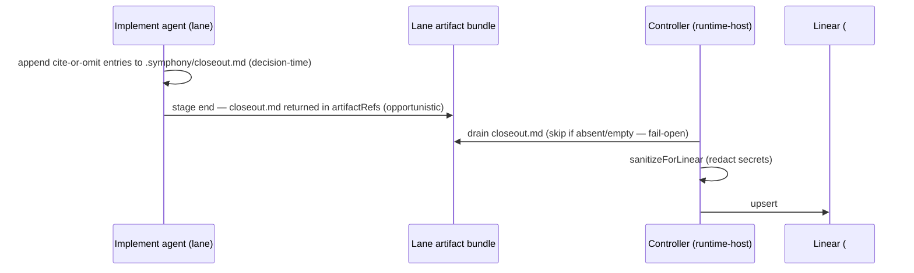

# Implement-Stage Closeout Comment — Design

## Goal Capsule

- **Objective:** Capture the consequential decisions a dispatched **implement**
  agent makes — most importantly the ones not obvious from the merged ticket —
  into a durable, structured `## Closeout` Linear comment, written *during* the
  session at decision-time and posted by the controller at stage end.
- **Product authority:** Eric (operator).
- **Primary consumer:** a future implementer / cold-reading agent (and the
  operator) — the rich rationale. **Secondary consumer:** the planner / auditor —
  the structured tail, via the already-live Phase-0 comment-enrichment path.
- **Why this shape (the pivot):** SYMPH-962's post-hoc transcript-mining approach
  was reshaped after two findings: (1) the Phase-A gate over operator desktop
  logs ran the wrong experiment and returned NO-BUILD; (2) the failure it was
  fighting — agents losing context on long sessions and being unable to author a
  rich report at the end — is *avoidable* for dispatched agents, because their
  behavior is programmable. So we capture at decision-time in the lane, not by
  reconstructing a transcript afterward. This is the "decision-time structured
  capture" alternative the parent plan named as the natural fallback once mined
  recall proved too low.

---

## Product Contract

### Summary

The implement stage maintains a cite-or-omit `closeout.md` in its workspace as it
works. The lane declares it as a produced artifact; on stage end the **controller**
reads it, applies a secret-redaction pass, and posts/updates one idempotent
`## Closeout` Linear comment per issue. v1 is report-only (the comment only); no
structural Linear edges are projected yet. This rides existing rails — the
artifact-return mechanism (as spec-fidelity uses for `spec-fidelity.json`) and the
idempotent sync-by-marker pattern (as `sync_workpad` uses for `## Workpad`).

### Problem Frame

When a dispatched implement agent makes a consequential design decision — chooses
an approach the ticket didn't propose, departs from the approach it did propose,
defers part of the scope, discovers a blocker or a landmine — that decision is
durable and planner/implementer-relevant, but it is under-recorded in
machine-usable form:

- The "file deferred work as Linear edges" discipline only fires when work
  *remains*; a design decision that *completes* the work leaves nothing for it.
- The merged ticket says "done" and still describes the original approach, so it
  can actively *mislead* a cold reader.
- The diff shows *what* was built, never *why-not-the-alternative*; that reasoning
  lived only in the agent's context and is gone by session end.
- The just-shipped spec-fidelity judge (SYMPH-971) *detects* AC divergence
  post-hoc but, by construction, cannot recover the *reason* — the reason isn't in
  the diff. Only the agent, at decision-time, has it.

The hand-maintained evidence that this class is real and valuable: the
`CLAUDE.md` "Fragile areas" list ("`active_states` must include ALL states — hit
3 times") and the operator's memory files are exactly this kind of
implementer-discovered record, captured manually because the cost of not having
it was paid repeatedly.

### Key Decisions

- KD1. **Decision-time, in-lane capture — not post-hoc transcript mining.**
  The agent appends to `closeout.md` at the moment a decision is made, while
  context is fresh. This is feasible (unlike for operator desktop sessions)
  because the dispatched agent's behavior is set by the stage prompt — capture is
  a mandated step, not a discipline we hope holds. It is also an anti-hallucination
  property: recording what just happened beats confabulating at the end.
- KD2. **The lane never writes to Linear; the controller does.** The lane emits a
  `closeout.md` artifact; the controller reads, redacts, and posts. This matches
  spec-fidelity's read-only-to-Linear pattern, avoids putting Linear credentials
  or write tools in the lane (which symphony-ts does not wire into crabrunner
  lanes today), and works identically in the live single-transition crabrunner
  path. If/when decomposed+capsule dispatch lands, `closeout.md` becomes a
  produced capsule the controller drains.
- KD3. **Separate `## Closeout` marker, distinct from `## Workpad`.** The workpad
  is a *forward plan* (investigate handoff, read by implement and by spec-fidelity
  as `planNarrative`, and load-bearing for the investigate retry brake). The
  closeout is a *backward record*. A distinct marker reuses 100% of the
  sync-by-marker plumbing while avoiding two collisions: the investigate retry
  brake (a successful `sync_workpad` is treated as stage-complete) and the
  spec-fidelity plan-narrative input.
- KD4. **Implementer-first; planner is a cheap projection.** A good
  reason-rich decision record contains everything the planner's structural view
  needs; the reverse is false. So the artifact is designed for the cold-reading
  implementer (rich rationale), and the planner consumes the structured tail.
- KD5. **Cite-or-omit is the load-bearing anti-hallucination rule.** Every
  *structured* entry must cite concrete evidence (a `file:line`, commit, ticket
  id, or specific failure) or it is omitted. A fabricated structural claim (a
  hallucinated `blockedBy`) is worse than a missing one because it actively
  mis-sequences future work — the parent plan's R1 ("extraction promotes confident
  garbage") risk. Empty sections are the expected normal; inventing entries to
  fill the shape is a failure.
- KD6. **Fact and opinion are separate tiers.** Factual sections (decisions,
  deferrals, blocks, landmines) are evidence-bound. The **Assessment** is
  explicitly subjective (confidence, risk, hindsight) and is never projected to a
  structural mutation.
- KD7. **v1 is report-only.** The comment is the only output. Projecting the
  structured tail to native Linear edges (blockedBy / relates / supersedes) is
  v1.1, and requires a verify-before-mutate gate on the cited relations. This
  follows `measure-before-caps` / `telemetry-before-consumer`: emit the records
  now, design the projection from observed records.
- KD8. **This replaces the Document-based closeout convention.** The
  reason-first comment, sourced at decision-time, is a better-sourced and leaner
  artifact than a session-end-authored Linear-Document closeout, on a surface
  agents can reliably write and enrichment already reads. The on-demand HTML
  `ezra-session-report` (user-addressed, explicit-request-only) is unaffected. A
  git-committed markdown store (the parent plan's canonical store) is optional for
  v1 — the comment is the durable home; Linear is queryable if a corpus is later
  needed.

### The Closeout Schema

`## Closeout` marker, then a narrative **head** and a structured **tail**. Only
sections with grounded content appear (per-section, independent).

```markdown
## Closeout

**What shipped:** <capability delivered — a few sentences, not a diff restatement>

### Design decisions              — cite-or-omit; the centerpiece
- **<decision>**: chose <B> over <A/alternatives>. Reason <C>. Evidence: <file:line>.
  [⚠ diverges from ticket: proposed <X>]   ← flag only when it contradicts the ticket

**Assessment:** <honest opinion: confidence, what I'm least sure about, risks a
reviewer/future implementer should watch, hindsight, effort vs. expectation.>

### Deferred / not done
- **<item>**: not done — <why>. → <SYMPH-XXX / new ticket>. Evidence: <where>.
### Blocked / depends on
- blockedBy SYMPH-XXX — <why>. Evidence: <what surfaced it>.
### Belongs elsewhere
- relates/supersedes SYMPH-XXX — <what moved>. Evidence: <where>.
### Landmines
- `<file/area>`: <constraint a future implementer must know>. Evidence: <file:line>.
### Open questions
- <unresolved — independent of whether anything diverged>
```

- **Head = What shipped + Design decisions + Assessment.** The narrative prose
  (What shipped + Assessment together) prefers **5 sentences, 7 at most**. The
  Design-decisions list is bounded by cite-or-omit, not a sentence count, and is
  the centerpiece — it captures *all* consequential `decision` atoms, both
  in-latitude choices (the ticket was silent) and divergences (flagged).
- **Tail = Deferred / Blocked / Belongs elsewhere / Landmines / Open questions.**
  Each cite-or-omit and independent. Open questions and landmines can appear with
  zero divergences.
- **Empty case is per-section.** A "built as specified" session = full head (What
  shipped + Assessment), no Design-decision/Deferred/Blocked entries, but possibly
  Landmines / Open questions. It is never a single line.
- **Atom-type mapping (parent plan §4.1 / KD5 reuse):** Design decisions =
  `decision`; Deferred = `new_work` / `state_fact`; Blocked / Belongs =
  `relation`; Landmines = `state_fact`; Open questions = `open_question`.

### Requirements

**Capture (in-lane)**
- R1. The implement stage prompt instructs the agent to maintain
  `.symphony/closeout.md` *during* the run, appending entries at decision-time,
  not reconstructing at the end.
- R2. The prompt enforces cite-or-omit on every structured entry and states that
  empty sections are normal and inventing entries to fill the shape is a failure.
- R3. The prompt bounds the narrative prose (What shipped + Assessment together)
  to 5 sentences (7 max) — the Design-decisions list is bounded by cite-or-omit,
  not a sentence count — and forbids secrets, tokens, or raw logs in the file.
- R4. Design decisions capture both in-latitude choices and divergences;
  divergence is a flag on a decision, not a separate section.
- R5. The agent never writes to Linear; it only writes the local file.

**Projection (controller)**
- R6. Implement's `StageExecutionProfile` declares `produces: ["closeout.md"]`.
- R7. On stage end the controller reads `closeout.md` from the lane's returned
  artifacts (existing tar/artifact-ref mechanism).
- R8. The controller applies an idempotent credential-shaped-string redaction pass
  before posting (a secret that slips the agent must not reach the comment).
- R9. The controller posts/updates exactly one `## Closeout` comment per issue via
  sync-by-marker (find the service-account `## Closeout` comment → update; else
  create), reusing the `sync_workpad` idempotency pattern.
- R10. On rework, the latest implement run **replaces** the comment (it reflects
  what shipped, not a per-attempt log).
- R11. Post on any run that produced a non-empty `closeout.md`, including
  blocked/failed implements. Absent or empty artifact → no post (fail-open).
- R12. v1 projects **only** the comment — no native Linear edges. (Edge projection
  + verify-before-mutate gate is v1.1.)

**Boundaries**
- R13. Distinct `## Closeout` marker; the `## Workpad` comment, the investigate
  retry brake, and spec-fidelity's `planNarrative` input are untouched.
- R14. v1 covers the implement stage only.

### Key Flows

- F1. Implement-stage closeout
  - **Trigger:** decision-time, throughout the implement run (R1).
  - **Steps:** agent appends cite-or-omit entries to `.symphony/closeout.md` as
    decisions are made → adds the bounded narrative head at stage end → lane
    returns `closeout.md` as a produced artifact → controller reads, redacts,
    posts/updates the `## Closeout` comment.
  - **Outcome:** the ticket carries a durable, structured record of the
    consequential decisions, readable cold by a future implementer and parseable
    by the planner; nothing irreversible was mutated.

### Acceptance Examples

- AE1. **Covers R1, R4.** A design decision made early in a long implement run
  (e.g. "put the brake in runtime-host, not the prompt") appears in the closeout
  because it was appended at the moment, not reconstructed from compacted context.
- AE2. **Covers R4.** An in-latitude choice the ticket was silent on is recorded
  as a Design decision with no divergence flag; a choice that contradicts the
  ticket carries `⚠ diverges from ticket`.
- AE3. **Covers R2, KD5.** A run that built exactly what the ticket asked produces
  a closeout with What-shipped + Assessment and no Design-decision entries — no
  invented divergence.
- AE4. **Covers R8.** A credential-shaped string the agent accidentally wrote into
  `closeout.md` is redacted by the controller and never reaches the comment.
- AE5. **Covers R9, R10.** Two implement runs on one issue yield exactly one
  `## Closeout` comment, updated to the second run's content.
- AE6. **Covers R11.** A blocked implement that recorded "couldn't proceed because
  X — evidence: file:line" still posts a closeout.

### Success Criteria

**v1**
- Capture-at-source: decisions made early in long runs survive in the closeout
  (measured against the run transcript on spot-checks).
- Precision over recall: the structured tail is high-precision — spot-checks find
  no fabricated structural claims (cite-or-omit holds). Report-only first per
  `measure-before-caps`.
- Replaces the convention: implement closeouts land as `## Closeout` comments; the
  Document-based closeout is retired for this path.
- Cost: per-run closeout token cost is itemized and bounded; report-only first.

**v1.1**
- Edge projection: the structured tail projects to native Linear edges behind a
  verify-before-mutate gate; a captured atom is traceable to a planner candidate
  that cites it.
- Recall measurement: per-atom-type recall against a labeled corpus seeded from
  real closeout runs.

### Scope Boundaries

**Deferred to v1.1+**
- Projection of the structured tail to native Linear edges + the
  verify-before-mutate gate (R12).
- Recall measurement / golden corpus (needs real closeout runs to seed).
- A git-committed markdown store (optional; the comment is the v1 home).
- Decomposed/capsule-path consumption wiring (the single-transition path injects
  recent comments today; the decomposed path uses capsule handoff — SYMPH-857).

**Outside this work**
- Investigate / review / merge closeouts (implement-only in v1).
- Post-hoc transcript mining (superseded by decision-time capture).
- Linear Documents as the transport (superseded by the comment; SYMPH-842 not
  built).
- The on-demand HTML `ezra-session-report` (unchanged, explicit-request-only).
- Any ticket create/close/merge execution (a downstream concern; the closeout
  records, it does not act).

### Dependencies / Assumptions

- The live crabrunner path is single-transition (carries the full StageDefinition
  prompt); the implement prompt is rendered by the controller and shipped to the
  lane as a `prompt.md` file (SYMPH-856).
- The lane returns produced artifacts to the controller via the existing
  artifact-ref / tar mechanism (as spec-fidelity does).
- Comment-enrichment is ON in prod (`comment_enrichment: true`), so a `## Closeout`
  comment is ingested into `PlannerContext` by the live Phase-0 path for the
  secondary planner consumer — no new consumer wiring needed for v1.

---

## Planning Contract

**Product Contract preservation:** unchanged — this enrichment adds HOW (Key
Technical Decisions, Implementation Units, Verification Contract, Definition of
Done) without altering the requirements (R1–R14), key decisions (KD1–KD8), or
acceptance examples (AE1–AE6) above.

**Depth:** Standard · **Type:** feat. Crosses prompt → lane → controller →
Linear; the product design is settled, ~5 units.

### Key Technical Decisions

- **KTD1 — `closeout.md` is an opportunistic, fail-open artifact, NOT a gating
  capsule.** It is drained if present; its absence or emptiness never fails or
  blocks the implement stage (R11). It must NOT be declared as a required
  produced *capsule* — the decomposed path's `verifyProducedCapsules`
  (`src/orchestrator/decomposed-stage-dispatch.ts:286`) fails closed on a
  declared-but-absent capsule. The controller reads it from the lane result's
  `artifactRefs`, mirroring how spec-fidelity reads `spec-fidelity.json`
  (`src/agent/spec-fidelity.ts`).
- **KTD2 — Controller posts; the lane is read-only to Linear.** Matches the
  spec-fidelity pattern (the lane emits an artifact; the controller records). The
  crabrunner lane is not wired with Linear-write tools in symphony-ts, so posting
  must be controller-side. `LinearTrackerClient.postComment` (create) exists
  (`src/tracker/linear-client.ts:579`); the update-by-marker half is added in U3.
- **KTD3 — Idempotent `## Closeout` upsert reuses the workpad pattern.** Fetch
  comments → find the latest service-account comment whose body starts with
  `## Closeout` → `commentUpdate` if found, else create. Port the
  find-by-marker + author-scoping + `COMMENT_UPDATE_MUTATION` logic from
  `src/codex/workpad-sync-tool.ts`. Author-scoping ensures operator comments are
  never clobbered.
- **KTD4 — Reuse existing redaction; do not build new.** Apply
  `sanitizeForLinear` from `src/shared/egress.ts` (credential redaction + fences)
  before posting (R8). Pick a closeout-appropriate length cap at implementation —
  the `DEFAULT_LINEAR_MAX_LEN = 2000` constant is tuned for short notifications;
  the bounded-but-multi-section closeout likely needs a higher cap.
- **KTD5 — Per-workflow boolean flag, report-only.** Gate posting behind a
  `closeout_comment` per-workflow flag (pattern: `comment_enrichment` in
  `pipeline-config/workflows/WORKFLOW-symphony.md`; `reviewExecution` flags).
  Enable for symphony; default off elsewhere. Report-only first, per
  `measure-before-caps`.
- **KTD6 — Single-transition crabrunner path for v1.** The live path renders the
  prompt, ships it to the lane, and returns artifacts. The decomposed/capsule
  path (SYMPH-856/857) is deferred; same-issue downstream consumption there would
  need capsule wiring (see Scope Boundaries).

### High-Level Technical Design



---

## Implementation Units

### U1. Closeout-capture block in the implement prompt

- **Goal:** The implement agent maintains `.symphony/closeout.md` at decision-time
  per the schema.
- **Requirements:** R1, R2, R3, R4, R5; KD1, KD5.
- **Dependencies:** none.
- **Files:** `pipeline-config/prompts/implement.liquid` (add block);
  `tests/agent/prompt-builder.test.ts` (assert the block renders).
- **Approach:** add the `## Closeout capture` block (the trigger wording in the
  Product Contract). Static text — introduces no new LiquidJS variables, so
  `strictVariables` is unaffected. Mirror the existing output-discipline / workpad
  instruction style already in the prompt.
- **Patterns to follow:** the existing instruction sections in
  `pipeline-config/prompts/implement.liquid`; the shared output-budget block in
  `pipeline-config/prompts/global.liquid`.
- **Test scenarios:**
  - Covers R1, R4. Rendering the implement-stage prompt includes a
    `## Closeout capture` section instructing decision-time capture to
    `.symphony/closeout.md`, with the Design-decisions + divergence-flag guidance.
  - Covers R2. The rendered block states cite-or-omit and "empty sections are
    normal; do not invent entries to fill the shape."
  - Covers R3. The block states the 5-sentence (7 max) narrative bound and forbids
    secrets, tokens, and raw logs.
  - The implement prompt still renders under `strictVariables: true` with the
    standard render context (no new undefined variables).
- **Verification:** the implement prompt renders with the block present; existing
  prompt-builder render tests pass.

### U2. Make `closeout.md` retrievable by the controller (opportunistic artifact)

- **Goal:** The implement lane returns `.symphony/closeout.md` so the controller
  can drain it, without it being a gating capsule.
- **Requirements:** R6, R11; KD2; KTD1.
- **Dependencies:** U1.
- **Files:** `src/config/stage-execution-profile.ts` (implement-stage artifact
  declaration, near the `produces` builder ~:272); `src/config/types.ts` if a
  shape change is needed; `tests/config/stage-execution-profile.test.ts`.
- **Approach:** ensure `closeout.md` is collected into the implement lane's
  returned `artifactRefs` as a NON-gating artifact. Pattern on
  `createSpecFidelityExecutionProfile`'s `produces: ["spec-fidelity.json"]`.
- **Execution note:** first confirm whether the existing `produces` channel is
  gating (the decomposed `verifyProducedCapsules` fail-closed check). If it is,
  add/route through a separate opportunistic-artifact list rather than the gating
  capsule list — closeout absence must stay fail-open (KTD1). This gating-vs-
  opportunistic determination is the unit's key implementation-time discovery.
- **Patterns to follow:** `src/agent/spec-fidelity.ts`
  (`createSpecFidelityExecutionProfile`); the `produces` handling in
  `src/config/stage-execution-profile.ts`.
- **Test scenarios:**
  - Covers R6. The implement stage profile collects `closeout.md` into its
    returned artifacts.
  - Covers R11, KTD1. A missing `closeout.md` does not fail the implement stage
    (no fail-closed capsule check trips).
- **Verification:** profile test asserts `closeout.md` is collected and that its
  absence is non-fatal.

### U3. Idempotent `## Closeout` comment upsert on the tracker client

- **Goal:** A controller-side upsert that creates or updates the single
  service-account `## Closeout` comment per issue.
- **Requirements:** R9, R10; KD2; KTD3.
- **Dependencies:** none (parallel to U1/U2).
- **Files:** `src/tracker/linear-client.ts` (add an upsert-by-marker method);
  `tests/tracker/linear-client.test.ts`.
- **Approach:** fetch issue comments → find the latest comment authored by the
  service account whose body starts with `## Closeout` → `commentUpdate` if found,
  else create via the existing `postComment`. Port `findExistingWorkpadComment` +
  `COMMENT_UPDATE_MUTATION` + viewer-id author-scoping from
  `src/codex/workpad-sync-tool.ts`.
- **Patterns to follow:** `src/codex/workpad-sync-tool.ts`; existing `postComment`
  / `fetchIssueComments` in `src/tracker/linear-client.ts`.
- **Test scenarios:**
  - Covers R9. No existing `## Closeout` comment → creates one.
  - Covers R9, R10. An existing service-account `## Closeout` comment → updates it
    (one comment, not two).
  - Author-scoping: an operator-authored `## Closeout`-shaped comment is NOT
    updated or clobbered.
  - Idempotent: two upserts with the same body → a single comment, no duplicate.
- **Verification:** linear-client tests assert create-when-absent,
  update-when-present, and author-scoping.

### U4. Post-implement drain + redact + post (controller hook)

- **Goal:** After the implement stage, drain `closeout.md`, redact it, and upsert
  the `## Closeout` comment.
- **Requirements:** R7, R8, R10, R11, R12; KD2, KD7; KTD1, KTD4.
- **Dependencies:** U2, U3.
- **Files:** `src/orchestrator/runtime-host.ts` (post-implement-stage hook;
  pattern on the spec-fidelity evidence/verdict handling);
  `tests/orchestrator/runtime-host.test.ts`.
- **Approach:** on implement-stage completion, read `closeout.md` from the lane
  result's `artifactRefs` (as spec-fidelity reads its artifact). If absent or
  empty/whitespace → no-op (fail-open). Else `sanitizeForLinear` (egress.ts) and
  call the U3 upsert. Post on any run that produced non-empty content, including
  blocked/failed implements. v1 posts only the comment — no Linear edges (R12).
- **Execution note:** the exact post-implement hook location is an
  implementation-time locate; pattern on how `runSpecFidelityLane` results are
  assembled/recorded.
- **Patterns to follow:** `src/agent/spec-fidelity.ts`
  (`parseSpecFidelityLaneResult` reading `artifactRefs`); the spec-fidelity
  assembly path in `src/orchestrator/runtime-host.ts`.
- **Test scenarios:**
  - Covers R11. Absent/empty `closeout.md` → no comment posted.
  - Covers R7, R10. Non-empty `closeout.md` → upserts the `## Closeout` comment
    with the redacted body.
  - Covers R8. A credential-shaped string in `closeout.md` is redacted before
    posting.
  - Covers AE6. A blocked implement that produced non-empty content still posts.
  - Covers AE5, R10. Two implement runs → one comment, updated to the latest.
  - Covers R12. No Linear edges are created in v1 (comment only).
- **Verification:** runtime-host tests assert the drain → redact → upsert path and
  the fail-open no-op.

### U5. Per-workflow `closeout_comment` flag (report-only gate)

- **Goal:** Gate closeout posting behind a per-workflow boolean; enable it for
  symphony.
- **Requirements:** R12; Success Criteria (report-only); KTD5; KD7.
- **Dependencies:** U4.
- **Files:** `src/config/types.ts` (config shape); `src/config/config-resolver.ts`
  (parse + default-off); `pipeline-config/workflows/WORKFLOW-symphony.md` (enable);
  `tests/config/config-resolver.test.ts`.
- **Approach:** add an opt-in `closeout_comment` flag (default false), patterned on
  `comment_enrichment` / `reviewExecution` gating. U4's hook checks it. Turn it on
  for symphony only.
- **Patterns to follow:** the `comment_enrichment` flag wiring;
  `reviewExecution.crabrunnerJobGroup` gating.
- **Test scenarios:**
  - Flag off (default) → the U4 hook does not post.
  - Flag on → posts.
  - Config defaulting: a missing flag resolves to off.
- **Verification:** config-resolver tests assert default-off and per-workflow
  enable; the symphony workflow has the flag on.

---

## Verification Contract

Project gates (must all pass — see `CLAUDE.md`):

- `pnpm exec vitest run` — all tests pass (use `vitest run` directly in a
  worktree; the `pnpm test` pretest can fail on operator skill drift).
- `pnpm build` — compiles without errors.
- `pnpm typecheck` — no type errors.
- `pnpm lint` — Biome passes.

Dogfood (manual, report-only): run one symphony implement on a test ticket with
`closeout_comment` on; confirm a single `## Closeout` comment appears, is updated
(not duplicated) on a re-run, and that an injected secret is redacted.

---

## Definition of Done

- All five units landed with their test scenarios; every Verification Contract
  gate is green.
- A symphony implement run produces a `## Closeout` comment (report-only): present
  when the agent recorded content, idempotent on rework, redacted, and fail-open
  when no `closeout.md` is produced.
- No Linear edges are projected (v1 boundary holds); the on-demand HTML report and
  the now-retired Document closeout are unaffected.
- Behind the per-workflow flag, default-off except symphony.

---

## Grounding (verified 2026-06-29)

- Mechanism precedents: `sync_workpad` idempotent marker comment
  (`src/codex/workpad-sync-tool.ts`); spec-fidelity read-only lane + produced
  artifact + `produces: ["spec-fidelity.json"]` (`src/agent/spec-fidelity.ts`).
- Read/dispatch path: controller assembles `implementationCommentDeltas` /
  `workpadContext` (`src/orchestrator/runtime-host.ts:4746`); crabrunner backend
  renders the stage prompt field-for-field and ships it as a temp prompt file
  (`src/stage-execution/crabrunner-backend-factory.ts:316`); decomposed sub-stage
  path deliberately drops comment/workpad context for capsule handoff
  (`src/orchestrator/decomposed-stage-dispatch.ts:262`,
  `src/orchestrator/runtime-host.ts:4901`).
- Prompt: `pipeline-config/prompts/implement.liquid` (capture block added here).
- Parent: `docs/plans/2026-06-29-symph-962-closeout-capture-plan.md`
  (KD reuse §4.1 atom vocabulary, R1 confident-garbage risk); SYMPH-971
  spec-fidelity lane (detection complement).
