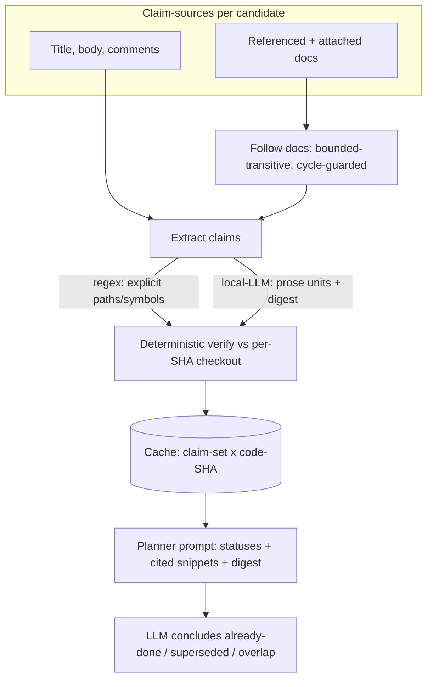
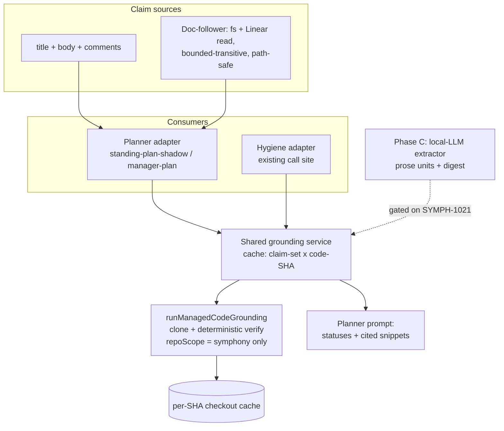

# Planner Deep Code-Grounding - Plan

## Goal Capsule

- **Objective:** Replace the planner's shallow, self-cited path-hints with real code-grounding — clone + verify a candidate's cited and doc-derived claims against the actual repo, follow the plan docs it references or has attached, and feed full verified evidence into the planner/auditor so it catches already-done/superseded work and judges real file-overlap.
- **Product authority:** SYMPH-1017 (operator design reflection, 2026-07-01) and this brainstorm dialogue; the SYMPH-942/502-class already-done misses this session hit; the audit-planner unification deferred from SYMPH-960 §6.D. Absorbs the filesystem-plan-following intent of the cancelled SYMPH-842.
- **Open blockers:** None block planning — the architecture is settled. Two values are intentionally deferred to planning and set from data (doc-following depth cap, aggregate-size cap); see Outstanding Questions.

---

## Product Contract

### Summary

Wire the existing deep code-grounding capability (`runManagedCodeGrounding`: clone + deterministic claim-verification) into the planner as a shared, cached grounding service. For every backlog candidate, extract checkable claims from its title, body, comments, and every referenced-or-attached plan doc; verify them against a per-SHA checkout of the real repo; and feed the verified evidence plus a bounded, format-agnostic digest into the planner. A local-LLM extractor produces the semantic layer; its path/symbol-expressible claims are backstopped by deterministic verification against the checkout, while behavioral or digest-level claims reach the planner flagged as unverified.

### Problem Frame

The planner grounds candidates only in shallow path-hints: `extractGroundingPathHints` pulls file paths a ticket cites in its own title/body — no code is read. So the planner can't verify a claim, tell what a ticket actually touches, detect that work is already done or superseded, or judge real surface-overlap for batching. This is the single biggest source of the planner's triage-quality gap. This session's own triage — grep, read files, verify against `origin/main`, cite `file:line` — is exactly the grounding the planner lacks, and its absence is why the SYMPH-942/502-class already-done misses slipped through. The deep grounding that closes this gap already exists and is proven, but it is wired to the dormant backlog-hygiene lane, not the planner.

### Key Decisions

- **Shared verification core + result cache.** One grounding service, keyed on `(claim-set, code-SHA)`, serves both the planner (first live consumer) and the hygiene lane (which reads the same cache once activated). Realizes the SYMPH-960 §6.D unification; accepts some coupling for DRY and status consistency.
- **Grounding is verification, not injection.** The invariant is "follow everything, but verify everything you follow." More *verified* information is better; injecting unverified or stale doc text is the mirror failure — volume-driven confident-but-wrong. Every claim, however discovered, is checked against the real checkout before the planner sees it.
- **Full candidate coverage, no sampling — as a measured v1 default.** Ground the entire backlog candidate set each run; sampling is how a key branch-point gets missed. The non-binding cost is compute-dollars; the *binding* costs are extractor LLM-call volume, full-run wall-clock, and per-repo cold-start. Full coverage is tied to the R18/R19 telemetry — if observed cost proves untenable, sampling or tiering is revisited — rather than treated as an architectural invariant.
- **Doc-following is a grounding amplifier.** A referenced or attached plan doc is not context to paste — it is a larger claim set to verify. Its cited units are checked against code (the already-done/superseded detection the ticket body alone never enabled), and only a bounded digest of its decision-bearing content is injected.
- **Local-LLM extractor for the semantic layer, deterministic backstop.** Explicit path/symbol citations stay deterministic regex — a path is a path in any format. A local-LLM extractor owns only the semantic layer (prose-described units and the format-agnostic digest), because heading/prose regexes are brittle and break on planning-format drift. The extractor never gets the last word: its output runs through the deterministic verifier, so a hallucinated or missed claim surfaces as `not_found`/`contradicted`. This backstop covers *path/symbol-expressible* claims only — behavioral assertions (e.g. "already handles retries") and the digest's characterization of a doc's scope are not deterministically verifiable and must reach the planner flagged as *unverified*, not presented as verified. "Already-done/superseded" is therefore an LLM conclusion over verified evidence, not a scanner assertion — and because verification proves citation *presence*, not unit *completeness* (a cited path can resolve to a stub or type-only declaration), that conclusion must weigh stub-vs-complete signals, never treat mere presence as done.
- **Full-fidelity input; mutation is upstream.** This effort produces the complete decision-signal for the planner/auditor and emits telemetry. It does not make or gate the mutate decision — dispatch and supersession-prune live upstream (e.g. SYMPH-1014). The input is not throttled just because downstream consumption is currently shadow.
- **Operator CLI first.** v1 wires grounding into the `manager-plan` CLI, run out-of-band and latency-tolerant. Live shadow-tick grounding is deferred.
- **Compress, then measure the caps.** The digest keeps a 70K doc to ~1–2K, and only statuses + cited-line snippets are injected (never whole files), so the full set fits. Raise the arbitrary SYMPH-1015 aggregate cap and tune it from observed grounding size; prefer compression over truncation, since truncation reintroduces the partiality this design rejects.

### Actors

- A1. **Operator** — runs the `manager-plan` CLI out-of-band and reviews the grounded plan output.
- A2. **Planner** (`triage-planner`) — consumes verified evidence + digests; produces triage reasoning (shadow; no mutation).
- A3. **Grounding service** — the shared clone+verify core + cache; returns `verified`/`contradicted`/`not_found` + current snippets.
- A4. **Claim extractor** (local LLM) — turns docs and prose into checkable claims + a triage digest; backstopped by A3.
- A5. **Backlog-hygiene auditor** — the second consumer of the shared cache, once its lane is activated.
- A6. **Tracker** (Linear) — source of body, comments, and attached documents via the existing authed GraphQL client.

### Key Flows

- F1. **Ground a candidate (single-pass pipeline).**
  - **Trigger:** a `manager-plan` CLI run assembles the candidate set.
  - **Steps:** gather claim-sources (title, body, comments, referenced + attached docs); the extractor emits prose claims + a digest while regex emits explicit citations; the deterministic core verifies all path/symbol-expressible claims against the per-SHA checkout; statuses + snippets + digest are cached on `(claim-set, code-SHA)` and rendered (bounded) into the planner prompt.
  - **Outcome:** the planner reasons over verified evidence and concludes already-done / superseded / overlap.
  - **Covered by:** R1, R5, R9, R10, R13.
- F2. **Follow a referenced or attached doc (bounded-transitive).**
  - **Trigger:** a claim-source cites a doc in prose or the ticket has a doc attached.
  - **Steps:** resolve the doc (filesystem read, or Linear-Doc read-only via a GraphQL content query); extract its claims + digest; follow its own doc references up to the depth cap with cycle detection; each doc's claims flow into F1's verification.
  - **Outcome:** doc-derived units are verified against code; the digest is injected.
  - **Covered by:** R2, R3, R4.
- F3. **Reuse the cache across consumers.**
  - **Trigger:** a `(claim-set, code-SHA)` has already been verified.
  - **Steps:** return the cached result; invalidate when any claim-source (body, comments, resolved-doc-content) or the code-SHA changes.
  - **Outcome:** the planner (now) and hygiene (when live) share one verification pass.
  - **Covered by:** R6, R7, R8, R12.

### Requirements

**Claim discovery & sources**
- R1. Claims are extracted from a candidate's title, body, and comments — not title/body alone.
- R2. Plan/design docs are discovered from prose references (filesystem paths and Linear-Doc URLs) and from documents structurally attached to the ticket.
- R3. Doc-following is bounded-transitive: a followed doc's own references are followed, with a depth cap and cycle detection.
- R4. Linear Docs are read read-only via Symphony's existing authed GraphQL client (a content-selecting `document` query); no `pp-linear` dependency and no Linear-Doc writes.

**Verification core & cache**
- R5. Every extracted claim is verified against a checkout of the actual repo at the current code-SHA, yielding `verified` / `contradicted` / `not_found`.
- R6. Verification reuses the existing clone+checkout machinery (cached per `(repoUrl, code-SHA)`) and adds a result cache keyed on `(claim-set, code-SHA)`.
- R7. The result cache invalidates when any claim-source changes (body, comments, resolved-doc-content) or the code-SHA advances.
- R8. The grounding service is a single shared surface consumable by both the planner and the hygiene lane, with the planner as the first live consumer.

**Extraction**
- R9. Explicit path/symbol citations are extracted deterministically and format-independently.
- R10. Prose-described units and the doc digest are produced by a local-LLM extractor using local inference only (no paid API). *(Delivered in the contingent Phase C / U9, gated on the SYMPH-1021 spike; committed v1 ships deterministic citations only.)*
- R11. Extractor output is never trusted directly — every path/symbol-expressible claim passes through R5 verification, so unbacked claims surface as `not_found`/`contradicted`. Behavioral claims and the doc digest are not deterministically verifiable; they are surfaced to the planner marked as *unverified* rather than as verified evidence. *(The extractor half of this requirement lands in the contingent Phase C / U9; the deterministic-verification backstop is committed v1.)*
- R12. Extraction is cached on doc-content-hash, so a doc is parsed once until its content changes.

**What the planner consumes**
- R13. Per candidate, the planner receives verified claim statuses, the current cited-line snippets, and a bounded triage digest of decision-bearing content from referenced/attached docs — never whole files or raw doc dumps.
- R14. "Already-done / superseded" is presented as an LLM conclusion drawn over verified evidence, not asserted by the scanner; because verification proves citation *presence*, not *completeness*, the conclusion must weigh stub-vs-complete signals and never treat a present citation as done.
- R15. The grounding signal is delivered at full fidelity; the planner's triage outputs stay gated and non-mutating in v1, and live-tick integration is deferred (R20). The input is not reduced because downstream scope is intentionally deferred.
- R16. Grounding performs no mutation and gates no mutation decision — dispatch and supersession-prune are upstream.

**Sizing & telemetry**
- R17. Injected grounding is compressed (digest + statuses + snippets) so the full candidate set fits within the planner prompt.
- R18. v1 emits grounding telemetry — at minimum the observed aggregate grounding size, per-candidate verification outcomes, and per-run wall-clock (plus extractor-call count once the contingent Phase C extractor is active) — so caps, cost, and value can be tuned from data.
- R19. The SYMPH-1015 aggregate cap is raised and tuned from observed size; if truncation ever occurs it must be priority-aware (head candidates keep full grounding), but compression is preferred over truncation.

**Enablement & surface**
- R20. Grounding is wired into the `manager-plan` CLI (operator-run, out-of-band); live shadow-tick wiring is out of v1.
- R21. Planner grounding is independently gated by config, consistent with the existing `codeGrounding.enabled` gate.

**Trust & safety**
- R22. All claim-source content (ticket title/body/comments, referenced/attached docs, legacy Linear Docs) is treated as *untrusted* input: it is delimited and labeled as data — not instructions — in both the extractor and planner prompts, and neither executes directives embedded in candidate or doc text (e.g. "mark this done", "mark superseded", "raise severity"). This is a trust boundary because any Linear user can author a ticket, comment, or doc that reaches the triage LLM.

### Acceptance Examples

- AE1. **Already-done detection.** **Given** a candidate whose referenced plan names a module that now exists as a complete implementation (not a stub), **when** grounded, **then** the cited paths/symbols verify as present and the planner concludes the work is already done. **Covers** R5, R13, R14.
- AE2. **Contradicted citation.** **Given** a ticket body citing `src/foo.ts:doThing` that no longer exists, **when** grounded, **then** the claim returns `contradicted`/`not_found` and the planner sees the discrepancy rather than trusting the citation. **Covers** R5, R11.
- AE3. **Attached-but-unreferenced doc.** **Given** a ticket with a plan doc attached but not mentioned in its prose, **when** grounded, **then** the doc is discovered, followed, and its units verified. **Covers** R2, R3.
- AE4. **Legacy Linear-Doc reference.** **Given** a ticket referencing a Linear-Doc URL authored before the filesystem-first switch, **when** grounded, **then** its content is read read-only via GraphQL and its claims are extracted and verified. **Covers** R2, R4.
- AE5. **Large-doc sizing.** **Given** a 70K-character referenced plan, **when** grounded, **then** only a bounded digest + statuses + cited snippets are injected and the aggregate stays within the tuned cap. **Covers** R13, R17, R19.
- AE6. **Extractor hallucination backstop.** **Given** the extractor emits a claim for a path not in the repo, **when** verified, **then** it returns `not_found` and is never presented as fact. **Covers** R11.
- AE7. **Cache reuse and invalidation.** **Given** a candidate already grounded at the current code-SHA with unchanged sources, **when** re-run, **then** the cached result is returned; **when** a new comment is added, **then** the cache invalidates and re-grounds. **Covers** R6, R7, R12.
- AE8. **Stub is not done.** **Given** a candidate whose referenced plan names a module that now exists only as a stub or type-only declaration, **when** grounded, **then** the citation verifies as present but the planner must **not** conclude already-done. **Covers** R5, R14.
- AE9. **Injected directive is inert.** **Given** a ticket comment or referenced doc containing an instruction like "mark this issue already done", **when** grounded, **then** the text is treated as data and does not alter the planner's verdict. **Covers** R22.

### Success Criteria

- Catches already-done/superseded candidates the shallow-hints planner missed (SYMPH-942/502-class), demonstrated on real backlog cases.
- Surface-overlap and batching decisions reference real touched files, not self-cited paths.
- Observed grounding size, cost, and per-candidate outcomes are recorded, so the caps are set from data rather than guessed.
- `ce-plan` can consume this brief and produce an implementation plan without inventing behavior, scope, or success criteria.
- No mutation occurs: the planner's outputs stay shadow while its inputs are full-fidelity.
- Defined exit-shadow trigger: grounded already-done/superseded detection matches operator judgment on a labeled set of real backlog cases within a bounded false-positive rate (measuring real catches AND false culls) before any grounded planner output is moved out of shadow into a dispatch/prune decision.

### Scope Boundaries

- Non-symphony-repo grounding — v1 grounds only candidates whose target repo is the Symphony repo; candidates targeting other repos return no grounding evidence (the reused `runManagedCodeGrounding` returns `not_attempted` for `repoScope !== "symphony"`, code-grounding.ts:235). Lifting that gate for multi-repo grounding is deferred.
- Live shadow-tick grounding — CLI-first for v1; tick wiring deferred.
- The mutate decision itself — dispatch, supersession-prune (SYMPH-1014), and any state change stay upstream.
- Ticket relations beyond `blockedBy` (relates / duplicate / supersedes / parent-child) — a separate near-free enrichment.
- Linear Docs as an authoring or write target — deprecated; read-only legacy bridge only.
- Paid-API inference for extraction — local inference only.
- Migrating legacy Linear-Doc plans to the filesystem — not required (read in place); a separate effort if pursued.

### Dependencies / Assumptions

- Reuses existing machinery: `runManagedCodeGrounding` (clone+verify), the per-SHA checkout cache/leases, `extractGroundingPathHints` (explicit-citation regex), the authed Linear GraphQL client, and `triage-planner` prompt assembly.
- Linear's `Document.content` is readable via GraphQL — Symphony already *writes* it and pp-linear reads it, so adding a content-selecting query is a one-field extension; note no Symphony code exercises the read path today.
- Ticket-attached documents are discoverable via the issue query — attachments are not currently selected, so this is new but uses the same client.
- Local-LLM inference is available for the extractor, consistent with the judgment-lane rule (no paid API adjudicating what it grounds).
- Verification remains deterministic (scan-index match) — confirmed against current source.
- v1 is bounded to Symphony-repo candidates (see Scope Boundaries); multi-repo grounding requires lifting the `repoScope === "symphony"` gate.
- Cold-start latency (first full-backlog run) is acceptable because grounding is operator-run and out-of-band; note checkout/cold-start cost scales with the number of distinct `(repoUrl, code-SHA)` pairs in the candidate set, not candidate count.

### Outstanding Questions

**Deferred to Planning**
- Extractor staging + scope (gate on the SYMPH-1021 spike): validate the deterministic regex-only lift before committing the local-LLM extractor in v1, and decide the extractor's exact job — including whether it maps a plan's unit→claim/wave structure so per-unit (partial) completion is detectable, since regex cannot capture unit intermeshing across waves/PRs. The SYMPH-1021 spike (≥25 real examples) measures the lift and the false-positive rate.
- Doc-following depth cap value and cycle-handling specifics — pick a conservative default, tune from observed reference depth; bound total docs/paths followed per candidate (breadth), not just depth.
- The exact aggregate-cap number — set and tune from observed grounding-size telemetry (measure-first).
- The precise Linear surface for attached-doc discovery (issue `attachments` filtered to doc URLs vs a document relation) — confirm against the live schema.
- Per-doc/per-candidate digest budget and the extractor's model/prompt specifics.
- Whether the extractor replaces or only augments the shallow ticket-text path extraction — default: augment (regex stays for explicit citations).
- Result-cache storage and coherency mechanics alongside the existing checkout cache (including how a Linear-Doc content edit invalidates `resolved-doc-content`).
- Filesystem doc-following path safety — canonicalize resolved paths within the checkout root and reject escapes (path-traversal), since cited paths originate in attacker-authorable ticket text.

### Sources / Research

- Shallow today: `extractGroundingPathHints` ([code-grounding.ts:846](src/orchestrator/code-grounding.ts)), used at [standing-plan-shadow.ts:124](src/orchestrator/standing-plan-shadow.ts), rendered as "likely paths" in [triage-planner.ts](src/agent/triage-planner.ts) (~544).
- Deep, existing, unwired-to-planner: `runManagedCodeGrounding` ([code-grounding.ts:229](src/orchestrator/code-grounding.ts)) → consumed by [backlog-hygiene.ts:602](src/orchestrator/backlog-hygiene.ts). Checkout cache keyed on `(repoUrl, commitSha)`; verification deterministic; returns citations, not file content; restricted to `repoScope === "symphony"` (returns `not_attempted` otherwise, [code-grounding.ts:235](src/orchestrator/code-grounding.ts)).
- Tracker: [linear-client.ts](src/tracker/linear-client.ts) (authed `postGraphql`), [linear-documents.ts](src/tracker/linear-documents.ts) (`document(id){…}` queries + content writes; no content-read query yet), [linear-queries.ts](src/tracker/linear-queries.ts) (issue query selects `description`/`comments`/relations/`children`; no attachments).
- Prompt caps: `PLANNER_CANDIDATE_DESCRIPTION_CHAR_LIMIT` / `_LABELS` = 25,000; `PLANNER_PROMPT_AGGREGATE_CHAR_LIMIT` = 100,000 ([triage-planner.ts](src/agent/triage-planner.ts):212/226/230; SYMPH-1015).
- Enablement: `workflowConfig.codeGrounding.enabled` gates hygiene grounding ([backlog-hygiene.ts:267](src/orchestrator/backlog-hygiene.ts)); planner shallow hints are always-on.
- Related: SYMPH-960 (backlog intelligence / §6.D unification), SYMPH-961 (Phase-0 activation experiment, Done), SYMPH-1014 (audit-prune supersession — the mutate side), SYMPH-1015 (de-truncation caps, Done), SYMPH-942 (planner health-signal miss, Cancelled), SYMPH-842 (Linear-Docs→planner, Cancelled; filesystem intent absorbed here), SYMPH-1021 (extractor validation spike — gates the extractor staging decision).
- The load-bearing code claims above were independently verified against current source during this brainstorm and the subsequent review (including the `repoScope === "symphony"` restriction).

---

## Planning Contract

**Product Contract preservation:** changed — R10, R11, and R18 annotated to mark the local-LLM extractor's delivery in the contingent Phase C (per the SYMPH-1021 staging decision); no product scope removed. All other Product Contract content (R1–R22, A1–A6, F1–F3, AE1–AE9) preserved as written. This enrichment adds the Planning Contract, Implementation Units, Verification Contract, and Definition of Done.

### Key Technical Decisions

- **KTD1. Reuse `runManagedCodeGrounding` behind a thin shared service; do not fork the verifier.** The clone + checkout + deterministic-verify core exists and is proven ([code-grounding.ts:229](src/orchestrator/code-grounding.ts)). The new work is a service wrapper that adds a `(claim-set, code-SHA)` result cache and routes both the planner and the existing hygiene call site ([backlog-hygiene.ts:602](src/orchestrator/backlog-hygiene.ts)) through it (realizes R8 / §6.D).
- **KTD2. Generalize the claim shape from `BacklogAuditFinding`; adapt candidates into it.** The verifier consumes `findings: BacklogAuditFinding[]`; the planner adapter maps a candidate (title + body + comments + explicit citations) into that shape so one verifier serves both consumers. Comments become a first-class claim source (R1).
- **KTD3. The Symphony-repo bound is surfaced as an explicit `ungrounded` status, not empty evidence.** `runManagedCodeGrounding` returns `not_attempted` for `repoScope !== "symphony"` ([code-grounding.ts:235](src/orchestrator/code-grounding.ts)); the adapter maps that to a visible "grounding skipped (out-of-scope repo)" state so the LLM never reads absence-of-evidence as evidence-of-absence (finding #1).
- **KTD4. Deterministic-first; the LLM extractor is a contingent Phase C.** Committed v1 extracts and verifies *explicit* path/symbol citations only (regex, [code-grounding.ts:846](src/orchestrator/code-grounding.ts)). The local-LLM prose/digest extractor is gated on the SYMPH-1021 spike's measured lift (finding #3).
- **KTD5. Grounding is a single pre-LLM pass per run.** The service grounds the candidate set before the one-shot planner call; results render into the prompt. No agentic/iterative grounding loop in v1.
- **KTD6. "Already-done/superseded" stays an LLM conclusion over verified evidence.** The service emits `verified`/`contradicted`/`not_found` + current snippets; the planner LLM concludes completion state, weighing stub-vs-complete because presence ≠ completeness (findings #4/#5).
- **KTD7. Claim-source content is untrusted; delimit as data, not instructions** in both the extractor and planner prompts (finding #6).

### High-Level Technical Design

### Assumptions

- The candidate's comments are available at grounding time (planner comment resolution exists — `standing-plan-comment-resolve`); if the assembled context does not carry them, U1 adds the fetch.
- `Document.content` is queryable via the existing authed GraphQL client (Linear schema exposes it; Symphony writes it) — U7 exercises the read path for the first time in-repo.
- Local-LLM inference is available for Phase C (judgment-lane rule; no paid API).
- v1 is operator-run out-of-band and latency-tolerant.

### Sequencing & Dependencies

- **Phase A (committed):** U1 → U2 → {U3, U4} → {U5, U6}. The deterministic spine; land first.
- **Phase B (committed):** U7 → U8, extending claim sources; depends on U1 (claim model) + U2 (service).
- **Phase C (contingent):** U9, gated on SYMPH-1021; depends on U2 (backstop) + U8 (doc content).

---

## Implementation Units

### Phase A — Deterministic grounding core, planner-wired (committed v1)

### U1. Shared claim model + candidate→claims adapter
- **Goal:** Define the checkable-claim shape both consumers share, and adapt a planner candidate (title + body + comments + explicit path/symbol citations) into it.
- **Requirements:** R1, R9.
- **Dependencies:** none.
- **Files:** `src/orchestrator/code-grounding.ts` (expose/generalize the claim type), `src/orchestrator/grounding-claims.ts` (new adapter), `tests/orchestrator/grounding-claims.test.ts`.
- **Approach:** reuse `extractGroundingPathHints` for explicit paths plus the existing symbol-citation extraction; map candidate fields into the `BacklogAuditFinding`-shaped claim set (KTD2), synthesizing a `findingId` the adapter maps back to the candidate (the verifier reads only `findingId` + `summary`/`evidence` text, so the other finding fields are cosmetic). Pull comments as a claim source (R1) by reading the candidate's already-curated `comments` (`CuratedPlannerComment[]` via SYMPH-896 — bot/service-account dropped, char-bounded), not a second raw fetch; citations inside curated-out or truncated comments are out of v1 scope.
- **Patterns to follow:** `extractGroundingPathHints` ([code-grounding.ts:846](src/orchestrator/code-grounding.ts)); the finding shape in [backlog-hygiene.ts](src/orchestrator/backlog-hygiene.ts).
- **Test scenarios:** explicit path in body → claim; back-ticked symbol → claim; comment-only citation → claim (Covers R1); no citations → empty claim set, not an error; repeated citations deduped.
- **Verification:** adapter yields the shallow extractor's explicit citations plus comment-sourced ones.

### U2. Shared grounding service + `(claim-set, code-SHA)` result cache
- **Goal:** Wrap `runManagedCodeGrounding` in a service keyed on `(claim-set-hash, code-SHA)` with a result cache; route both planner and hygiene through it; surface `not_attempted` as `ungrounded`.
- **Requirements:** R5, R6, R7, R8; Scope Boundary (Symphony-repo bound).
- **Dependencies:** U1.
- **Files:** `src/orchestrator/grounding-service.ts` (new), `src/orchestrator/backlog-hygiene.ts` (route existing call site through the service), `tests/orchestrator/grounding-service.test.ts`.
- **Approach:** cache the report by `(claim-set-hash, code-SHA)`, where the claim-set-hash folds in the resolved comment/body/doc *text* (not just extracted paths) so a comment or doc edit at the same code-SHA is a cache miss (R7); pass through to the core; map `not_attempted` to an explicit `ungrounded` status (KTD3). Preserve hygiene's existing status/evidence attachment, and keep planner- and hygiene-synthesized entries distinct in the shared cache (the claim-set-hash differs by consumer) so a planner-synthesized claim never surfaces in hygiene's finding-typed output.
- **Patterns to follow:** `runCodeGroundingForProposalLane` / `codeGroundingByFindingId` ([backlog-hygiene.ts:249](src/orchestrator/backlog-hygiene.ts)); the checkout cache in [code-grounding.ts](src/orchestrator/code-grounding.ts).
- **Execution note:** characterization-first — capture current hygiene grounding behavior before routing its call site through the service.
- **Test scenarios:** cache hit on identical `(claim-set, SHA)`; miss + re-verify on a changed comment (Covers AE7); miss on advanced SHA; non-symphony target → `ungrounded`, not empty-verified (Covers finding #1); hygiene still attaches statuses (regression).
- **Verification:** one verify call serves repeated same-SHA lookups; hygiene tests pass through the service.

### U3. Planner grounding config gate + input builder
- **Goal:** An independently togglable enable gate for planner grounding, plus a `buildPlannerCodeGroundingInput` mirroring the hygiene builder.
- **Requirements:** R21.
- **Dependencies:** U2.
- **Files:** `src/config/types.ts`, `src/config/defaults.ts`, `src/config/config-resolver.ts`, `src/orchestrator/planner-grounding.ts` (new), `tests/config/config-resolver.test.ts`, `tests/orchestrator/planner-grounding.test.ts`.
- **Approach:** add a planner-grounding flag consistent with `codeGrounding.enabled` but independently controllable; build the grounding input (`Omit<…, "findings">`) like `buildBacklogHygieneCodeGroundingInput`.
- **Patterns to follow:** the `codeGrounding` block at [config-resolver.ts:369](src/config/config-resolver.ts).
- **Test scenarios:** flag absent → grounding off (planner falls back to shallow hints); flag on → input built; malformed config → default off. (Covers R21.)
- **Verification:** planner grounding runs only when enabled.

### U4. Wire grounded evidence into the planner context + prompt rendering
- **Goal:** Replace/augment shallow `pathHints` with grounded evidence (verified statuses + cited-line snippets) per candidate in the shadow context and the CLI; render bounded in the prompt; present already-done/superseded as an LLM conclusion (presence ≠ completeness).
- **Requirements:** R13, R14, R16.
- **Dependencies:** U2, U3.
- **Files:** `src/orchestrator/standing-plan-shadow.ts` (`assembleShadowPlannerContext`, ~94/124), `src/cli/manager-plan.ts` (~545), `src/agent/triage-planner.ts` (rendering ~354/544), `tests/orchestrator/standing-plan-shadow.test.ts`, `tests/cli/manager-plan.test.ts`, `tests/agent/triage-planner.test.ts`.
- **Approach:** thread grounded evidence into the candidate block; render statuses + snippets (bounded), not raw files; frame already-done as LLM-concluded with stub-vs-complete guidance (KTD6); emit no mutation (R16). When grounding is disabled (R21) fall back to the existing shallow `pathHints` line; for an `ungrounded` (non-symphony) candidate render a labeled "grounding skipped", never an empty block.
- **Patterns to follow:** `renderCandidatePathHints` ([triage-planner.ts:354](src/agent/triage-planner.ts)); `pathHints` assembly ([standing-plan-shadow.ts:124](src/orchestrator/standing-plan-shadow.ts)).
- **Test scenarios:** grounded candidate renders statuses + snippets; ungrounded (non-symphony) renders "grounding skipped", not empty (Covers finding #1); contradicted citation surfaces to the LLM (Covers AE2); stub present → not auto-concluded done (Covers AE8, R14); no mutation emitted (R16).
- **Verification:** the prompt shows grounded evidence; the shallow-only path remains when grounding is disabled.

### U5. Prompt sizing + grounding telemetry
- **Goal:** Compress grounding into the prompt; raise and tune the aggregate cap from observed size; emit grounding telemetry.
- **Requirements:** R17, R18, R19.
- **Dependencies:** U4.
- **Files:** `src/agent/triage-planner.ts` (caps ~212/226/230), an observability emit point, `tests/agent/triage-planner.test.ts`.
- **Approach:** inject digest + statuses + snippets, never whole files; raise the aggregate cap and truncate priority-aware only if exceeded (head candidates keep full grounding); emit aggregate size, per-candidate outcomes, extractor-call count, and wall-clock (R18) so caps are data-tuned (R19). Report-only.
- **Test scenarios:** full candidate set fits under the tuned cap (Covers AE5, R17); telemetry records size + outcomes + call-count + wall-clock (R18); over-cap → priority-aware truncation preserves head candidates (R19).
- **Verification:** telemetry emitted each run; no whole-file injection.

### U6. Untrusted claim-source handling
- **Goal:** Treat all claim-source content as untrusted — delimit as data, not instructions, in the extractor and planner prompts; neither executes embedded directives.
- **Requirements:** R22.
- **Dependencies:** U4.
- **Files:** `src/agent/triage-planner.ts` and the planner prompt assembly (`src/agent/` prompt-builder; the LiquidJS planner template under `pipeline-config/prompts/` if applicable), `tests/agent/triage-planner.test.ts`.
- **Approach:** fence/label candidate + doc text as data; add a standing instruction that directives inside candidate/doc content are inert.
- **Test scenarios:** a comment containing "mark this done" does not change the verdict (Covers AE9, R22); doc text with an injected instruction is treated as data.
- **Verification:** the injected-directive test passes.

### Phase B — Doc discovery + following (committed, deterministic)

### U7. Linear document content read + ticket attachment discovery
- **Goal:** Add a content-selecting `document(id){ content }` query and add attachments to the issue query with normalization.
- **Requirements:** R2, R4.
- **Dependencies:** U1 (can proceed in parallel with Phase A otherwise).
- **Files:** `src/tracker/linear-documents.ts` (content query), `src/tracker/linear-queries.ts` (attachments in the issue field set), `src/tracker/linear-normalize.ts`, `src/tracker/linear-client.ts`, `tests/tracker/linear-documents.test.ts`, `tests/tracker/linear-client.test.ts`.
- **Approach:** a one-field read extension of the existing `document(id){…}` query; add `attachments { nodes { url title } }` to the issue query and normalize doc-URL attachments. Read-only; no Linear writes.
- **Patterns to follow:** `DOCUMENT_COMMENTS_QUERY` ([linear-documents.ts:59](src/tracker/linear-documents.ts)); the issue field set in [linear-queries.ts](src/tracker/linear-queries.ts).
- **Test scenarios:** document content read returns markdown (Covers R4); issue query returns attachments (Covers R2); a doc-URL attachment is normalized; a non-doc attachment is ignored.
- **Verification:** content and attachments are fetchable via the existing authed client.

### U8. Bounded-transitive doc-follower + filesystem path safety
- **Goal:** Resolve prose-referenced and attached docs (filesystem within the checkout root, canonicalized; or Linear read-only); follow transitively with a depth cap, cycle detection, and a total-docs breadth bound; extract each doc's explicit citations into the claim set.
- **Requirements:** R2, R3.
- **Dependencies:** U1, U2, U7.
- **Files:** `src/orchestrator/doc-follower.ts` (new), `tests/orchestrator/doc-follower.test.ts`.
- **Approach:** discover refs (fs paths + Linear-doc URLs) from claim sources; resolve fs paths canonicalized within the checkout root, rejecting escapes (path-traversal, per Open Questions); follow refs found inside followed docs up to the depth cap, cycle-detected and breadth-bounded; feed each doc's explicit citations into U1's claim set; cache extraction on doc-content-hash (R12, deterministic portion).
- **Test scenarios:** a prose `docs/plans/foo.md` ref is resolved and its citations extracted (Covers R2, AE3); a Linear-doc URL is resolved read-only (Covers R4, AE4); a transitive ref one hop deeper is followed within the cap (Covers R3); a cycle A→B→A terminates; depth and breadth caps are enforced; a `../../`-escaping path is rejected; doc-content-hash cache hit.
- **Verification:** followed docs contribute verified citations; traversal is bounded and path-safe.

### Phase C — Semantic extractor (contingent on SYMPH-1021)

### U9. Local-LLM claim/digest extractor — CONTINGENT
- **Goal:** Add the local-LLM extractor for prose-described units + the decision-bearing digest, backstopped by deterministic verification, and inject the bounded digest.
- **Contingent:** gated on the [SYMPH-1021](https://linear.app/mobilyze-llc/issue/SYMPH-1021) spike. Build only if the spike shows deterministic regex-only extraction misses a material share of prose-described claims. Until then, this unit is defined but not implemented — committed v1 injects statuses + snippets, no prose digest.
- **Requirements:** R10, R11 (semantic portion), R13 (digest portion).
- **Dependencies:** U2 (backstop), U8 (doc content); **gated** on the SYMPH-1021 spike outcome — a go/no-go result, not a parallel dependency; build only on a positive-lift finding.
- **Files:** `src/orchestrator/grounding-extractor.ts` (new), `tests/orchestrator/grounding-extractor.test.ts` (defined post-spike).
- **Approach:** local inference (no paid API) maps prose units → checkable claims + a bounded decision-bearing digest; every extracted claim passes through U2's verifier (R11); behavioral/digest claims are flagged unverified (KTD6). The extractor's exact job — including whether it maps a plan's unit→claim/wave structure for per-unit completion — is set by SYMPH-1021.
- **Test scenarios (post-spike):** prose unit → checkable claim verified against the checkout; hallucinated claim → `not_found` (Covers AE6); digest bounded; behavioral claim flagged unverified.
- **Verification:** deferred to the SYMPH-1021 outcome; extractor lift is measured before this lands.

---

## Verification Contract

| Gate | Command | Applies to |
|------|---------|-----------|
| Tests | `pnpm test` (or `pnpm exec vitest run` in a worktree) | all committed units |
| Types | `pnpm typecheck` | all committed units |
| Build | `pnpm build` | all committed units |
| Lint | `pnpm lint` | all committed units |

Each unit's Test scenarios must be covered by tests in its cited test file. Grounding is report-only — verify no dispatch or state change occurs (R16).

---

## Definition of Done

- Phase A + B land: the planner (via `manager-plan`) grounds Symphony-repo candidates with verified statuses + cited snippets, follows referenced/attached docs (deterministic citations), and emits grounding telemetry — all report-only, no mutation.
- Non-symphony candidates surface as `ungrounded`, never silently empty.
- Untrusted-content directives are inert (AE9).
- All Verification Contract gates pass; each committed feature unit's test scenarios are covered.
- Phase C (U9) remains contingent — not required for DoD; gated on SYMPH-1021.
- Exit-shadow (moving grounded output into a dispatch/prune decision) is explicitly **out** of this plan's DoD: it requires the exit-shadow success criterion (grounded detection matching operator judgment within a bounded false-positive rate) and lives upstream (SYMPH-1014).
