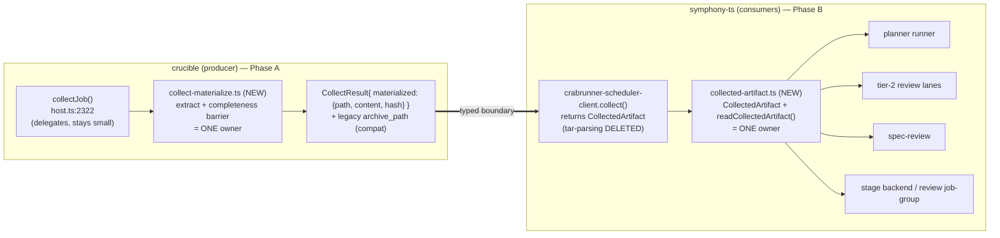

# refactor: Own crabrunner artifact materialization at the producer boundary

> **Product Contract preservation:** unchanged. This plan enriches the design brief (`docs/design-briefs/2026-07-05-crabrunner-artifact-materialization-boundary.md`); no product-scope change.
> **Cross-repo:** Phase A lands in **crucible** (paths under `crabrunner/`, `docs/`), Phase B in **symphony-ts** (paths under `src/`). Each unit names its repo. All paths are repo-relative to their own repo.

---

## Summary

The crabrunner `collect` boundary hands consumers a **raw, unextracted `.tar` path with no completeness guarantee**. As a result, ≥4 symphony files independently re-parse crucible's tar (512-byte headers) with their own weak `size>0` readiness checks. The tier-2 plan-review lane reads its artifact before materialization completes, so **valid** model reviews (`## Verdict`/`## Findings` present on disk) are read as empty and rejected `invalid_artifact` → the review degrades to no verdict.

Fix (**Fork A**): the **crucible producer** extracts and materializes the artifact behind a completeness barrier and returns a **typed, complete `CollectedArtifact`**. Symphony **deletes all hand-tar-parsing** and consumes that artifact through **one owner module per repo**. The result is a net-negative-LOC refactor with a single owner and a root fix for every consumer (planner, review lanes, spec-review, stage execution). **Anti-ballooning is a first-class requirement**, enforced by a mechanical guard test so this responsibility can never re-scatter.

---

## Problem Frame

- **Producer returns a raw reference, not an artifact.** Crucible `collect` (`crabrunner/src/host.ts:2322-2355`; `CollectResult` in `crabrunner/src/types.ts:159`) creates a `.tar` via `spawnSync("tar", -cf …)` and returns its **path** — no extraction, no stat/completeness barrier, no documented contract. Crucible has zero tar-extraction anywhere.
- **The responsibility is unowned, so consumers re-solve it.** Symphony hand-parses the tar in `src/stage-execution/crabrunner-scheduler-client.ts:1358-1414` and re-implements "refs → readable artifact" in `src/claude-runner/crabrunner-claude-runner.ts:591-690`, `src/review/crabrunner-review-job-group.ts`, `src/stage-execution/crabrunner-backend.ts`, `src/agent/spec-fidelity.ts`, `src/cli/spec-review-watch.ts` — each with its own `size>0` readiness heuristic.
- **The weakest heuristic loses a race.** `isReadableTextArtifact` (`crabrunner-claude-runner.ts:645`) accepts any `size>0` file, then `validateClaudeArtifact` (`:324`) reads it before the cross-host artifact is fully materialized → "missing `## Verdict`".
- **Confirmed 2026-07-05 (validity2 run):** opus and codex review lanes both *succeeded* (`state: succeeded`, exit 0) and wrote valid `## Verdict`/`## Findings` artifacts on disk, yet both were rejected `invalid_artifact` and the tier-2 record came back `aggregateVerdict: degraded`. Not model-specific, not a format problem — a materialization race against an unowned boundary.
- **Why this keeps recurring:** with no single owner, every fix patches one caller and grows an already-large file (`host.ts` ~2300 LOC, `crabrunner-scheduler-client.ts` ~1400 LOC). This is the band-aid/god-file engine the effort must stop.

---

## Requirements

- **R1** — `collect` returns a **complete, materialized artifact** (guaranteed fully written before return), not a raw archive path. (crucible)
- **R2** — Artifact extraction/materialization/read exists in **exactly one owner module per repo**; no other file parses tar bytes or applies its own readiness heuristic.
- **R3** — Symphony consumers depend only on a typed `CollectedArtifact` interface — never on archive/tar internals.
- **R4** — All hand-tar-parsing and per-caller materialization in symphony is **deleted** (net-negative symphony LOC).
- **R5** — A **mechanical guard test** in each repo fails if tar-parsing primitives (`parseTarString`, raw 512-byte tar-header reads, `tar -x`, `readFile(*.tar)`) appear **outside** the owner module.
- **R6** — **No touched existing file grows**; new modules are small (≤ ~150 LOC); `host.ts` and `crabrunner-scheduler-client.ts` shrink or hold.
- **R7** — The tier-2 plan-review returns a real `PASS`/`CHANGES_REQUESTED` (not `degraded`) on a re-run of the validity check.
- **R8** — The collect artifact contract is **documented** (crucible operator runbook).
- **R9** — Phase A (crucible) is **backward-compatible** during rollout so symphony can migrate without a lockstep deploy.

---

## Key Technical Decisions

### KTD1 — Fork A: the producer owns materialization
Crucible extracts + materializes behind a completeness barrier and returns a complete artifact. **Rejected alternative (Fork B):** keep the tar + add a completeness barrier only. B fixes the race but leaves every consumer parsing tars — it does not remove the duplication or shrink the files, so it fails R4/R6. A is the only option that makes the change net-subtractive.

### KTD2 — `CollectedArtifact` typed contract (the seam)
A discriminated union that consumers depend on instead of refs/tars:
```
type CollectedArtifact =
  | { status: "ready";   jobId; path: string /* guaranteed-complete local */; content: string; hash: string }
  | { status: "missing" | "empty"; jobId; reason: string }
```
`content` is read once, at the boundary. Downstream validation operates on `content` (a string), never a path.

### KTD3 — One owner module per repo; never inline into the god-files
- crucible: **new** `crabrunner/src/collect-materialize.ts` — `collectJob()` (`host.ts:2322`) calls it in a few lines; extraction is never inlined into `host.ts`.
- symphony: **new** `src/stage-execution/collected-artifact.ts` — the `CollectedArtifact` type + `readCollectedArtifact()`; `crabrunner-scheduler-client.ts` delegates, never inlines.

### KTD4 — Mechanical guard test (anti-re-scatter)
Each repo ships a test that greps its own source and **fails** if `parseTarString`, raw 512-byte tar-header reads, `tar -x`/`tar --extract`, or `readFile(<...>.tar)` appear outside the one owner module. This is the tripwire that prevents the exact re-duplication that caused the bug. It lands in the **same** change that introduces the owner.

### KTD5 — File-size budget, deletion-first
New modules ≤ ~150 LOC. No touched existing file may grow; symphony net diff LOC must be **negative**. Introduce the owner and delete the duplicates in the **same** PR so duplication never coexists with the new seam. Enforced by the diff-size assertion in U8 / the CI diff gate where available; otherwise asserted in the PR body.

### KTD6 — Sequencing + backward compatibility
Phase A (crucible) lands first and is **additive/versioned**: `CollectResult` gains materialized fields while keeping the existing `archive_path` so current consumers keep working. Phase B (symphony) migrates onto the materialized fields, then the legacy path can be retired in a later cleanup (deferred).

### KTD7 — `validateClaudeArtifact` takes content, not a path
Refactor the validator (defined today in `src/claude-runner/cmux-claude-runner.ts`, imported by `crabrunner-claude-runner.ts:32`) to accept the artifact **string**. This makes validation pure, race-free, and unit-testable, and removes the last place a consumer reads a racing path.

---

## High-Level Technical Design



**Before:** each consumer independently parses the tar and guesses readiness (race-prone, duplicated). **After:** crucible returns a complete artifact; symphony reads it through one owner; consumers never touch archive internals. The dashed-red intent: the per-caller `materialize*`/`extractArtifactFromTar`/`parseTarString`/`isReadableTextArtifact` blocks are removed.

---

## Implementation Units

### Phase A — crucible (Linear team MOB); lands first

### U1. crucible: `collect-materialize` owner module (extract + completeness barrier)
- **Repo:** crucible
- **Goal:** One module that turns a completed job's collect archive into a fully-materialized, guaranteed-complete artifact descriptor.
- **Requirements:** R1, R2, R6, R9
- **Dependencies:** none
- **Files:** `crabrunner/src/collect-materialize.ts` (new, ≤150 LOC); `crabrunner/src/collect-materialize.test.ts` (new)
- **Approach:** Extract the `.tar` (the existing collect archive) to a stable local path (e.g. `<stateRoot>/collected/<jobId>/`). Apply a **completeness barrier** before returning — the artifact must be fully materialized (stat-stable size / hash-verified against the recorded `artifactHashes`), not merely present. Return a typed descriptor `{ status: "ready" | "missing" | "empty", path, content, hash, reason }`. The exact cross-host materialization mechanism (whether the archive must be synced from the crabbox worker first) is an execution-time detail — the barrier's contract is "do not return `ready` until the artifact bytes are final."
- **Patterns to follow:** existing crucible tar creation `host.ts:2305-2320`; hash recording in the terminal evidence.
- **Test scenarios:**
  - Happy: archive containing a `/artifact/*.md` entry → `ready` with full `content` + matching `hash`.
  - Edge: archive with no artifact entry → `missing` (typed), not a throw.
  - Edge: zero-length / whitespace-only artifact entry → `empty` (typed).
  - Error/race: truncated or still-being-written archive → barrier does **not** return `ready` (returns `missing`/`empty` or waits per the barrier contract); never returns partial content. This is the regression that reproduces the 2026-07-05 defect at the producer.
- **Verification:** unit tests pass; module ≤150 LOC; no tar logic added to `host.ts`.

### U2. crucible: extend `CollectResult`; `collectJob` delegates to the owner
- **Repo:** crucible
- **Goal:** Expose the materialized artifact on the collect contract without growing `host.ts` or breaking existing callers.
- **Requirements:** R1, R6, R9
- **Dependencies:** U1
- **Files:** `crabrunner/src/types.ts` (extend `CollectResult`, ~:159); `crabrunner/src/host.ts` (`collectJob` ~:2322 — delegate to U1 in a few lines); `crabrunner/src/host.test.ts` (or existing collect test) update
- **Approach:** Add `materialized: { path, content, hash } | null` (or the `CollectedArtifact` shape) to `CollectResult`, populated by calling U1. **Keep `archive_path`** for backward compatibility (KTD6/R9). `collectJob` gains only a call + assignment — net LOC in `host.ts` must not increase (extraction lives in U1).
- **Patterns to follow:** existing `CollectResult` construction in `host.ts:2338`.
- **Test scenarios:**
  - Happy: a succeeded job's `collect` returns `materialized.status = ready` with content, and `archive_path` still present.
  - Edge: a job with no artifact → `materialized.status = missing`, `archive_path` still present (compat).
  - Integration: an existing consumer that reads `archive_path` still works unchanged (proves additive/versioned).
- **Verification:** crucible suite green; `host.ts` net LOC ≤ prior.

### U3. crucible: document the contract + crucible guard test
- **Repo:** crucible
- **Goal:** Make the collect artifact contract explicit and lock the owner boundary.
- **Requirements:** R5, R8
- **Dependencies:** U1, U2
- **Files:** `docs/crabrunner-operator-runbook.md` (document collect artifact completeness + materialization contract); `crabrunner/src/collect-materialize.guard.test.ts` (new guard)
- **Approach:** Document that `collect` returns a materialized artifact behind a completeness barrier, and that extraction lives only in `collect-materialize.ts`. Guard test fails if tar-extraction primitives (`tar -x`, `tar --extract`, raw tar-header parsing) appear outside `collect-materialize.ts`.
- **Test scenarios:** guard passes on current tree; guard fails when a tar-extraction call is introduced into another file (proven with a fixture or an inline synthetic).
- **Verification:** runbook section present; guard green.

### Phase B — symphony-ts (Linear team SYMPH); after Phase A is available

### U4. symphony: `collected-artifact` owner module (the single reader)
- **Repo:** symphony-ts
- **Goal:** One symphony module owning the `CollectedArtifact` type + the sole artifact-read path.
- **Requirements:** R2, R3
- **Dependencies:** U2 (consumes crucible's materialized fields)
- **Files:** `src/stage-execution/collected-artifact.ts` (new, ≤150 LOC); `tests/stage-execution/collected-artifact.test.ts` (new)
- **Approach:** Define `CollectedArtifact` (KTD2). `readCollectedArtifact(collectResult)` maps crucible's materialized fields → `CollectedArtifact`. **No tar parsing** — it reads the guaranteed-complete `content`/`path` crucible provides. Typed absence for missing/empty.
- **Patterns to follow:** the discriminated-result style already used in `crabrunner-scheduler-client.ts` return types.
- **Test scenarios:**
  - Happy: materialized ready result → `{ status: "ready", content, path, hash }`.
  - Edge: missing/empty materialized result → typed `missing`/`empty`.
  - Error: malformed/absent materialized fields (pre-migration crucible) → typed `missing` with a clear reason (graceful during rollout).
- **Verification:** unit tests pass; module ≤150 LOC.

### U5. symphony: scheduler client returns `CollectedArtifact`; delete its tar-parsing
- **Repo:** symphony-ts
- **Goal:** The single crucible-facing seam returns the typed artifact; remove its hand-tar-parsing.
- **Requirements:** R3, R4, R6
- **Dependencies:** U4
- **Files:** `src/stage-execution/crabrunner-scheduler-client.ts` (delegate `collect()` to U4; **delete** the tar-parsing at `:1358-1414` and the `collectRemoteRunEvidence` ref-massaging that only fed it); `tests/stage-execution/crabrunner-scheduler-client.test.ts` (update)
- **Approach:** `collect()` returns `CollectedArtifact` via `readCollectedArtifact`. Remove `findTarEntryText`/`parseTarString`/512-byte header code. File LOC must drop.
- **Test scenarios:**
  - Happy: `collect()` on a ready job → `CollectedArtifact.ready` with content.
  - Edge: missing artifact → typed `missing`.
  - Guard-adjacent: no tar-parsing symbols remain in this file (covered mechanically in U8).
- **Verification:** file net LOC negative; scheduler tests green.

### U6. symphony: claude-runner consumes `CollectedArtifact`; delete materializer; validate on content
- **Repo:** symphony-ts
- **Goal:** Remove the racing read that caused the review degradation.
- **Requirements:** R3, R4, R7, KTD7
- **Dependencies:** U4, U5
- **Files:** `src/claude-runner/crabrunner-claude-runner.ts` (**delete** `materializeCrabrunnerArtifact`/`extractArtifactFromTar`/`parseTarString`/`isReadableTextArtifact` at `:591-690`; consume `CollectedArtifact` from the scheduler seam); `src/claude-runner/cmux-claude-runner.ts` (refactor `validateClaudeArtifact` to accept `content: string`); `tests/claude-runner/crabrunner-claude-runner.test.ts` + `tests/claude-runner/*validate*` (update)
- **Approach:** The runner reads the `CollectedArtifact.content` (already complete) and calls `validateClaudeArtifact(content, …)`. No path reads, no tar. `validateClaudeArtifact` becomes a pure string function.
- **Execution note:** Add a **regression test first** that reproduces the validity2 defect — a valid `## Verdict`/`## Findings` string validates to no errors — so the fix is proven against the exact failure.
- **Test scenarios:**
  - Covers R7. Regression: a valid `## Verdict\nPASS\n\n## Findings` content string → zero validation errors (this is the exact artifact opus/codex produced on 2026-07-05).
  - Happy: `CollectedArtifact.ready` → runner returns the validated review, `status` reviewed.
  - Edge: `missing`/`empty` artifact → runner surfaces a typed unavailable result (not a false "invalid format").
  - Error: content present but genuinely malformed (no `## Verdict`) → real validation error (proves the validator still catches true failures).
- **Verification:** file net LOC negative; the false-`invalid_artifact` path is gone.

### U7. symphony: collapse remaining consumers onto the owner
- **Repo:** symphony-ts
- **Goal:** Every other crabrunner-artifact consumer reads through `readCollectedArtifact`.
- **Requirements:** R2, R3, R4
- **Dependencies:** U4
- **Files:** `src/review/crabrunner-review-job-group.ts`, `src/stage-execution/crabrunner-backend.ts`, `src/agent/spec-fidelity.ts`, `src/cli/spec-review-watch.ts` (replace per-caller ref-resolution/tar-reading with `readCollectedArtifact`); their existing tests updated
- **Approach:** Swap each consumer's bespoke "resolve a ref into a parsed artifact" onto the one owner. Preserve each consumer's existing fail-closed/degraded policy semantics (they decide what to do with a `missing`/`empty` artifact; they no longer decide *how* to read it).
- **Test scenarios:**
  - Per consumer, happy: ready artifact flows through unchanged behavior.
  - Per consumer, edge: `missing`/`empty` preserves that consumer's existing degraded/fail-closed policy.
  - Integration (review job-group): a succeeded lane with a complete artifact yields a parsed review (no false "malformed").
- **Verification:** each touched file net LOC ≤ prior; suites green.

### U8. symphony: guard test + size gate + live validity re-run
- **Repo:** symphony-ts
- **Goal:** Lock the owner boundary mechanically and prove the end-to-end fix.
- **Requirements:** R5, R6, R7
- **Dependencies:** U5, U6, U7
- **Files:** `tests/stage-execution/no-tar-parsing-outside-owner.test.ts` (new guard); PR checklist/CI note for the net-LOC gate
- **Approach:** Guard test greps `src/` and fails if `parseTarString`, raw 512-byte tar-header reads, `tar -x`, or `readFile(<…>.tar)` appear outside `src/stage-execution/collected-artifact.ts`. Assert symphony net diff LOC is negative (PR body / CI diff gate). Then re-run the live validity check (`symphony-manager-plan --project 9c1064215e8d --state Backlog --planner-grounding --persist` against a fresh build on the crabrunner host) and confirm the tier-2 record is `reviewed` with a real `PASS`/`CHANGES_REQUESTED`, **not** `degraded`.
- **Test scenarios:**
  - Guard passes on the final tree; guard fails on a synthetic reintroduction of tar-parsing outside the owner.
  - E2E (manual/verification): tier-2 `aggregateVerdict` ∈ {PASS, CHANGES_REQUESTED}, `status: reviewed`, no `invalid_artifact` findings.
- **Verification:** guard green; net LOC negative; live review returns a real verdict.

---

## Scope Boundaries

**In scope:** the crucible collect materialization contract + completeness barrier (Phase A), and the symphony consumption + deletion of all hand-tar-parsing/materialization (Phase B), with guard tests both sides.

### Deferred to Follow-Up Work
- Retiring the legacy `archive_path` from `CollectResult` after all consumers migrate (KTD6 keeps it for compat).
- Broader decomposition of `host.ts` / `crabrunner-scheduler-client.ts` beyond what these units touch — related to SYMPH-947 (god-file decomposition); this plan only guarantees those files shrink or hold, it does not fully decompose them.
- The workspace-sync (reverse-sync) proof path, unless it shares the same tar seam.

### Ticket reshape (out of this plan's code, tracked separately)
- **Supersede SYMPH-1050** (retryOnInvalid) — a band-aid made unnecessary by the completeness barrier.
- **Fold SYMPH-1047 + SYMPH-1048** (collect archive path contract / collect lifecycle) into this effort — they describe exactly this boundary.

---

## Verification Contract

- **Behavioral:** the tier-2 plan-review returns a real `PASS`/`CHANGES_REQUESTED` (not `degraded`) on a re-run of the validity check (R7).
- **Structural:** symphony net diff LOC is **negative**; no touched existing file grows; `host.ts` and `crabrunner-scheduler-client.ts` shrink or hold (R6).
- **Boundary:** guard tests green in both repos; `rg` finds **zero** tar-parsing outside the one owner module per repo (R2, R5).
- **Suites:** crucible full suite green; symphony `pnpm typecheck && pnpm lint && pnpm test && pnpm build` green.
- **Compat:** an existing `archive_path` consumer still works after Phase A (R9).

## Definition of Done

- [ ] Crucible `collect` returns a materialized `CollectedArtifact` behind a completeness barrier; `archive_path` retained for compat; contract documented in the operator runbook.
- [ ] Extraction/materialization lives in exactly one owner module per repo; guard tests enforce it.
- [ ] All symphony hand-tar-parsing + per-caller materialization deleted; consumers read `CollectedArtifact` only; `validateClaudeArtifact` takes content.
- [ ] Symphony net LOC negative; no touched file grew; both suites green.
- [ ] Live validity re-run shows the tier-2 review `reviewed` with a real verdict.
- [ ] SYMPH-1050 superseded; SYMPH-1047/1048 folded; Phase-A (MOB) and Phase-B (SYMPH) tracked as the two sequenced tickets.

---

## Sources & Research

- Origin design brief: `docs/design-briefs/2026-07-05-crabrunner-artifact-materialization-boundary.md`.
- Evidence (validity2 run, 2026-07-05): valid opus/codex artifacts on disk rejected `invalid_artifact`; `crabrunner-claude-runner.ts:324` (validate), `:591` (materialize), `:645` (`size>0` gate).
- Crucible: `crabrunner/src/host.ts:2322-2355` (collect), `types.ts:159` (`CollectResult`), `paths.ts:79` (archive path), no extraction anywhere in `crabrunner/src`.
- Symphony duplication surface: `crabrunner-scheduler-client.ts:1358-1414`, `crabrunner-claude-runner.ts:591-690`, `crabrunner-review-job-group.ts`, `crabrunner-backend.ts`, `spec-fidelity.ts`, `spec-review-watch.ts`.
- Prior dogfood context: `docs/plans/2026-07-02-manager-plan-dogfood-runbook.md`.
