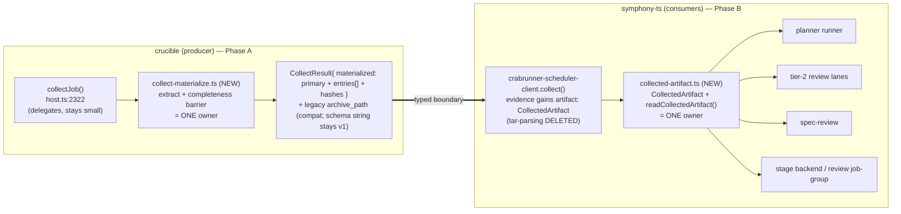

# refactor: Own crabrunner artifact materialization at the producer boundary

> **Product Contract preservation:** unchanged. This plan enriches the design brief (`docs/design-briefs/2026-07-05-crabrunner-artifact-materialization-boundary.md`); no product-scope change.
> **Cross-repo:** Phase A lands in **crucible** (paths under `crabrunner/`, `docs/`), Phase B in **symphony-ts** (paths under `src/`). Each unit names its repo. All paths are repo-relative to their own repo.

---

## Summary

The crabrunner `collect` boundary hands consumers a **raw, unextracted `.tar` path with no completeness guarantee**. As a result, ≥4 symphony files independently re-parse crucible's tar (512-byte headers) with their own weak `size>0` readiness checks. The tier-2 plan-review lane reads its artifact before materialization completes, so **valid** model reviews (`## Verdict`/`## Findings` present on disk) are read as empty and rejected `invalid_artifact` → the review degrades to no verdict.

Fix (**Fork A**): the **crucible producer** extracts and materializes the artifact behind a completeness barrier and returns a **typed, complete `CollectedArtifact`**. Symphony **deletes all hand-tar-parsing** and consumes that artifact through **one owner module per repo**. The result is a net-negative-LOC refactor with a single owner and a root fix for every consumer (planner, review lanes, spec-review, stage execution). **Anti-ballooning is a first-class requirement**, enforced by a mechanical guard test so this responsibility can never re-scatter.

---

## Problem Frame

- **Producer returns a raw reference, not an artifact.** Crucible `collect` (`crabrunner/src/host.ts:2322-2355`; `CollectResult` in `crabrunner/src/types.ts:159`) creates a `.tar` via `spawnSync("tar", -cf …)` and returns its **path** — no extraction, no stat/completeness barrier, no documented contract. Crucible has zero *collect-artifact* extraction (its workspace-materialization scripts do run `tar -xzf` for `workspace.tgz` — `client.ts:1271,1331,1413` — a separate, legitimate surface the U3 guard must allowlist).
- **The responsibility is unowned, so consumers re-solve it.** Symphony hand-parses the tar in `src/stage-execution/crabrunner-scheduler-client.ts:1358-1414` and re-implements "refs → readable artifact" in `src/claude-runner/crabrunner-claude-runner.ts:591-690`, `src/review/crabrunner-review-job-group.ts` (+ its dispatcher, `src/review/crabrunner-review-dispatcher.ts:320-369`), `src/stage-execution/crabrunner-backend.ts`, `src/agent/spec-fidelity.ts` — each with its own `size>0`/try-read readiness heuristic. (`spec-review-watch.ts` was initially miscounted in this list — verified: its only read is a workspace source doc, no artifact read.)
- **The weakest heuristic loses a race.** `isReadableTextArtifact` (`crabrunner-claude-runner.ts:645`) accepts any `size>0` file, then `validateClaudeArtifact` (`:324`) reads it before the cross-host artifact is fully materialized → "missing `## Verdict`".
- **Confirmed 2026-07-05 (validity2 run):** opus and codex review lanes both *succeeded* (`state: succeeded`, exit 0) and wrote valid `## Verdict`/`## Findings` artifacts on disk, yet both were rejected `invalid_artifact` and the tier-2 record came back `aggregateVerdict: degraded`. Not model-specific, not a format problem — a materialization race against an unowned boundary.
- **Why this keeps recurring:** with no single owner, every fix patches one caller and grows an already-large file (`host.ts` ~2300 LOC, `crabrunner-scheduler-client.ts` ~1400 LOC). This is the band-aid/god-file engine the effort must stop.

---

## Requirements

- **R1** — `collect` returns a **complete, materialized artifact** (guaranteed fully written before return), not a raw archive path. (crucible)
- **R2** — Artifact extraction/materialization/read exists in **exactly one owner module per repo**; no other file parses tar bytes or applies its own readiness heuristic.
- **R3** — Symphony consumers depend only on a typed `CollectedArtifact` interface — never on archive/tar internals.
- **R4** — All hand-tar-parsing and per-caller materialization in symphony is **deleted** (net-negative symphony LOC).
- **R5** — A **mechanical guard test** in each repo fails if tar-parsing primitives (`parseTarString`, raw 512-byte tar-header reads, `tar -x`, `readFile(*.tar)`) appear **outside** the owner module.
- **R6** — **No touched existing file grows**; new modules are small (**U1's owner `collect-materialize.ts` ≤ ~250 LOC** — it absorbs extraction + barrier + hardening + cap by design; **all other new modules ≤ ~150 LOC**); `host.ts` and `crabrunner-scheduler-client.ts` shrink or hold.
- **R7** — The tier-2 plan-review returns a real `PASS`/`CHANGES_REQUESTED` (not `degraded`) on a re-run of the validity check.
- **R8** — The collect artifact contract is **documented** (crucible operator runbook).
- **R9** — Phase A (crucible) is **backward-compatible** during rollout so symphony can migrate without a lockstep deploy.
- **R10** — **Archive-entry hardening** at extraction (crucible): materialize only regular-file entries; reject any entry whose normalized name is absolute or resolves outside the extraction root; never create symlink/hardlink/device entries; `lstat`-verify the artifact is a regular file before reading `content`.

---

## Key Technical Decisions

### KTD1 — Fork A: the producer owns materialization
Crucible extracts + materializes behind a completeness barrier and returns a complete artifact. **Rejected alternative (Fork B):** keep the tar + add a completeness barrier only. B fixes the race but leaves every consumer parsing tars — it does not remove the duplication or shrink the files, so it fails R4/R6. A is the only option that makes the change net-subtractive.

### KTD2 — `CollectedArtifact` typed contract (the seam)
A discriminated union that consumers depend on instead of refs/tars. **Entry-aware** — the collect archive is a multi-file evidence bundle (primary artifact + `*.usage.json` + spec-fidelity outputs + closeout/context JSONs), and real consumers select entries by name:
```
type CollectedArtifact =
  // `status` describes the PRIMARY artifact. `entries` rides EVERY arm — workers ALWAYS
  // write usage.json (even on failed/turn-capped lanes, where the .md fail-closes), so
  // usage/spec-fidelity entries must survive an absent or withheld primary.
  | { status: "ready"; jobId;
      primary: { name: string; content: string; hash: string };
      entries: CollectedEntry[];
      producerPath: string /* producer-host extraction dir — DIAGNOSTIC ONLY (remote for ssh lanes) */ }
  | { status: "oversize"; jobId; primary: { name: string; hash: string; bytes: number }; entries: CollectedEntry[]; reason: string } // the PRIMARY itself exceeded the cap
  | { status: "missing" | "empty"; jobId; entries: CollectedEntry[]; reason: string } // reasons: artifact_lost_after_terminal / job_produced_nothing / producer_predates_materialization

type CollectedEntry =
  | { name: string; content: string; hash: string }
  | { name: string; hash: string; bytes: number; contentWithheld: true } // over-cap sibling: metadata only
```
**Primary-selection policy (documented; matches today's `extractArtifactFromTar`):** first `/artifact/*.md|.txt` entry, excluding `*.usage.json`. **`content`/`hash` are the authoritative cross-host fields** — read once at the boundary; downstream validation operates on `content` (a string), never a path. `producerPath` is diagnostic only: for ssh lanes `collect` executes on the remote crabbox host, so the extraction dir is a REMOTE path a symphony consumer cannot read — consumers MUST never dereference it (the U8 guard flags it). **Size discipline:** an over-cap *sibling* is marked `contentWithheld` (metadata stays in `entries`); result-level `oversize` is reserved for an over-cap *primary*. An **aggregate max-total-bytes** bounds the whole inlined payload (primary first, then entries in deterministic name order; the remainder withheld) — entry *count* is agent-controlled, so a per-entry cap alone cannot keep the summed collect JSON under the 16 MiB transport. **Liveness sidecars** (`*.progress.jsonl`, `*.heartbeat.json` — written into the artifact dir by the lane worker and growing with lane length) are excluded from inline content by default (metadata-only entries).

### KTD3 — One owner module per repo; never inline into the god-files
- crucible: **new** `crabrunner/src/collect-materialize.ts` — `collectJob()` (`host.ts:2322`) calls it in a few lines; extraction is never inlined into `host.ts`.
- symphony: **new** `src/stage-execution/collected-artifact.ts` — the `CollectedArtifact` type + `readCollectedArtifact()`; `crabrunner-scheduler-client.ts` delegates, never inlines.

### KTD4 — Mechanical guard test (anti-re-scatter)
Each repo ships a test that greps its own source and **fails** if `parseTarString`, raw 512-byte tar-header reads (including `512`/`0x200` block arithmetic over buffers), `tar -x`/`tar --extract`, `readFile(<...>.tar)`, `.tar` string literals, or tar-package imports (`"tar"`, `tar-stream`, `node-tar`) appear outside the one owner module. It lands in the **same** change that introduces the owner. **Honest framing:** the guard is best-effort defense-in-depth — a paraphrased reimplementation (e.g. `readFile(archivePath)` with the `.tar` literal at a distant join site, exactly today's code shape) evades token greps — so the one-owner rule is enforced by review + tripwire together, and dynamic-path readers (the review dispatcher) must be *converted and reviewed*, not merely grepped (see U7/U8).

### KTD5 — File-size budget, deletion-first
New modules ≤ ~150 LOC, with one honest carve-out: U1's `collect-materialize.ts` ≤ ~250 LOC (extraction + barrier + hardening + cap live there by design; an artificially low budget would force a mid-flight split of the one owner). No touched existing file may grow; symphony net diff LOC must be **negative**. Introduce the owner and delete the duplicates in the **same** PR so duplication never coexists with the new seam. Enforced by the diff-size assertion in U8 / the CI diff gate where available; otherwise asserted in the PR body.

### KTD6 — Sequencing + backward compatibility
Phase A (crucible) lands first and is **additive/versioned**: `CollectResult` gains materialized fields while keeping the existing `archive_path` so current consumers keep working. The `schema` string stays exactly `crucible.crabrunner.collect.v1` — symphony's `parseCollect` hard-rejects any other value (`crabrunner-scheduler-client.ts:836-838`) and its Zod schemas are `.passthrough()`, so the new fields ride the existing schema string additively and consumers feature-detect by field presence, never by schema-string comparison. Phase B (symphony) migrates onto the materialized fields, then the legacy path can be retired in a later cleanup (deferred).

### KTD7 — `validateClaudeArtifact` takes content, not a path
Refactor the validator (defined today in `src/claude-runner/cmux-claude-runner.ts`, imported by `crabrunner-claude-runner.ts:32`) to accept the artifact **string**. This makes validation pure, race-free, and unit-testable, and removes the last place a consumer reads a racing path.

### KTD8 — CMUX mirror integrity is contract-retired; Claude runner results move to v2

The CMUX same-stem mirror/freshness/remote-SHA contract is **retired**, not ported. It protected a transport that returned a remote path and relied on a separately copied local mirror. Crabrunner crosses the boundary through the materialization contract in KTD2: `CollectedArtifact.primary.content` is complete and its producer-owned hash/sha256 metadata is the integrity seam. Recreating the mirror block would duplicate that owner and violate R2–R4.

The persisted `ClaudeRunnerResult` contract is versioned to `schemaVersion: 2` and renames `cmuxSpawnBin` to `runnerBin`. No legacy-name tolerance is carried forward: live execution has already moved to crabrunner, no consumer reads the old field, and preserving it would encode a false transport name in new artifacts. Readers that need to ingest historical v1 result JSON must treat v1 as an archived format rather than reinterpret `cmuxSpawnBin` as a crabrunner path.

---

## High-Level Technical Design



**Before:** each consumer independently parses the tar and guesses readiness (race-prone, duplicated). **After:** crucible returns a complete artifact; symphony reads it through one owner; consumers never touch archive internals. The dashed-red intent: the per-caller `materialize*`/`extractArtifactFromTar`/`parseTarString`/`isReadableTextArtifact` blocks are removed.

---

## Implementation Units

### Phase A — crucible (Linear team MOB); lands first

### U1. crucible: `collect-materialize` owner module (extract + completeness barrier)
- **Repo:** crucible
- **Goal:** One module that turns a completed job's collect archive into a fully-materialized, guaranteed-complete artifact descriptor.
- **Requirements:** R1, R2, R6, R9
- **Dependencies:** none
- **Files:** `crabrunner/src/collect-materialize.ts` (new, ≤ ~250 LOC — see R6 carve-out); `crabrunner/tests/collect-materialize.test.ts` (new — under `crabrunner/tests/`, the `bun test tests` glob; a test under `src/` would never run)
- **Approach:** Extract the `.tar` (the existing collect archive) to the **reserved collect subpath** `<stateRoot>/materialized/<jobId>/collect/` — NOT the per-job root itself: `materialized/<jobId>/` is already the workspace-materialization tree (`workspace/`, `materialization.json`, sync proofs), pre-existing and non-empty for every ssh lane, so publishing to the root would hit `ENOTEMPTY` on exactly the lanes that matter. The subpath inherits the per-job prune lifecycle (`pruneState` removes `materialized/<jobId>` on terminal + collected + TTL) and `collectStateRootSizes` accounting. **Publish protocol:** extract into a **same-filesystem sibling temp** (`materialized/<jobId>/.collect.tmp-<nonce>` — same fs guarantees atomic rename, no `EXDEV`), verify, then atomically rename to `collect/`; republish is **idempotent** (existing dir replaced, or reused on matching archive hash — `collectJob` is destructively re-entrant today); orphaned `.collect.tmp-*` dirs fall under the same prune registration. **Producer-owned completeness barrier** — the verification input must exist on the producer side (do NOT verify against symphony's `artifactHashes`: those are post-hoc consumer hashes computed from the same possibly-racing downloaded file, and crucible records no artifact hash today): extract into a temp dir, verify each entry's byte count against its tar-header size, atomically rename into place, and have the materializer **compute and return each entry's sha256 itself** (per entry name — duplicate entries fail verification, never last-wins). The barrier never blocks indefinitely: truncated/incomplete input gets a bounded wait, then a typed non-`ready` status (timeout → `missing`; single-digit seconds suggested). **Derive `missing` reasons from producer-held terminal state** (`not_yet_synced` is NOT producer-observable: `collectJob` refuses non-terminal jobs and workers write the artifact dir directly on the producer host — there is no sync step to wait on): terminal status `complete` requires the artifact to have existed at terminal reconcile, so complete-but-absent-from-archive → `artifact_lost_after_terminal` (a producer-visible anomaly); every other terminal state → `job_produced_nothing`. **Entry hardening (R10):** materialize only regular-file entries; reject absolute or root-escaping names; never create symlink/hardlink/device entries; `lstat`-verify before reading `content`. Return the entry-aware descriptor (KTD2): `primary` + named `entries` + producer-diagnostic path.
- **Patterns to follow:** existing crucible tar creation `host.ts:2305-2320`; hash recording in the terminal evidence.
- **Test scenarios:**
  - Happy: archive containing a `/artifact/*.md` entry → `ready` with `primary.content` + materializer-computed `hash`; sibling `*.usage.json` exposed under `entries` by name.
  - Edge (failed lane): archive with `usage.json` and **no** `.md` (workers always write usage; the `.md` fail-closes) → `missing` WITH the usage entry present in `entries` — usage-ledger parity preserved.
  - Edge: well-formed archive with **no** artifact entry → `missing` with reason `artifact_lost_after_terminal` (terminal status was `complete`) vs `job_produced_nothing` (any other terminal state); not a throw.
  - Edge: zero-length / whitespace-only artifact entry → `empty` (typed); `entries` still carried.
  - Edge (cap): primary under cap + one sibling over cap → `ready`, primary content intact, sibling marked `contentWithheld`.
  - Edge (cap): PRIMARY over cap → result-level `oversize` (name/hash/bytes); `entries` still carried.
  - Edge (cap): many under-cap entries whose sum exceeds the aggregate cap → `ready`, primary first, overflow entries `contentWithheld`, total serialized size below the transport bound.
  - Edge (layout): per-job dir pre-exists with workspace-materialization content → publish to `collect/` succeeds without touching workspace files; a second collect of the same job (re-collect) succeeds idempotently.
  - Error/race: truncated or still-being-written archive → barrier does **not** return `ready`; never returns partial content; bounded wait then `missing`. This reproduces the 2026-07-05 defect's input condition in a unit fixture.
  - Adversarial (R10): entry named `../escape.md` or with an absolute path → typed non-`ready`; **no write lands outside the extraction root**.
  - Adversarial (R10): symlink entry → not materialized; `content` never read through a link (`lstat` proven).
  - Adversarial (R10): FIFO entry (`mkfifo` in the artifact dir survives `tar -cf`) → not materialized; no blocking read.
  - Adversarial (R10): hardlink entry → not created (the case `lstat` cannot catch — a hardlinked file IS a regular file; the never-create rule is the sole defense).
  - Adversarial (R10): duplicate entries under the same name → verification failure, not last-wins.
- **Verification:** unit tests pass (incl. all adversarial-entry scenarios); module ≤ ~250 LOC (R6 carve-out); no tar logic added to `host.ts`.

### U2. crucible: extend `CollectResult`; `collectJob` delegates to the owner
- **Repo:** crucible
- **Goal:** Expose the materialized artifact on the collect contract without growing `host.ts` or breaking existing callers.
- **Requirements:** R1, R6, R9
- **Dependencies:** U1
- **Files:** `crabrunner/src/types.ts` (extend `CollectResult`, ~:159); `crabrunner/src/host.ts` (`collectJob` ~:2322 — delegate to U1 in a few lines); `crabrunner/tests/host.test.ts` (the existing suite location under the `bun test tests` glob) update
- **Approach:** Add `materialized: <KTD2 entry-aware shape> | null` to `CollectResult`, populated by calling U1; `null`/absent (pre-migration producer) is **defined**: symphony's U4 maps it to typed `missing` with reason `producer_predates_materialization`. Enforce a **configurable max-content-bytes cap** at materialization (mirroring the `WORKSPACE_SYNC_ARTIFACT_MAX_READ_BYTES` typed too-large precedent), sized well under symphony's 16 MiB execFile stdout buffer (`crabrunner-scheduler-client.ts:103`) and crucible's 20 MiB remote capture — over-cap *siblings* are marked `contentWithheld` (metadata only), an over-cap *primary* returns the result-level `oversize` arm, and an **aggregate max-total-bytes** bounds the whole payload (primary-first inclusion; liveness sidecars excluded from inline content — see KTD2). **Transport rationale (recorded):** inline-JSON content over the existing collect stdout channel was chosen over extending the crabbox `downloads` channel because it needs no new transfer machinery and review artifacts are KB-scale; the cap bounds the worst case. **Keep `archive_path`** for backward compatibility (KTD6/R9), and keep the `schema` string exactly `crucible.crabrunner.collect.v1` — new fields are additive under the existing schema string (see KTD6). `collectJob` gains only a call + assignment — net LOC in `host.ts` must not increase (extraction lives in U1).
- **Patterns to follow:** existing `CollectResult` construction in `host.ts:2338`.
- **Test scenarios:**
  - Happy: a succeeded job's `collect` returns `materialized.status = ready` with content, and `archive_path` still present.
  - Edge: a job with no artifact → `materialized.status = missing`, `archive_path` still present (compat).
  - Integration: an existing consumer that reads `archive_path` still works unchanged (proves additive/versioned).
- **Verification:** crucible suite green; `host.ts` net LOC ≤ prior.

### U3. crucible: document the contract + crucible guard test
- **Repo:** crucible
- **Goal:** Make the collect artifact contract explicit and lock the owner boundary.
- **Requirements:** R5, R8
- **Dependencies:** U1, U2
- **Files:** `docs/crabrunner-operator-runbook.md` (document collect artifact completeness + materialization contract); `crabrunner/tests/collect-materialize.guard.test.ts` (new guard — under `crabrunner/tests/` so it actually runs)
- **Approach:** Document that `collect` returns a materialized artifact behind a completeness barrier, and that extraction lives only in `collect-materialize.ts`. Guard test is **scoped to collect-archive extraction** and uses KTD4's full token set (`parseTarString`, raw tar-header parsing incl. `512`/`0x200` arithmetic, `tar -x`/`tar --extract`, `readFile(*.tar)`, `.tar` string literals, tar-package imports) outside `collect-materialize.ts`, with an explicit **allowlist for the legitimate workspace-materialization `tar -xzf` blocks** (`client.ts:1271,1331,1413` — `workspace.tgz` handling, a different subsystem).
- **Test scenarios:** guard passes on current tree; guard fails when a tar-extraction call is introduced into another file (proven with a fixture or an inline synthetic).
- **Verification:** runbook section present; guard green.

### Phase B — symphony-ts (Linear team SYMPH); after Phase A is available

### U4. symphony: `collected-artifact` owner module (the single reader)
- **Repo:** symphony-ts
- **Goal:** One symphony module owning the `CollectedArtifact` type + the sole artifact-read path.
- **Requirements:** R2, R3
- **Dependencies:** U2 (consumes crucible's materialized fields)
- **Files:** `src/stage-execution/collected-artifact.ts` (new, ≤150 LOC); `tests/stage-execution/collected-artifact.test.ts` (new)
- **Approach:** Define `CollectedArtifact` (KTD2, entry-aware). `readCollectedArtifact(collectResult)` maps crucible's materialized entry set → `CollectedArtifact` (`primary` + named `entries`). **No tar parsing and no path reads** — `content`/`hash` are authoritative; `producerPath` is never dereferenced (remote for ssh lanes). Typed absence for missing/empty; `null`/absent materialized (pre-migration crucible) → typed `missing` with reason `producer_predates_materialization`. **All arms carry `entries`** (usage stays reachable when the primary is absent or withheld); consumers thread `oversize`/`contentWithheld` through their existing unavailable/degraded paths.
- **Patterns to follow:** the discriminated-result style already used in `crabrunner-scheduler-client.ts` return types.
- **Test scenarios:**
  - Happy: materialized ready result → `{ status: "ready", primary, entries }` with the usage entry accessible by name.
  - Edge: missing/empty materialized result → typed `missing`/`empty` (reasons preserved).
  - Edge (remote lane): `producerPath` points at a nonexistent local path → reader still returns `ready` from `content`; nothing dereferences the path.
  - Edge: crucible `oversize` materialized result → symphony `{ status: "oversize" }` with name/hash/bytes preserved; `entries` intact.
  - Error: malformed/absent materialized fields (pre-migration crucible) → typed `missing` with reason `producer_predates_materialization` (graceful during rollout).
- **Verification:** unit tests pass; module ≤150 LOC.

### U5. symphony: scheduler client returns `CollectedArtifact`; delete its tar-parsing
- **Repo:** symphony-ts
- **Goal:** The single crucible-facing seam returns the typed artifact; remove its hand-tar-parsing.
- **Requirements:** R3, R4, R6
- **Dependencies:** U4
- **Files:** `src/stage-execution/crabrunner-scheduler-client.ts` (thread the materialized artifact through `collect()`; **delete** the tar-parsing at `:1358-1414`); `tests/stage-execution/crabrunner-scheduler-client.test.ts` (update)
- **Approach:** `collect()` **keeps returning `CrabrunnerTerminalEvidence`** (state/usage/message/progress/process consumers unchanged); the evidence **gains `artifact: CollectedArtifact`** in place of `artifactRefs`/`artifactHashes`, with both the local `parseCollect` branch and the remote `collectRemoteRunEvidence` branch mapping through `readCollectedArtifact`. (`CrabrunnerTerminalEvidence` is **symphony-internal** — the field swap is atomic within the Phase-B PR, every evidence consumer updated in U6/U7; wire-level compat (KTD6/R9) is unaffected. The workspace-sync ref that rode `artifactRefs` moves to a dedicated `workspaceSyncRef` evidence field.) `readUsageFromCollectArchive` (`:972-1012` — the sole `findTarEntryText` consumer; it feeds the token-usage ledger from `/artifact/*.usage.json`) is **rewired onto the named usage entry** in `artifact.entries` — signature unchanged, only its internals swap to a named-entry lookup; the usage entry is present on non-`ready` arms too (KTD2), so telemetry must not regress on failed lanes. Then remove `findTarEntryText`/`parseTarString`/512-byte header code, and **delete the `${runResult.job_id}.tar` presence-check block** (`:702-711`) — the archive-missing signal derives from `artifact.status` instead — so zero `.tar` string literals remain outside the owner (U8 guard). File LOC must drop.
- **Test scenarios:**
  - Happy: `collect()` on a ready job → evidence carries `artifact.status = "ready"`; `readUsageFromCollectArchive` sources from the named usage entry (ledger parity proven).
  - Edge: missing artifact → typed `missing` (reason preserved).
  - Guard-adjacent: no tar-parsing symbols remain in this file (covered mechanically in U8).
- **Verification:** file net LOC negative; scheduler tests green.

### U6. symphony: claude-runner consumes `CollectedArtifact`; delete materializer; validate on content
- **Repo:** symphony-ts
- **Goal:** Remove the racing read that caused the review degradation.
- **Requirements:** R3, R4, R7, KTD7
- **Dependencies:** U4, U5
- **Files:** `src/claude-runner/crabrunner-claude-runner.ts` (**delete** `materializeCrabrunnerArtifact`/`extractArtifactFromTar`/`parseTarString`/`isReadableTextArtifact` at `:591-690`; consume `CollectedArtifact` from the scheduler seam); `src/claude-runner/cmux-claude-runner.ts` (refactor `validateClaudeArtifact` to accept `content: string`); `tests/claude-runner/crabrunner-claude-runner.test.ts` (**receives the validity2 regression case** + `CollectedArtifact`-consumption tests); `tests/claude-runner/cmux-claude-runner.test.ts` (validator-signature tests live here, with `validateClaudeArtifact`)
- **Approach:** The runner reads the `CollectedArtifact.content` (already complete) and calls `validateClaudeArtifact(content, …)`. No tar, no racing path reads. **The runner then persists `content` to `artifactDir/<artifactName>.md` (a plain local write of complete bytes) and keeps `ClaudeRunnerResult.artifactPath` non-null** — downstream consumers re-read that file after the runner returns (`plan-review-lanes.ts:256`, `triage-planner.ts:1656`, `spec-review.ts:1170`) and must keep working unchanged. `validateClaudeArtifact` becomes a pure string function.
- **Execution note:** Add a **regression test first, at the runner boundary** — terminal evidence whose `CollectedArtifact` is `ready` with the exact 2026-07-05 `## Verdict`/`## Findings` content must produce a reviewed runner result with **zero `invalid_artifact` findings**. This test *fails* against the old artifactRefs/path-read flow and passes after U6. (A string-level validator test alone would only compile after the KTD7 signature change and then pass tautologically — the validity2 string never reached the validator; the race was upstream.)
- **Test scenarios:**
  - Covers R7. Regression (runner boundary): ready `CollectedArtifact` carrying the exact 2026-07-05 `## Verdict\nPASS\n\n## Findings` content → reviewed result, zero `invalid_artifact` findings (fails on the pre-fix path-read flow).
  - Happy: `CollectedArtifact.ready` → runner returns the validated review, `status` reviewed; `artifactPath` file exists with the persisted content.
  - Edge: `missing`/`empty`/`oversize` artifact → runner surfaces a typed unavailable result (not a false "invalid format").
  - Error: content present but genuinely malformed (no `## Verdict`) → real validation error (proves the validator still catches true failures).
- **Verification:** file net LOC negative; the false-`invalid_artifact` path is gone.

### U7. symphony: collapse remaining consumers onto the owner
- **Repo:** symphony-ts
- **Goal:** Every other crabrunner-artifact consumer reads through `readCollectedArtifact`.
- **Requirements:** R2, R3, R4
- **Dependencies:** U4, U5
- **Files:** `src/review/crabrunner-review-job-group.ts`; `src/review/crabrunner-review-dispatcher.ts` (**the actual council-review reader** — `collectReviewerArtifact`/`readArtifactRef` at `:320-369` iterate `laneEvidence.artifactRefs` with a try-readFile readiness heuristic; convert onto the owner — its dynamic `readFile(path)` evades the U8 grep, so this conversion is verified by review, not grep); `src/stage-execution/crabrunner-backend.ts`; `src/agent/spec-fidelity.ts` (multi-entry selection — `spec-fidelity.json`/`.md`/all `/artifact/*.json` — moves onto named `entries`); `src/spec-review/spec-review.ts` (`:1170` — reads the runner-result `artifactPath` file, which stays valid once U6 persists complete content; **rescoped to verify-only**, no owner conversion needed — it holds a `ClaudeRunnerResult`, not scheduler evidence; `spec-review-watch.ts` has no artifact-read path and drops out entirely); their existing tests updated
- **Approach:** Swap each consumer's bespoke "resolve a ref into a parsed artifact" onto the one owner. Preserve each consumer's existing fail-closed/degraded policy semantics (they decide what to do with a `missing`/`empty`/`oversize`/`contentWithheld` artifact; they no longer decide *how* to read it). Persisted-ref consumers (flows holding refs after the originating process exits) obtain the artifact via the owner's read of the materialized entry set, and lane-aware anti-spoof diagnostics keep entry names/refs available from `entries`.
- **Test scenarios:**
  - Per consumer, happy: ready artifact flows through unchanged behavior.
  - Per consumer, edge: `missing`/`empty` preserves that consumer's existing degraded/fail-closed policy.
  - Integration (review job-group): a succeeded lane with a complete artifact yields a parsed review (no false "malformed").
- **Verification:** each touched file net LOC ≤ prior; suites green.

### U8. symphony: guard test + size gate + live validity re-run
- **Repo:** symphony-ts
- **Goal:** Lock the owner boundary mechanically and prove the end-to-end fix.
- **Requirements:** R5, R6, R7
- **Dependencies:** U5, U6, U7
- **Files:** `tests/stage-execution/no-tar-parsing-outside-owner.test.ts` (new guard); PR checklist/CI note for the net-LOC gate
- **Approach:** Guard test greps `src/` and fails if `parseTarString`, raw 512-byte tar-header reads (incl. `512`/`0x200` buffer arithmetic), `tar -x`, `readFile(<…>.tar)`, `.tar` string literals, or tar-package imports appear outside `src/stage-execution/collected-artifact.ts`; it also flags dereferences of the producer-diagnostic `producerPath` outside logging. (Dynamic-path reads evade greps — U7's dispatcher conversion is verified by review.) Assert the per-repo budgets — symphony net diff LOC negative AND crucible `host.ts` ≤ prior (gates must be repo-scoped; a naive whole-diff check would misfire on crucible's new owner module) — via PR body / CI diff gate. Then re-run the live validity check (`symphony-manager-plan --project 9c1064215e8d --state Backlog --planner-grounding --persist` against a fresh build on the crabrunner host) and confirm the tier-2 record is `reviewed` with a real `PASS`/`CHANGES_REQUESTED`, **not** `degraded`.
- **Test scenarios:**
  - Guard passes on the final tree; guard fails on a synthetic reintroduction of tar-parsing outside the owner.
  - E2E (manual/verification): tier-2 `aggregateVerdict` ∈ {PASS, CHANGES_REQUESTED}, `status: reviewed`, no `invalid_artifact` findings.
- **Verification:** guard green; net LOC negative; live review returns a real verdict.

---

## Scope Boundaries

**In scope:** the crucible collect materialization contract + completeness barrier (Phase A), and the symphony consumption + deletion of all hand-tar-parsing/materialization (Phase B), with guard tests both sides.

### Deferred to Follow-Up Work
- Retiring the legacy `archive_path` from `CollectResult` after all consumers migrate (KTD6 keeps it for compat).
- Broader decomposition of `host.ts` / `crabrunner-scheduler-client.ts` beyond what these units touch — related to SYMPH-947 (god-file decomposition); this plan only guarantees those files shrink or hold, it does not fully decompose them.
- The workspace-sync (reverse-sync) proof path, unless it shares the same tar seam.

### Ticket reshape (out of this plan's code, tracked separately)
- **Supersede SYMPH-1050** (retryOnInvalid) — a band-aid made unnecessary by the completeness barrier.
- **Fold SYMPH-1047 + SYMPH-1048** (collect archive path contract / collect lifecycle) into this effort — they describe exactly this boundary.

---

## Verification Contract

- **Behavioral:** the tier-2 plan-review returns a real `PASS`/`CHANGES_REQUESTED` (not `degraded`) on a re-run of the validity check (R7).
- **Structural — per repo (R6):** crucible — `host.ts` net LOC ≤ prior; `collect-materialize.ts` ≤ ~150 LOC (crucible's net may be slightly positive: it gains the owner module). symphony — net diff LOC **negative**; no touched symphony file grows; `crabrunner-scheduler-client.ts` shrinks.
- **Hardening (R10):** adversarial-entry tests (traversal name, absolute name, symlink entry, hardlink entry, FIFO/device entry, duplicate entries) green; no write outside the extraction root.
- **Boundary:** guard tests green in both repos; `rg` finds **zero** tar-parsing outside the one owner module per repo (R2, R5).
- **Suites:** crucible full suite green; symphony `pnpm typecheck && pnpm lint && pnpm test && pnpm build` green.
- **Compat:** an existing `archive_path` consumer still works after Phase A (R9).

## Definition of Done

- [ ] Crucible `collect` returns a materialized `CollectedArtifact` behind a producer-owned completeness barrier; `archive_path` retained for compat; contract documented in the operator runbook (incl. entry-hardening policy R10 + extraction-tree retention).
- [ ] Extraction/materialization lives in exactly one owner module per repo; guard tests enforce it.
- [ ] All symphony hand-tar-parsing + per-caller materialization deleted; consumers read `CollectedArtifact` only; `validateClaudeArtifact` takes content.
- [ ] Symphony net LOC negative; no touched file grew; both suites green.
- [ ] Live validity re-run shows the tier-2 review `reviewed` with a real verdict.
- [x] SYMPH-1050 superseded; SYMPH-1047/1048 folded; Phase-A (MOB) and Phase-B (SYMPH) tracked as the two sequenced tickets — **done 2026-07-05, pre-implementation:** MOB-812 (Phase A) blocks SYMPH-1061 (Phase B); SYMPH-1050 superseded (comment posted); SYMPH-1047/1048 folded + Cancelled. Tracked outside the code units (see Scope Boundaries).

---

## Sources & Research

- Origin design brief: `docs/design-briefs/2026-07-05-crabrunner-artifact-materialization-boundary.md`.
- Evidence (validity2 run, 2026-07-05): valid opus/codex artifacts on disk rejected `invalid_artifact`; `crabrunner-claude-runner.ts:324` (validate), `:591` (materialize), `:645` (`size>0` gate).
- Crucible: `crabrunner/src/host.ts:2322-2355` (collect), `types.ts:159` (`CollectResult`), `paths.ts:79` (archive path), no extraction anywhere in `crabrunner/src`.
- Symphony duplication surface: `crabrunner-scheduler-client.ts:1358-1414`, `crabrunner-claude-runner.ts:591-690`, `crabrunner-review-job-group.ts` + `crabrunner-review-dispatcher.ts:320-369`, `crabrunner-backend.ts`, `spec-fidelity.ts`, `spec-review.ts:1170` (runner-result path read).
- Prior dogfood context: `docs/plans/2026-07-02-manager-plan-dogfood-runbook.md`.
