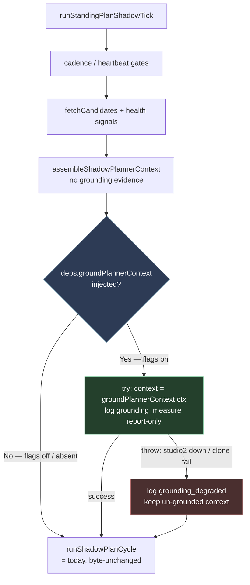
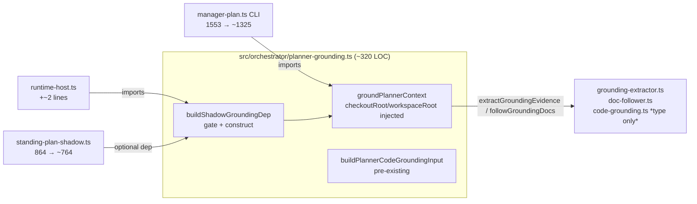

# feat: Wire SYMPH-1017 code-grounding into the live standing-plan shadow tick (config-gated)

> **Tracker:** SYMPH-1065 (Symphony team, currently Triage) · **Target repo:** symphony-ts
> **Hard constraint (Eric):** No change may take an existing file — or create a new file — past **400 lines**; new code should ideally *subtract* from existing larger files. This is a first-class acceptance criterion (see R7 and the File-Size Scorecard), not a side note.

---

## Product Contract

### Summary

Wire the existing SYMPH-1017 code-grounding pipeline into the live standing-plan **shadow tick** (`runStandingPlanShadowTick`), **config-gated and default-off**, mirroring the tick's existing comment-enrichment block: best-effort, fail-open, report-only, and byte-unchanged when off. The candidate-context assembler already accepts grounding evidence; the tick simply never populates it. Per the ticket, the CLI's grounding path is **extracted into a shared helper** (rather than reinvented) and reused by both the `manager-plan` CLI and the tick. Because every file this touches is already a God file, the change is paired with two behavior-preserving extractions so the two central files end up net-**smaller**.

### Problem Frame

The live standing-plan shadow tick assembles planner context via `assembleShadowPlannerContext({candidates, inFlight, envelope, health})` (+ optional comment enrichment) but never populates `groundingEvidenceByIssueId` and never runs the SYMPH-1017 grounding pipeline. Today, `groundingEvidenceByIssueId` is populated in **no** production path — only the operator-run `manager-plan` CLI grounds, via `--planner-grounding` → `defaultGroundPlannerContext` (`src/cli/manager-plan.ts`).

Consequence: the tier-2 decorrelated review skips with note `"no grounded evidence"` whenever it runs in the shadow tick, because the gate requires `plannerGroundingEnabled && hasGroundedScheduledEvidence` (`src/review/plan-review.ts:96-108`). So the facet-3 diff-gate wiring of the trust ramp (SYMPH-1034) is **inert in production** until grounding is present in the tick.

This work is the follow-up that SYMPH-1017 explicitly deferred: its R20 reads "Grounding is wired into the `manager-plan` CLI (operator-run, out-of-band); live shadow-tick wiring is out of v1." SYMPH-1065 closes exactly that gap — under a default-off flag, report-only, so cost (~78–90s + a studio2 extractor dependency per changed tick) is measured before anything relies on it.

### Requirements

Traced from the ticket's acceptance criteria (AC1–AC4) plus the operator constraint (R7).

| ID | Requirement | Origin |
|----|-------------|--------|
| **R1** | A config flag (default-off) enables code-grounding in the live shadow tick. When on, the tick populates grounding evidence for candidates using the SYMPH-1017 grounding pipeline — **not** a reimplementation. | AC1 |
| **R2** | When off, the tick's planner-prompt / dispatch output is **byte-unchanged** and adds **zero** cost (no clone, no extractor call, no grounding run). | AC2 |
| **R3** | With grounding on, a scheduled candidate carries `groundingEvidence.status: "grounded"`, so `hasGroundedScheduledEvidence` returns true — proving tier-2 *would* run (once facet-3 wires tier-2 into the tick) instead of skipping on "no grounded evidence". | AC3 |
| **R4** | Report-only: grounding evidence and its cost telemetry (extractor calls, wall-clock, grounded/ungrounded counts, warnings) are recorded/logged; **nothing gates dispatch**. | AC4 |
| **R5** | Fail-open: any grounding failure (studio2 extractor unreachable, clone/checkout failure, extractor error) degrades gracefully — the tick continues with un-grounded context and **never breaks the poll**. | CLAUDE.md fire-and-forget discipline; SYMPH-1017 fail-open |
| **R6** | Reuse the CLI's grounding path via a **shared helper**; the CLI and the tick call the same code. The shared helper contains **no** God-file imports and stays ≤400 lines. | AC/Scope ("extract a shared helper if needed") |
| **R7** | **File-size constraint (first-class).** No file this change touches or creates ends over 400 lines *by growth*; the two central God files (`manager-plan.ts`, `standing-plan-shadow.ts`) end net-**smaller**; new modules stay <400. The single accepted exception is a ~2-line thin wiring delta in `runtime-host.ts` (9644 LOC) — one import + one conditional spread — whose full decomposition is already owned by the deferred **SYMPH-947**. | Eric (session directive) |

### Scope Boundaries

**In scope**
- Extracting the CLI grounding path into a shared, injectable helper (`checkoutRoot`/`workspaceRoot` parameterized instead of `process.cwd()`).
- A config-gated, best-effort, fail-open, report-only grounding block in `runStandingPlanShadowTick`.
- Runtime-host wiring that constructs and injects the grounding dependency only when the existing `plannerGrounding` (and `codeGrounding`) flags are on.
- One behavior-preserving offset extraction (queue-health shapers) so the tick file ends net-smaller.

**Out of scope (non-goals)**
- **Wiring tier-2 review into the tick.** SYMPH-1065 only *populates evidence*; the tier-2-in-tick gating is SYMPH-1034 facet-3's job. The ticket is explicit: "tier-2 (once wired by the facet-3 plan)". This plan proves the gate *would* pass via a unit test on `hasGroundedScheduledEvidence`, not by running tier-2.
- **Promoting grounding/tier-2 from report-only to advisory/gating** (owned by SYMPH-875, gated on the report-only measurement window).
- **Calibrating the LLM extractor** — the dogfood ran the crude regex fallback because studio2 was unreachable; real extractor quality is SYMPH-1021's concern. This plan wires the pipeline as-is.
- **Changing the grounding pipeline internals** (`code-grounding.ts`, `grounding-extractor.ts`, `doc-follower.ts`).

#### Deferred to Follow-Up Work

- **`src/orchestrator/runtime-host.ts` decomposition — already owned by [SYMPH-947](https://linear.app/mobilyze/issue/SYMPH-947), operator-deferred to next-gen models.** No new ticket is filed (search-before-create: SYMPH-947 explicitly covers `runtime-host.ts` with a shovel-ready decomposition map). This plan adds only a ~2-line grounding-dep spread. Note: the SYMPH-948 file-size *gate* that would have frozen this file was **scrapped** (SYMPH-948 is Done; the cheap gates were not built), and no active CI size-guardrail exists — so the 2-line delta trips nothing.
- **`src/orchestrator/code-grounding.ts` (1994 LOC)** is a standing God file **untouched by this plan** (a single type-only import). Not filed as a new ticket — it would fall under a broadened SYMPH-947-style umbrella if/when that effort expands; surfacing it as a fresh ticket now would duplicate an intentionally-deferred workstream.
- **Route the tick's grounding through the existing `GroundingService` cache — [SYMPH-1067](https://linear.app/mobilyze/issue/SYMPH-1067) (filed, measure-first).** The extracted path (`defaultGroundPlannerContext`) calls `extractGroundingEvidence` uncached, bypassing `src/orchestrator/grounding-service.ts` (which `backlog-hygiene.ts` already uses, keyed on `repoUrl + commitSha + claim-set`). Fine for the one-shot CLI, but the tick re-grounds the backlog on a cadence — unchanged candidates get re-extracted every tick. Deferred, not done here: this plan's extraction is behavior-preserving, and per measure-first the caching change waits until the report-only telemetry shows the cost warrants it. Surfaced by the council review (adversarial).
- (If impl reveals it) **Extract the shadow-tick comment-enrichment cluster** as a second offset if `standing-plan-shadow.ts` needs to shed more — decide during U3.

---

## Planning Contract

### Key Technical Decisions

**KTD1 — Reuse existing config gates; add no config surface.**
A config-backed planner-grounding switch already exists: `WorkflowPlannerGroundingConfig { enabled }` (`src/config/types.ts:241-243`), `DEFAULT_PLANNER_GROUNDING_ENABLED = false` (`src/config/defaults.ts:280-282`), plus a sibling `codeGrounding` gate, all already resolved onto `ResolvedWorkflowConfig` (`src/config/types.ts:675-677`, resolver `src/config/config-resolver.ts:386-388`). The tick's feature gate is **`currentConfig.plannerGrounding?.enabled === true` alone** — mirroring the CLI's single `--planner-grounding` switch. `codeGrounding.enabled` is **not** an additional required gate: the shared helper hardcodes the `DEFAULT_CODE_GROUNDING_*` config (exactly as `defaultGroundPlannerContext` does today), so `codeGrounding.enabled` gates other consumers (backlog-hygiene), not this path. **Result: zero changes to `config/types.ts`, `config-resolver.ts`, `defaults.ts`.** This is why the earlier "net-neutral config via scoped extractions" idea is dropped — there is no config delta to offset.

**KTD2 — Inject grounding as an optional tick dependency; gate + construct in runtime-host.**
The tick already conditionally receives optional deps (`fetchIssueComments?`, `fetchTriageIssues?`, …) that runtime-host spreads in only when available. Grounding follows the same pattern: the tick gains one optional dep, and runtime-host injects it **only when `plannerGrounding.enabled` is on and the product is symphony-scope** (KTD4). Otherwise the dep is absent → the grounding block is skipped entirely → the assembled context is identical to today. This is what makes R2 (byte-unchanged, zero cost) structurally true rather than conditionally true. The gate-and-construct logic lives in the shared module as **synchronous** `buildShadowGroundingDep(config, {checkoutRoot, workspaceRoot, env, now})` returning a **spreadable partial** — `{}` when `plannerGrounding.enabled` is off **or the product is non-symphony-scope** (see KTD4), `{ groundPlannerContext }` otherwise — so runtime-host's delta is the irreducible floor: **one import + one `...buildShadowGroundingDep(...)` spread** inside the existing (synchronous) deps object. All testable logic (including the symphony-scope gate) stays out of the 9644-line God file.

**KTD3 — Mirror the comment-enrichment block: assemble → (optional) ground → cycle.**
The CLI's `groundPlannerContext` takes a `PlannerContext` and returns an enriched one (evidence attached to each `backlog` candidate). That is the exact shape of the existing `enrichPlannerContextWithComments` block in the tick (`standing-plan-shadow.ts:820-846`). The grounding block slots in right after it: gated, best-effort `try/catch`, report-only `log(...)`, `context = await deps.groundPlannerContext({context, candidates, …})`. The AC phrase "before assembling context" is satisfied in intent — grounded evidence is present in the final context handed to the planner; the mechanism is post-assembly enrichment, matching the CLI and the ticket's "mirror the CLI's path" instruction.

**KTD4 — Grounding is symphony-scoped by construction; gate on the product signal (`REPO_URL`), not the orchestrator's own checkout.**
Two facts constrain the target, and the review (feasibility + adversarial, anchor 100) caught that they interact in a way the first draft got wrong:
1. `resolveRuntimeRepoRoot()` (`runtime-host.ts:594`) always resolves to the **orchestrator's own symphony-ts checkout** (derived from `import.meta.url`, three levels up from the compiled binary) — **not** the active product's repo. `workspaceManager.root` is the per-issue clone *pool* dir, not a git checkout either.
2. Grounding is **symphony-self-dev-scoped in v1** (SYMPH-1017's repo-scope restriction; `queue_triage.enabled` is true only in `WORKFLOW-symphony.md` today).

So the target must **not** be inferred from `resolveRuntimeRepoRoot()`'s git remote — that always reads `symphony` regardless of which product's tick is running, which means the pipeline's per-candidate `ungrounded` short-circuit **could never fire** for a non-symphony product. Instead it would ground that product's tickets against symphony's *unrelated* code+SHA and emit false `status: "grounded"` evidence — the exact garbage-evidence failure this KTD is supposed to prevent. The fix: `buildShadowGroundingDep` infers scope **synchronously** from the per-product signal `process.env.REPO_URL` via `inferManagerPlanGroundingRepoScope`, and constructs the grounding dep **only when that infers `symphony`**. When symphony: `checkoutRoot = resolveRuntimeRepoRoot()` (correct — it *is* symphony) and commit = `rev-parse HEAD`. For any non-symphony product — **or when `REPO_URL` is unset** — return `{}`: no grounding, **zero cost**, no wrong-repo evidence. This is safe because both production launch paths (`run-pipeline.sh` and the `symphony-ctl`-generated launchd plist) always set `REPO_URL`, including symphony's own URL for the symphony product; the only unset case is a bare non-wrapper `node dist/… WORKFLOW.md` dev invocation, where **unset ⇒ no grounding is fail-closed and correct**. (Round-2 review corrected an earlier draft that tried a git-remote fallback here: the sketched `gitRemote()` doesn't exist, and the real helper `readGitValue` is *async* while the runtime-host deps object is built *synchronously* — the fallback isn't load-bearing given production always sets `REPO_URL`, so dropping it keeps `buildShadowGroundingDep` a pure synchronous regex test with no async ripple into the sync deps literal.)

This construction-time scope gate is strictly better than leaning on the pipeline's internal `repoScope` check: that check lives inside `runManagedCodeGrounding`, which runs *after* `extractGroundingEvidence` already fired the (expensive) extractor call per candidate — so "ungrounded" is evidence-safe but **not** cost-free. Gating at construction short-circuits before any clone or extractor call, so a non-symphony product pays nothing. The gate re-evaluates on each tick (the deps object is rebuilt per tick) — cheap (a regex test on process-invariant inputs), and it lets a config hot-reload of the flag take effect on the next tick without a restart.

**Boundary conditions (durable):** (1) the scope check is a URL-*suffix heuristic* (`inferManagerPlanGroundingRepoScope`, inherited unchanged from the CLI) — it matches `…/symphony` and `…/symphony-ts` but would misclassify an oddly-named fork (`…/my-symphony-ts-fork`); this plan is not the place to harden it. (2) If a non-symphony product ever sets `queue_triage.enabled: true` (only `WORKFLOW-symphony.md` does today), `resolveRuntimeRepoRoot()` is the wrong checkout for it — that product's repo+commit would need resolving (net-new, out of scope), and a config-resolver assertion failing loudly on *non-symphony product + grounding flags* is the right guard to add then. Stated here so whoever flips the flag sees it. *(Chosen over adding explicit repo/commit config fields now — unneeded while grounding is symphony-only.)*

**KTD5 — Consolidate the extraction into the existing `src/orchestrator/planner-grounding.ts`.**
A 40-line `src/orchestrator/planner-grounding.ts` already exists (`buildPlannerCodeGroundingInput`, a sibling SYMPH-1017 helper). Rather than birth a second, confusingly-named module (`src/agent/planner-grounding.ts`), the extracted grounding orchestration lands **in that existing file**, giving one planner-grounding home (~320 LOC, <400) and dissolving the naming-collision risk agent research flagged. Fallback if it exceeds 400: split into a `src/orchestrator/planner-grounding/` folder.

**Three `process.cwd()` sites** become injected params (feasibility flagged the first draft's "two"): `manager-plan.ts:1239` (`followGroundingDocs` checkoutRoot) and `:1403` (`readGitValue`'s internal `cwd`, called from `resolveManagerPlanGroundingTarget`) both bind to the injected **`checkoutRoot`** (a real git checkout); `:1293` (`extractGroundingEvidence` grounding `workspaceRoot`) binds to the injected **`workspaceRoot`** (a code-grounding cache dir — *not* required to be a git checkout). Missing the `:1403` site would silently keep git resolution on the process cwd, defeating the extraction in the tick context. The module gets its own `execFileAsync`; one grounding-only env const (`…_REPO_SCOPE_ENV`) moves with it.

**Names preserved for characterization.** The moved function is exported as `groundPlannerContext` in the shared module and **re-exported from `manager-plan.ts` as `defaultGroundPlannerContext`** (its current name); `inferManagerPlanGroundingRepoScope`, `readManagerPlanGroundingRepoScope`, and `toPlannerCandidateGroundingEvidence` keep their existing names, re-exported as needed. So `tests/cli/manager-plan.test.ts`'s imports are unchanged and the "stays green unchanged" characterization holds (feasibility caught that a rename would break the test import).

**KTD6 — Offset extraction: the SYMPH-939 queue-health shapers.**
To keep `standing-plan-shadow.ts` net-smaller after adding the grounding block, extract the self-contained queue-health cluster (`TRIAGE_INFLOW_WINDOW_MS`, `RESIDUAL_TRACK_MARKER`, `computeTriageIntake`, `computeResidualShare`, `buildQueueHealth`; lines ~298-422, ~125 LOC) into `src/orchestrator/standing-plan-queue-health.ts`. It references zero other in-file symbols and its `describe("SYMPH-939 health signals")` test block moves 1:1. *(Chosen over the context-assembly cluster, which drags shared helpers, the audit-disposition types, and an entangled test describe.)*

**KTD7 — "Designed for removal" honored.** Grounding (studio2 local-LLM extractor dependency) is a non-Claude-Code component per CLAUDE.md. The default-off gate + injectable-dep shape make it trivially removable — drop the runtime-host wiring and the feature vanishes with no residue in the tick's off-path.

### Assumptions

- The existing `plannerGrounding` / `codeGrounding` resolved config is reachable at the `runStandingPlanShadowTickIfEnabled` call site as `currentConfig.*` (agent research places it on `ResolvedWorkflowConfig`, which is the `currentConfig` in that scope). Verify in U4.
- `buildPlannerCodeGroundingInput` (the existing occupant of `planner-grounding.ts`) is thematically "planner grounding" and can share the module without mixing unrelated concerns. If it turns out unrelated, use the folder-split fallback (KTD5).
- The `manager-plan` CLI's existing grounding tests are sufficient characterization coverage for the extraction (U1). If gaps appear, add characterization tests before moving code.
- **`process.env.REPO_URL` is always set in production** — both `run-pipeline.sh` and the `symphony-ctl`-generated launchd plist export it for every product (symphony included → its own URL) — and **one orchestrator process serves exactly one product** (`src/cli/main.ts` throws on a second workflow-path arg, so `REPO_URL`/product are fixed for the process lifetime). KTD4's synchronous symphony-scope gate relies on both. Unset `REPO_URL` (only a bare non-wrapper invocation) → grounding off (fail-closed). Verify the pipeline/plist `REPO_URL` export in U4.

---

## High-Level Technical Design

### Tick control flow (the config-gated branch that makes R2 structural)

The `groundPlannerContext` dep is injected by runtime-host **only** when `plannerGrounding.enabled` is on and `REPO_URL` infers symphony-scope (KTD1/KTD4), so the "No" branch is the literal, unchanged code path of today — satisfying R2 without a runtime cost check.

### Shared / reused surface

### File-Size Scorecard (R7 — first-class acceptance criterion)

| File | Before | Δ | After | Net | ≤400 rule |
|------|-------:|---|------:|-----|-----------|
| `src/orchestrator/planner-grounding.ts` (shared home) | 40 | +~280 | ~320 | +280 | ✅ <400 |
| `src/cli/manager-plan.ts` | 1553 | −~234 / +~6 | **~1325** | **−228** | ✅ net-smaller |
| `src/orchestrator/standing-plan-shadow.ts` | 864 | −~125 / +~25 | **~764** | **−100** | ✅ net-smaller |
| `src/orchestrator/standing-plan-queue-health.ts` (new) | 0 | +~150 | ~150 | new | ✅ <400 |
| `src/orchestrator/runtime-host.ts` | 9644 | +~2 | ~9646 | +2 | ⚠️ accepted floor delta (1 import + 1 spread) — decomp owned by deferred SYMPH-947 |
| `src/config/*` (types, resolver, defaults) | — | 0 | — | 0 | ✅ untouched (KTD1) |

Two God files shrink; all new/changed logic lands in <400-line modules; config is untouched; runtime-host takes only the irreducible 2-line dependency-injection delta (no active size-gate blocks it — SYMPH-948's was scrapped).

---

## Implementation Units

### U1. Extract the CLI grounding path into a shared, injectable helper

**Goal:** Move `defaultGroundPlannerContext` and its helpers out of `manager-plan.ts` into the existing `src/orchestrator/planner-grounding.ts`, parameterizing the three `process.cwd()` sites (KTD5) as `checkoutRoot` / `workspaceRoot`. Behavior-preserving. (R6; R7 net-negative on `manager-plan.ts`.)

**Requirements:** R6, R7
**Dependencies:** none (prerequisite for U3, U4)
**Files:**
- `src/orchestrator/planner-grounding.ts` — receives the moved grounding orchestration: `groundPlannerContext` (the moved `defaultGroundPlannerContext` body), `resolveManagerPlanGroundingTarget`, `toPlannerCandidateGroundingEvidence`, `readGitValue`, `readManagerPlanGroundingRepoScope`, `inferManagerPlanGroundingRepoScope`, the `…GroundingInput`/`…GroundingResult` types, the moved `…_REPO_SCOPE_ENV` const, and its own `execFileAsync`.
- `src/cli/manager-plan.ts` — delete the moved bodies; import them back; **re-export `defaultGroundPlannerContext` (alias of `groundPlannerContext`), `toPlannerCandidateGroundingEvidence`, and `inferManagerPlanGroundingRepoScope` under their existing names** so external + test importers are unchanged; keep `execFileAsync`, `…_REPO_URL_ENV`, `…_COMMIT_ENV` (still used by `runManagerPlanCli`); pass `checkoutRoot: process.cwd()` / `workspaceRoot: process.cwd()` to preserve today's behavior.
- `tests/orchestrator/planner-grounding.test.ts` — new focused tests for the shared helper.
- `tests/cli/manager-plan.test.ts`, `tests/cli/manager-plan-dogfood-evidence.test.ts` — stay green unchanged (characterization), which the re-exports above guarantee.

**Approach:** The moving code already takes an injectable `input` (`env`, `now`, `repoUrl?`, `commitSha?`, `repoScope?`). Add `checkoutRoot: string` + `workspaceRoot: string` to the input and bind them by role — **git + doc resolution uses `checkoutRoot`** (`followGroundingDocs({checkoutRoot})` and `readGitValue(args, checkoutRoot)` for `remote.origin.url` / `rev-parse HEAD`); **the code-grounding cache dir uses `workspaceRoot`** (`extractGroundingEvidence`'s grounding `workspaceRoot`). These are the *same* value today (`process.cwd()`) but diverge in the tick: `checkoutRoot` must be a real git checkout (`resolveRuntimeRepoRoot()`), while `workspaceRoot` is a cache root (`workspaceManager.root`, a pool dir — feasibility flagged that threading it into `readGitValue` would break git resolution). Grep external importers of the moved *exported* symbols before deleting.

**Execution note:** Characterization first — run the existing CLI grounding tests green *before* moving, and again after, as the behavior-preserving safety net.

**Patterns to follow:** the existing `input`-injected shape of `defaultGroundPlannerContext`; import style of the current grounding imports in `manager-plan.ts`.

**Test scenarios:**
- Characterization: `tests/cli/manager-plan.test.ts` grounding cases pass unchanged after extraction (same evidence output for the same input).
- `groundPlannerContext` with injected `checkoutRoot`/`workspaceRoot`/`env`/`now` grounds a symphony-scope candidate → returns context whose backlog candidate carries `groundingEvidence.status: "grounded"`.
- Non-symphony `repoScope` (or a repoUrl that infers `non_symphony`) → candidate evidence `status: "ungrounded"`, `reason` set, no throw.
- `resolveGroundingTarget` falls back to git `remote.origin.url` + `rev-parse HEAD` of `checkoutRoot` when `repoUrl`/`commitSha` are absent; throws a clear error when neither flag nor git yields a value.
- `NO God-file import`: assert (review-level) the new module imports only leaf modules (`grounding-extractor`, `doc-follower`, `code-grounding` *type-only*, `linear-documents`, `config/defaults`, `domain/model`, `triage-planner`).

### U2. Extract the SYMPH-939 queue-health shapers (offset extraction)

**Goal:** Move the self-contained queue-health cluster out of `standing-plan-shadow.ts` into a sibling module so the tick file ends net-smaller after U3. Behavior-preserving. (R7.)

**Requirements:** R7
**Dependencies:** none (independent; lands with U3 in the same PR to keep the tick file net-negative)
**Files:**
- `src/orchestrator/standing-plan-queue-health.ts` — new; exports `TRIAGE_INFLOW_WINDOW_MS`, `RESIDUAL_TRACK_MARKER`, `computeTriageIntake`, `computeResidualShare`, `buildQueueHealth`; imports `Issue` (`../domain/model.js`) and `TriageIntakeHealth`/`HotFileGrowth`/`QueueHealth` (`../agent/triage-planner.js`).
- `src/orchestrator/standing-plan-shadow.ts` — delete the cluster; import the 5 symbols back; re-export any that are part of the file's public API (grep consumers first — NO_SEMANTIC_SEARCH: check direct imports, re-exports, and tests).
- `tests/orchestrator/standing-plan-queue-health.test.ts` — new; receives the `describe("SYMPH-939 health signals")` block (~lines 1141-1354) moved 1:1.
- `tests/orchestrator/standing-plan-shadow.test.ts` — remove the moved describe; update imports.

**Approach:** Pure lift-and-shift; the cluster references no other in-file symbol. Preserve exported names so external importers (`standing-plan-consumer.ts` and tests) are unaffected, re-exporting from `standing-plan-shadow.ts` if any consumer imports them from there.

**Execution note:** Behavior-preserving extraction; tests move with the code. No new behavior.

**Patterns to follow:** existing sibling-module structure in `src/orchestrator/`.

**Test scenarios:**
- The moved `describe` block passes verbatim from the new test file (same fixtures, same assertions).
- `tests/orchestrator/standing-plan-shadow.test.ts` still passes (tick behavior unchanged); no dangling imports.
- Grep proof: every prior importer of the 5 symbols still resolves (direct import or re-export).

### U3. Add the config-gated, fail-open, report-only grounding block to the shadow tick

**Goal:** Populate grounding evidence in `runStandingPlanShadowTick` when the injected grounding dep is present, mirroring the comment-enrichment block; best-effort, report-only, byte-unchanged when the dep is absent. (R1, R2, R3, R4, R5.)

**Requirements:** R1, R2, R3, R4, R5
**Dependencies:** U1 (shared helper), U2 (co-lands to keep the file net-negative)
**Files:**
- `src/orchestrator/standing-plan-shadow.ts` — add one optional dep to `StandingPlanShadowTickDeps` (e.g. `groundPlannerContext?`); add the gated `try/catch` grounding block after the comment-enrichment block (`~846`) and before `runShadowPlanCycle`; emit report-only telemetry.
- `tests/orchestrator/standing-plan-shadow.test.ts` — add grounding-on / grounding-off / fail-open / telemetry / gate-passing cases (reuse the existing `groundingEvidence()` fixture at lines 69-80).

**Approach:** `if (deps.groundPlannerContext !== undefined && context.backlog.length > 0) { try { context = await deps.groundPlannerContext({context, candidates, …}); await deps.log("queue_triage_grounding_measure", …, {outcome:"shadow", extractorCallCount, wallClockMs, grounded, ungrounded}); } catch (error) { await deps.log("queue_triage_grounding_degraded", …, {outcome:"degraded", detail}); } }`. The aggregate measurement is computed from the enriched context's per-candidate `groundingEvidence` (`extractorCallCount`, `wallClockMs`, `status` counts, `warnings`). Nothing returned to dispatch (report-only, R4). The outer tick `try/catch` already guarantees the poll survives, but the inner grounding `try/catch` is what keeps a grounding failure from skipping the comment-enrichment measurement / cycle (R5).

**Log-content guard (security review, R4).** The telemetry log MUST **hand-pick scalar/count fields only** — never spread the raw `groundingEvidence` object, and never log its `digest` or `claims` (which carry extracted ticket/doc/code-derived text). The structured logger (`src/logging/structured-logger.ts`) serializes *every* key present in the `fields` object into both the JSON-line sink and the human-readable message with no field-level redaction, so a `...groundingEvidence` spread (an easy slip mirroring the comment-enrichment `...enriched.measurement` line) would leak ticket/code content into logs every grounded tick. Mirror the existing counts-and-lengths telemetry shape.

**Execution note:** Start with a failing grounding-off test asserting byte-identical assembled context vs today (the R2 anchor), then add the on-path.

**Patterns to follow:** the comment-enrichment block `standing-plan-shadow.ts:820-846` — same gate → best-effort → `context = enriched.context` → report-only `log(...)` shape.

**Test scenarios:**
- *Covers R2.* Grounding-off (dep absent): the context handed to `runShadowPlanCycle` is byte-identical to today's (no `groundingEvidence` on any candidate); the injected grounding fn is never called.
- *Covers R1 / R3.* Grounding-on (dep returns enriched context): a scheduled candidate carries `groundingEvidence.status: "grounded"` in the context passed to `runShadowPlanCycle`.
- *Covers R3 (facet-3 boundary).* Feed that enriched context's coverage to `hasGroundedScheduledEvidence` → returns `true`. Unit-level on the gate helper; tier-2 is **not** wired into the tick.
- *Covers R5.* Grounding-on but the injected fn throws → tick logs `queue_triage_grounding_degraded`, continues with un-grounded context, returns a normal cycle result (poll not broken).
- *Covers R4.* Grounding-on logs a `queue_triage_grounding_measure` event with `extractorCallCount` / `wallClockMs` / grounded-vs-ungrounded counts; the cycle result / dispatch decision is unchanged vs the same run without the measurement.
- *Covers R4 log-guard.* The logged `fields` for a grounded candidate contain **no** `digest`/`claims`/raw-evidence keys — assert the serialized log line has only scalar/count fields (a candidate whose `digest`/`claims` carry a sentinel string must not have that string appear in the captured log output).
- Empty backlog (`context.backlog.length === 0`) → grounding block skipped, no telemetry, no throw.

### U4. Wire the grounding dependency in runtime-host (thin delta)

**Goal:** Construct and inject `groundPlannerContext` into the tick deps **only** when `plannerGrounding.enabled` is on **and `REPO_URL` infers symphony-scope** (KTD1, KTD4); keep runtime-host's delta minimal by pushing gate+construction into the shared module. (R1, R2, R7.)

**Requirements:** R1, R2, R7
**Dependencies:** U1, U3
**Files:**
- `src/orchestrator/planner-grounding.ts` — add **synchronous** `buildShadowGroundingDep(config, {checkoutRoot, workspaceRoot, env, now})` returning a **spreadable partial**: `{}` when `plannerGrounding.enabled` is off **or `inferManagerPlanGroundingRepoScope(env.REPO_URL ?? "")` is `non_symphony`** (unset `REPO_URL` → `non_symphony` → `{}`, fail-closed); `{ groundPlannerContext }` otherwise (the grounding fn bound to `checkoutRoot`/`workspaceRoot`/`env`/`now`). No git shell-out — a pure regex test keeps this synchronous so the runtime-host deps object stays a sync literal.
- `src/orchestrator/runtime-host.ts` — **2-line delta:** import `buildShadowGroundingDep`; add `...buildShadowGroundingDep(currentConfig, { checkoutRoot: resolveRuntimeRepoRoot(), workspaceRoot: workspaceManager.root, env: process.env, now: () => new Date() }),` inside the existing `runStandingPlanShadowTick(...)` deps object (`~6464-6510`).
- `tests/orchestrator/planner-grounding.test.ts` — cover the gate branches of `buildShadowGroundingDep` (flags, and the symphony-scope keyed on `REPO_URL`).

**Approach:** All inputs are already in scope at the call site (`resolveRuntimeRepoRoot()` is called ~line 6497 for hot-file growth; `workspaceManager.root` is the tick's `workspaceRoot`). The **product signal is `env.REPO_URL`** (both production launch paths always set it), not `resolveRuntimeRepoRoot()`'s git remote — which is always symphony (KTD4). `REPO_URL` unset (bare dev invocation only) → `non_symphony` → `{}` (fail-closed; **no git-remote fallback**, so the gate stays synchronous — round 2 caught that a fallback would force async into a sync call site). Returning a spreadable partial (not `dep | undefined`) keeps the runtime-host change to a single spread line that mirrors the existing `...(currentConfig.operatorAnchors === undefined ? {} : { operatorConfig: … })` conditionals. Testable logic lives in `buildShadowGroundingDep` (shared module, unit-tested); runtime-host holds only the untested 2-line wiring.

**Execution note:** Mostly wiring — prefer a focused unit test on `buildShadowGroundingDep` over a full runtime-host integration test (runtime-host is a 9644-line God file; a targeted helper test is the right altitude).

**Patterns to follow:** the conditional-spread deps pattern already in the tick deps object (`fetchIssueComments`, `operatorConfig`).

**Test scenarios:** (`buildShadowGroundingDep` is synchronous — these are pure unit tests, no I/O)
- *Covers R2 / default-off.* `plannerGrounding.enabled` off (default) → returns `{}` → no `groundPlannerContext` in the tick deps.
- *Covers R1.* `plannerGrounding.enabled` on **and** `REPO_URL` a symphony URL → returns `{ groundPlannerContext }` bound to the given `checkoutRoot`/`workspaceRoot`; invoking it grounds via the shared helper.
- *Covers KTD4 (the P1 the review caught).* Flag on **but `REPO_URL` a non-symphony product repo** → returns `{}` — no dep, no clone, no extractor call. Assert the construction-time symphony gate short-circuits before any grounding work (no wrong-repo `"grounded"` evidence, zero cost).
- *Covers the fail-closed default.* Flag on but `REPO_URL` **unset** → returns `{}` (production always sets `REPO_URL`, so this only affects bare dev invocations; unset must never ground).
- Integration (light): flag on + symphony `REPO_URL` + a stubbed grounding pipeline → the tick's assembled context gains grounded evidence.

---

## System-Wide Impact, Risks & Dependencies

- **Poll-loop safety (R5).** The shadow tick is fire-and-forget; the inner grounding `try/catch` plus the existing outer tick `try/catch` guarantee a grounding outage (studio2 unreachable, clone/checkout failure) degrades to un-grounded context and never breaks dispatch. This is the load-bearing risk and the reason the block mirrors the best-effort comment-enrichment pattern exactly.
- **Trust-boundary shift (security review).** This is the first time repo clone/materialization + an external LLM-extractor call (`http://studio2.local:8000/v1`, plaintext HTTP) + a Linear-authenticated document fetch all run **unattended, on a recurring cadence** inside the always-on orchestrator — previously only an operator-run CLI did. The concrete risk is contained by design: the clone target resolves once from `REPO_URL`/git (KTD4), **not** from any per-ticket field, so a malicious ticket cannot redirect the clone; grounding is a **read-only scan checkout that never executes cloned code**; `LINEAR_API_KEY` handling is unchanged; and the whole path is default-off + fail-open + symphony-scope-gated. The plaintext-HTTP extractor on a repeating cadence is an accepted trade on the assumption `studio2.local` is an internal-only, trusted-network host — if that assumption ever fails, add TLS / egress restriction before enabling. The log-content guard (U3) keeps extracted code/ticket text out of logs.
- **Cost when on (~78–90s per changed tick).** Report-only + default-off + measure-first (KTD1, R4) means cost is observed before anything relies on grounding. **Caveat the review sharpened:** that ~78–90s figure is from the dogfood's *regex fallback* (studio2 was unreachable in every recorded run — the real LLM extractor was never exercised end-to-end), so it is the fallback's cost, not the feature's steady-state. The first on-flag activation with studio2 reachable should re-measure the real path (a natural companion to SYMPH-1021's calibration); until then treat the figure as a floor. Both facts reinforce default-off.
- **Cost *shape* — full-backlog-every-tick is a deliberate v1 choice.** The extracted path grounds the entire filtered backlog on each changed tick (no subset), inherited from the CLI. That is intentional for v1: it matches SYMPH-1017's default and lets the report-only telemetry measure real per-candidate cost before any subsetting. Bounding grounding to a higher-value subset, and routing through the existing `GroundingService` cache (SYMPH-1067), are the two cost-containment levers deferred until that measurement exists.
- **Extraction ripple (U1/U2).** NO_SEMANTIC_SEARCH: before deleting any moved symbol, grep for direct imports, type-level references, re-exports, and test imports. The moved symbols are few and their importers bounded, but the God files are large — verify each.
- **`runtime-host.ts` remains a God file.** This plan does not fix that; it adds ~2 lines (import + spread). Decomposition is already owned by the deferred SYMPH-947; the SYMPH-948 size-gate that would have frozen the file was scrapped, so no active guardrail blocks the delta. Accepted per the confirmed decomposition posture.
- **Relationship to the trust ramp.** This plan is a hard prerequisite for the facet-3 diff-gate ([SYMPH-1066](https://linear.app/mobilyze/issue/SYMPH-1066), which declares "Blocked by SYMPH-1065" for real verdicts) producing real tier-2 verdicts, but does not itself wire tier-2. Landing order: SYMPH-1065 (evidence present) → SYMPH-1066 facet-3 (tier-2-in-tick) → SYMPH-875 (promote from report-only). The downstream ramp (SYMPH-1034) is itself `[Deferred]`, so this plan's near-term value is "opens the measurement window," not user-facing behavior — consistent with report-only.

---

## Verification Contract

**Gates (all must pass before any PR):**
- `pnpm exec vitest run` — full suite green (note: `pnpm test` pretest `validate:skill-installs` can fail on operator skill drift in a worktree; use `vitest run` directly).
- `pnpm build` — compiles.
- `pnpm typecheck` — no type errors (strict: `noUncheckedIndexedAccess`, `exactOptionalPropertyTypes`, `verbatimModuleSyntax`).
- `pnpm lint` — Biome passes.

**Feature-specific proofs:**
- **R2 anchor:** a grounding-off test asserts the assembled context is byte-identical to today's; the existing tick tests pass unchanged.
- **R3 anchor:** a test feeds the grounded tick context to `hasGroundedScheduledEvidence` and asserts `true`.
- **R7 anchor:** post-change `wc -l` on every touched/created file matches the File-Size Scorecard — `manager-plan.ts` and `standing-plan-shadow.ts` are net-smaller; all new files <400; only `runtime-host.ts` grew (~2 lines, per the scorecard).
- **Characterization:** `manager-plan` grounding tests and the moved SYMPH-939 health tests pass unchanged.

## Definition of Done

- R1–R6 satisfied and covered by the test scenarios above; R7 verified by the scorecard `wc -l` check.
- Grounding is default-off and byte-unchanged/zero-cost when off; on, it produces `status: "grounded"` evidence for symphony-scope scheduled candidates and report-only telemetry; failures fail open.
- Tier-2 is **not** wired into the tick (facet-3 boundary respected).
- No new decomposition tickets filed — `runtime-host.ts` decomposition is already tracked by the deferred SYMPH-947 (referenced, not duplicated).
- All four verify gates pass.

---

## Sources & Research

- **SYMPH-1065** (ticket) — problem, ACs, source refs, facet-3 relationship.
- `src/orchestrator/standing-plan-shadow.ts` — the tick (`runStandingPlanShadowTick` 707-864), context assembler (`assembleShadowPlannerContext` 131-204, already accepts `groundingEvidenceByIssueId`), comment-enrichment block (820-846, the pattern to mirror), queue-health cluster (298-422, the offset extraction).
- `src/cli/manager-plan.ts` — `defaultGroundPlannerContext` (1206-1328) + helpers (1330-1429), the grounding path to extract.
- `src/orchestrator/planner-grounding.ts` — existing 40-line sibling helper; the consolidation target.
- `src/review/plan-review.ts:96-108, 187-225` — the tier-2 gate; `hasGroundedScheduledEvidence` = `coverage.some(c => c.status === "grounded")`.
- `src/agent/triage-planner.ts:121, 153-162` — `PlannerGroundingStatus = "grounded" | "ungrounded"`; `PlannerCandidateGroundingEvidence` shape.
- `src/config/types.ts:241-243, 675-677`, `src/config/defaults.ts:280-282`, `src/config/config-resolver.ts:386-388` — the pre-existing, already-resolved `plannerGrounding` / `codeGrounding` gates (KTD1).
- `src/orchestrator/runtime-host.ts:594, 6446-6533` — the tick wiring site; `resolveRuntimeRepoRoot()` + `workspaceManager.root` in scope.
- `docs/plans/2026-07-01-symph-1017-planner-deep-code-grounding-plan.md` — grounding pipeline; R20 defers shadow-tick wiring (this plan closes it); repo-scope → `ungrounded` safety.
- `docs/plans/2026-07-01-symph-1016-standing-plan-review-plan.md` — tier-2 decorrelated review; report-only-at-introduction; shadow-tick deferral.
- `docs/plans/2026-07-02-manager-plan-dogfood-runbook.md` ("Differential-review data point — 2026-07-06" / Run 0-1) — ~16s/6 candidates → ~78–90s/38; studio2 (`http://studio2.local:8000/v1`, `grounding-extractor.ts:27`) unreachable → regex fallback ran; real extractor uncalibrated (SYMPH-1021).
- CLAUDE.md — fire-and-forget tick discipline, default-off/measure-first, "designed for removal".
- **SYMPH-947** (Backlog, deferred) — owns `runtime-host.ts` + `core.ts` decomposition; operator decision (2026-06-28) defers execution to next-gen models. The home for this plan's deferred runtime-host split.
- **SYMPH-948** (Done) — the file-size-budget gate that would have frozen `runtime-host.ts` was **scrapped** (reshaped into SYMPH-966/967/968); no active CI size-guardrail exists, so this plan's 2-line runtime-host delta is unblocked.
- **SYMPH-1066** (facet-3 diff-gate) — declares "Blocked by SYMPH-1065" for producing real tier-2 verdicts; the downstream consumer of this plan's grounding evidence.
- **SYMPH-1067** (filed by this review) — route the tick's grounding through the existing `GroundingService` cache; measure-first follow-up.
- `src/orchestrator/grounding-service.ts` — the `GroundingService` cache (keyed on `repoUrl + commitSha + claim-set`) the extracted path bypasses; `src/orchestrator/backlog-hygiene.ts` is its one current consumer.
- **Council doc-review (2026-07-06)** — 5 reviewers (coherence, feasibility, adversarial, security-lens, product-lens); caught the KTD4 grounding-target P1 (feasibility + adversarial), the cache bypass (adversarial → SYMPH-1067), and the log-content guard (security-lens).
