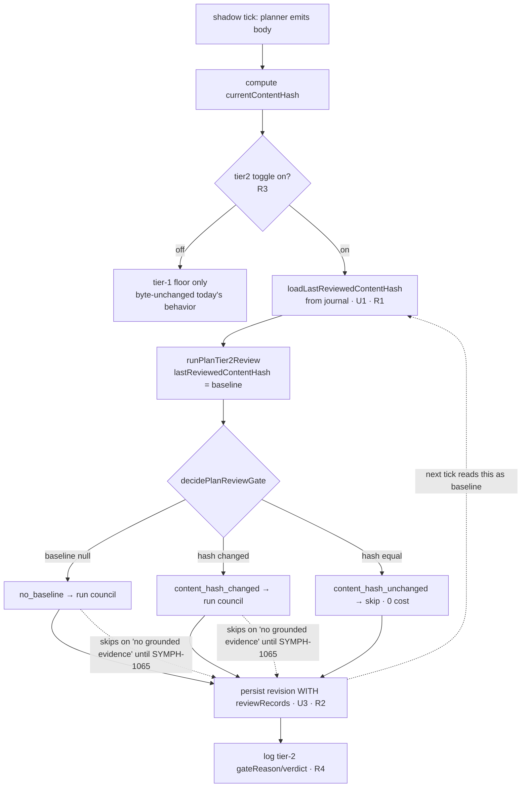

# feat: Make the standing-plan tier-2 diff-gate load-bearing in the live shadow tick

**Facet 3 of the plan-review trust ramp (SYMPH-1034).** Report-only / shadow-mode. Feed the diff-gate its baseline from the durable journal so the live shadow tick produces real `content_hash_changed` / `content_hash_unchanged` decisions instead of the permanent `no_baseline` it emits today. This does **not** gate dispatch — advisory surfacing and gating SYMPH-875 are later, operator-driven facets.

## Goal Capsule

**What this facet delivers standalone:** a load-bearing diff-gate in the live shadow tick — a durable, journal-backed baseline feed plus tier-2 invocation, so the gate emits real `no_baseline` / `content_hash_changed` / `content_hash_unchanged` decisions (and their telemetry) across ticks and restarts instead of the permanent `no_baseline` it emits today. The gate and review plumbing already exist end-to-end (`runPlanTier2Review` → `decidePlanReviewGate`); only the shadow tick's baseline feed and tier-2 invocation are missing. Keep it a focused wiring change — no new abstractions, reuse existing seams, inert-and-zero-cost when its config toggle is off.

**What it does NOT deliver on its own:** the catch-rate / false-positive / **verdict** / cost telemetry SYMPH-1034 facet 1 needs. That requires *real* tier-2 verdicts, which are triple-gated: **SYMPH-1065** (grounding in the tick — not yet built) landed, the default-off `plan_review` toggle flipped, and the grounding flag on. Until all three hold, tier-2 in the tick cleanly *skips* (`no grounded evidence`) and only **gate-decision** telemetry is produced. This facet lays the measure-*ready* plumbing; it does not open the measurement window.

---

## Problem Frame

The 2026-07-06 differential-review data point (see origin runbook) proved the tier-2 diff-gate works — but from a throwaway harness, not any production path. Two production gaps:

1. **The live shadow cycle never runs tier-2.** `runShadowPlanCycle` (`src/orchestrator/standing-plan-shadow.ts:591-595`) calls `runPlanPostEmitReview({context, body, runClaude})` with **no `tier2`** — only the tier-1 floor (deterministic + self-review) runs. The decorrelated council never runs in production.
2. **No path feeds the diff-gate baseline.** Even the manager-plan CLI, which *does* pass `tier2`, never passes `lastReviewedContentHash` (`src/cli/manager-plan.ts:786-800` → `src/orchestrator/plan-post-emit-review.ts:69-71` defaults `undefined`) → the gate input is `null` → `decidePlanReviewGate` returns `no_baseline` every time (`src/orchestrator/plan-review-gate.ts:31-38`). The gate's own doc comment states it: *"becomes load-bearing once a durable shadow-tick journal supplies lastReviewedContentHash."*

Consequence: the diff-gate can never say "unchanged → skip" or "changed → review the delta" in production. It is built but unwired.

**Scope boundary set by upstream constraint:** grounding is a hard prerequisite, not part of this facet. `runStandingPlanShadowTick` does not ground candidates (verified: it assembles context without `groundingEvidenceByIssueId`; grounding runs only in the manager-plan CLI). Because `runPlanTier2Review` skips unless `plannerGroundingEnabled && hasGroundedScheduledEvidence` (`src/review/plan-review.ts:96-108`), tier-2 in the tick will **cleanly skip** ("no grounded evidence") until grounding is wired in. That wiring is **[SYMPH-1065](https://linear.app/mobilyze-llc/issue/SYMPH-1065)** — a declared, filed prerequisite, deliberately *not* absorbed here (it would balloon this change with the SYMPH-1017 clone+verify+extractor pipeline).

---

## Requirements

- **R1** The shadow tick reads a durable `lastReviewedContentHash` from the journal and passes it to tier-2, so the gate produces `no_baseline` (first ever), `content_hash_changed` (delta), or `content_hash_unchanged` (skip) across ticks and across orchestrator restarts.
- **R2** The shadow tick persists tier-2 `reviewRecords` on the revision (today it drops them), so the *next* tick's baseline is durable.
- **R3** Running tier-2 in the shadow tick is gated by a **default-off** config toggle. When off, the tick is byte-unchanged and adds zero cost (measure-first; no forced council spend on existing shadow-tick operators).
- **R4** The shadow-plan log event carries the tier-2 `gateReason` / `status` / `aggregateVerdict` / finding-count for report-only telemetry.
- **R5** Report-only: dispatch, tracker state, and merge behavior are untouched. The tier-2 verdict is journaled + logged, never used to block.
- **R6** With grounding absent (the default until SYMPH-1065), tier-2 skips cleanly (`no grounded evidence`) without throwing; the tick stays best-effort and never breaks the poll.

---

## High-Level Technical Design

The gate is a per-tick decision over a journal-backed baseline; the loop closes because each reviewed revision becomes the next tick's baseline.

Diagram is authoritative alongside the prose.

---

## Key Technical Decisions

- **KTD1 — Baseline = newest revision with a `status:"reviewed"` tier-2 record.** Not simply the latest revision: a revision whose tier-2 was *skipped* or *degraded* is not a valid baseline. The read walks revisions newest-first and returns the first `reviewed` one's `contentHash` (else `null`). This makes an unchanged-plan streak (repeated skips) hold the last *real* baseline rather than resetting it.
- **KTD2 — Grounding stays out of scope; declared as prerequisite SYMPH-1065.** Absorbing the SYMPH-1017 grounding pipeline into the tick would violate the anti-ballooning constraint. Facet-3 is correct and zero-cost with grounding absent (tier-2 cleanly skips). This honors the origin instruction to "specify the dependency explicitly."
- **KTD3 — Default-off config toggle, not always-on.** Tier-2 adds ~30–35K tokens per changed tick (measured 2026-07-06) + the crabrunner council path. A default-off toggle keeps existing shadow-tick operators byte-unchanged. "Measure-first" here means the plumbing is measure-*ready*, not that a measurement window opens — the window opens only once SYMPH-1065 lands **and** an operator flips both the `plan_review` and grounding flags. This is unlike the `comment_enrichment` precedent (`WORKFLOW-symphony.md` ships it `enabled: true`, an already-open report-only window); facet-3 deliberately does not replicate that default. No cost cap (a guessed cap would halt runs; add caps only from observed spend).
- **KTD4 — Reuse the existing tier2 config shape.** The tick builds the exact `{enabled, planId, artifactDir, workspace, plannerGroundingEnabled, lastReviewedContentHash, env}` object the CLI already builds (`manager-plan.ts:786-800`). No new review abstraction; the diff-gate and lanes are untouched.
- **KTD5 — The last-reviewed-hash read lives in the store module, not inlined into the tick.** Anti-ballooning: `standing-plan-shadow.ts` is already large. The journal walk is a store concern (`standing-plan-store.ts`), exposed as one small projection + one loader.
- **KTD6 — `plannerGroundingEnabled` in the tier2 config is a separate config signal, defaulting false.** Until SYMPH-1065 lands, this stays false → tier-2 short-circuits on the first gate clause without even checking evidence. When SYMPH-1065 wires grounding, the same signal flips true and tier-2 begins running on changed ticks. The key is **intentionally inert in this facet** — it is pre-added here so SYMPH-1065 can enable grounding by flipping a flag rather than shipping a second config migration, and so the review path and grounding path stay independently switchable. (Scope note: it has no live consumer *within* facet-3; that is the accepted cost of the pre-add. The alternative — deferring the key to SYMPH-1065 — trades this inertness for a second migration.)
- **KTD7 — Sequencing: facet-3 before SYMPH-1065 (open to reversal — see below).** This ships an inert-until-1065 mechanism. Weighed against the alternatives: **(a) 1065 first** — grounding lands with nowhere to feed a review; the consumer (this gate) doesn't exist, so 1065 can't be verified end-to-end either. **(b) Together** — one large cross-cutting PR (grounding pipeline + tick wiring + store + config), harder to review, higher blast radius, contradicts the anti-ballooning constraint. **(c) Facet-3 first (chosen)** — the smaller, lower-risk half; independently correct and *provably* so before 1065 (toggle-off is byte-identical; toggle-on/grounding-absent is a clean-skip test), and it means 1065 lands against a ready consumer with tests already asserting the gate transitions. The cost of (c) is a merged-but-dormant code path exercised only by tests until 1065 — bounded because the path is default-off and the skip branch is covered. **This ordering is the plan's most reversible decision; if the operator prefers (a) or (b), re-sequence — nothing else in the plan depends on landing before 1065.** What verifies facet-3 pre-1065: the toggle-off byte-identity test and the toggle-on/grounding-absent clean-skip test — neither asserts verdict *quality* (that is 1065 + facet-1's job).

---

## Implementation Units

### U1. Store: durable last-reviewed-content-hash read

**Goal:** expose the diff-gate baseline from the journal. (R1)
**Dependencies:** none.
**Files:**
- `src/orchestrator/standing-plan-store.ts` — add `projectLastReviewedContentHash(journal): string | null` and `loadLastReviewedContentHash(workspaceRoot): Promise<string | null>`.
- `tests/orchestrator/standing-plan-store.test.ts` — new cases.

**Approach:** walk `plan_revision` journal entries newest-first (reuse the existing journal-read + entry-iteration helpers behind `latestPlanRevisionEntry` / `readStandingPlanJournal`; do **not** use `projectStandingPlan`, which returns only the latest revision). Return the `contentHash` of the first revision whose `reviewRecords` contains a record with `tier === "tier-2"` and `status === "reviewed"`; `null` if none. `loadLastReviewedContentHash` is the disk-reading wrapper mirroring `loadStandingPlan`.

**Patterns to follow:** `projectStandingPlan` / `loadStandingPlan` (`standing-plan-store.ts:48-81`) for the projection+loader pair; the review-record shape is `PlanReviewRecord` (`src/domain/plan-review-finding.ts`), `status` ∈ reviewed/skipped/degraded.

**Test scenarios:**
- Empty journal → `null`.
- Latest revision has a `tier-2` `reviewed` record → returns its `contentHash`.
- Latest revision has only a `skipped` (or `degraded`) tier-2 record, an earlier revision is `reviewed` → returns the **earlier** revision's `contentHash`. (KTD1)
- Revision carries only tier-1 findings, no tier-2 record → not counted as a baseline.
- `loadLastReviewedContentHash` round-trips: after recording a reviewed revision to disk, a fresh load returns its hash (survives a simulated restart). Covers R1's durability.

**Verification:** the helper returns the correct baseline across a multi-revision journal with mixed review statuses; existing store tests stay green.

### U2. Config: default-off shadow tier-2 toggle

**Goal:** gate tier-2-in-the-tick behind an opt-in flag. (R3)
**Dependencies:** none.
**Files:**
- `src/config/types.ts` — add a field to `WorkflowQueueTriageConfig` (`:572`), e.g. `planReview: { enabled: boolean; plannerGroundingEnabled: boolean }` (or two booleans — pick the shape consistent with sibling `commentEnrichment`).
- `src/config/config-resolver.ts` — read the new `queue_triage.plan_review.*` keys in `resolveQueueTriageConfig` (`:547`), defaulting off.
- `src/config/defaults.ts` — `DEFAULT_QUEUE_TRIAGE_PLAN_REVIEW_ENABLED = false`, `DEFAULT_..._PLANNER_GROUNDING_ENABLED = false`.
- `docs/WORKFLOW.template.md` — document the new keys.
- `tests/config/config-resolver.test.ts` (mirror existing queue-triage config tests) — parse cases.

**Approach:** mirror the existing `comment_enrichment` config path exactly (`config-resolver.ts:553`, `types.ts:619`). Default-off so absent config = today's behavior. `plannerGroundingEnabled` is a separate signal (KTD6) so an operator can enable the review path and the grounding path independently as SYMPH-1065 lands.

**Test scenarios:**
- Absent `plan_review` block → `enabled: false`, `plannerGroundingEnabled: false` (default = today's behavior).
- `plan_review.enabled: true` parses to enabled.
- `plan_review.planner_grounding_enabled: true` parses independently.
- Malformed/omitted values fall back to defaults (no throw).
- `docs/WORKFLOW.template.md` documents both keys (doc-sync gate stays green).

**Verification:** config resolves with the flag off by default and on when set; WORKFLOW template + resolver agree.

### U3. Shadow tick: run tier-2 with the baseline, persist review records, emit telemetry

**Goal:** wire U1 + U2 into the live cycle. (R1, R2, R4, R5, R6)
**Dependencies:** U1, U2.
**Files:**
- `src/orchestrator/standing-plan-shadow.ts` — `runShadowPlanCycle` (`:561-632`): read the baseline, build the tier2 config gated by U2, pass it to `runPlanPostEmitReview`, persist `reviewRecords`, add tier-2 fields to the `queue_triage_shadow_plan` log event. Thread the U2 config, a `loadLastReviewedContentHash` dep, **and a `runPlanPostEmitReview?` injection seam** through `ShadowPlanCycleDeps` / `StandingPlanShadowTickDeps` (injection-friendly, mirroring the existing `persistPlanRevision?` dep).
- `tests/orchestrator/standing-plan-shadow.test.ts` — new cases.

**Approach:**
- When the U2 toggle is **off**: do not pass `tier2` (today's exact call) — byte-unchanged. (R3)
- When **on**: `const lastReviewedContentHash = await loadLastReviewedContentHash(workspaceRoot)`; build `tier2 = {enabled: true, planId, artifactDir, workspace, plannerGroundingEnabled: <from U2 config>, lastReviewedContentHash, env}` and pass it to `runPlanPostEmitReview`. `artifactDir` under the tick's runtime artifact root keyed by `workspaceRoot`; `workspace` = the repo root the tick operates on; `env` = `process.env` (defer exact path derivation to implementation — reuse whatever the tick/runtime-host already uses for per-tick artifacts).
- Persist review records: add `reviewRecords: review.reviewRecords` to the `recordPlanRevision` options (`:598-602`) — the store already accepts them via `RotateRevisionOptions.reviewRecords` (`src/orchestrator/standing-plan-supersession.ts:42-48`, applied at `standing-plan-store.ts:119`). (R2)
- **Add the review-injection seam** (required by the test scenarios below): add an optional `runPlanPostEmitReview?` (or a `tier2.dependencies?: PlanTier2ReviewDependencies` passthrough) to `ShadowPlanCycleDeps`, resolved as `deps.runPlanPostEmitReview ?? runPlanPostEmitReview` — mirroring the existing seam at `manager-plan.ts:787` and the existing `persistPlanRevision?` dep (`standing-plan-shadow.ts:554`). Without this there is nowhere to attach the test stub; the `tier2` object literal above also carries the `dependencies` field through to `runPlanTier2Review`.
- **R2 durability across the unchanged-tick no-op (KTD1 interaction):** on an unchanged plan the tick still fires on cadence, and `recordPlanRevision` takes the content-hash no-op branch (`standing-plan-store.ts:104`). It journals a new (report-refresh) revision only when `refreshedReportRevision` detects a report-hash change (premises + findings + **reviewRecords**), carrying `contentHash` forward. So a skip record is persisted as a report-refresh revision, and KTD1's newest-first-**reviewed** walk correctly steps past skip-only report-refreshes to the last real baseline. This interaction must be tested (see scenarios), because R2's durability claim rests on it.
- Telemetry: extend the `queue_triage_shadow_plan` log fields (`:604-624`) with `review_tier2: { gate_reason, status, aggregate_verdict, findings }` from the tier-2 record. (R4)
- Tier-2 lanes self-provision via crabrunner inside `runPlanTier2Review` (they do **not** use the tick's planner `runClaude`, which only drives tier-1 self-review) — no extra runner wiring. Substrate note: the live orchestrator already runs on a staged crabrunner rollout, so the tick inherits the working substrate (cf. [SYMPH-1064](https://linear.app/mobilyze-llc/issue/SYMPH-1064)).

**Execution note:** start from a failing test that asserts the tier2 config (with the journal baseline) reaches a stubbed `runPlanPostEmitReview` — the wiring, not the council, is what U3 proves. Use the injected review stub (the seam added above) so no real crabrunner call is needed.

**Test-fixture strategy (resolves the grounding-off baseline problem):** with grounding off (the default and the only state until SYMPH-1065), the *real* `runPlanTier2Review` never returns a `reviewed` record — only `skipped` (`no grounded evidence`), so `loadLastReviewedContentHash` would always be `null` and the `content_hash_changed` / `content_hash_unchanged` scenarios could not establish a baseline through the real path. Resolve this via the injection seam: the stubbed `runPlanPostEmitReview` returns whatever record the scenario needs — a `reviewed` record (to seed a durable baseline) or a `skipped` record. This keeps U3 tests deterministic and council-free. The `no_baseline` and grounding-absent-skip scenarios need no stub-baseline (they short-circuit before any council call). U1's baseline-walk is tested separately from hand-built journal fixtures.

**Test scenarios:**
- Toggle off → `runPlanPostEmitReview` receives **no** `tier2`; log event has no `review_tier2` fields; behavior byte-identical to today. (R3)
- Toggle on, first-ever review (empty journal) → tier2 passed with `lastReviewedContentHash: null`; stubbed gate observes `no_baseline`. (R1)
- Toggle on, unchanged plan (current hash == stored last-reviewed) → stubbed review returns a `content_hash_unchanged` skip; assert no council invocation and 0 findings recorded. (R1)
- Toggle on, changed plan → `lastReviewedContentHash` = the prior reviewed hash; stubbed gate observes `content_hash_changed`. (R1)
- reviewRecords persist: after an on-toggle tick, `projectStandingPlan(journal).reviewRecords` includes the tier-2 record, and `loadLastReviewedContentHash` returns this tick's `contentHash` on the next tick. (R2)
- Baseline survives an intervening unchanged-tick skip: seed a `reviewed` revision (hash H), then run an unchanged-plan tick that produces a `skipped` record via the no-op/report-refresh path; assert `loadLastReviewedContentHash` still returns H (not the skip's hash / not null). Proves KTD1's newest-first-reviewed walk steps past report-refresh skips. (R2, KTD1)
- Telemetry: the shadow log event carries `review_tier2.gate_reason` / `aggregate_verdict`. (R4)
- Grounding absent (default) → stubbed review returns a `skipped` "no grounded evidence" record; the tick does not throw, records the skip, and dispatch is untouched. (R6)
- Dispatch untouched: the tick performs no dispatch/tracker mutation in any of the above. (R5)

**Verification:** with an injected review runner, gate decisions flow correctly across successive ticks; reviewRecords round-trip through the store; toggle-off is byte-identical to current behavior; `pnpm test` green.

---

## Scope Boundaries

**In scope:** the three units above — the durable baseline read, the default-off toggle, and the shadow-tick wiring + telemetry. Report-only.

### Deferred to Follow-Up Work / explicit dependencies
- **[SYMPH-1065](https://linear.app/mobilyze-llc/issue/SYMPH-1065) — HARD PREREQUISITE (filed):** wire SYMPH-1017 grounding into the live shadow tick, config-gated. Until it lands (or grounding is otherwise present), tier-2 in the tick cleanly *skips* on "no grounded evidence" — facet-3 is correct and zero-cost but produces no verdicts. This is the gate to *real prod verdicts*.
- **[SYMPH-1064](https://linear.app/mobilyze-llc/issue/SYMPH-1064) — substrate operability (filed):** the crabrunner version-default gap; not required for this facet (the live orchestrator runs on a staged rollout) but relevant to any standalone exercise of the tick.
- **Facet 1 — measurement (SYMPH-1034):** catch-rate on known escapes (superseded SYMPH-942, over-scheduled 906/907), false-positive rate, cost-vs-value. Consumes this facet's telemetry once SYMPH-1065 makes tier-2 actually run.

### Out of scope (later ramp facets, operator-driven)
- **Advisory surfacing** of tier-2 findings to an operator queue.
- **Gating** — using the tier-2 verdict to block/steer dispatch, and ultimately gating the shadow→active cutover **SYMPH-875**. This facet is strictly report-only.

---

## Risks & Dependencies

- **Inert-until-SYMPH-1065.** The single biggest caveat: with grounding absent, enabling the toggle produces only `skipped` tier-2 records. Mitigation: the plan states this explicitly; the toggle is default-off; SYMPH-1065 is filed and linked. An operator enabling `plan_review` before grounding sees clean skips in telemetry, not errors.
- **Live cost when enabled.** Each *changed* tick with grounding on spends ~30–35K tokens + a crabrunner council round. Bounded by the diff-gate (unchanged ticks skip at 0 cost) and by the default-off toggle. No cost cap (measure-first — a guessed cap would halt runs; add caps only from observed spend).
- **Best-effort invariant preserved.** The tick swallows failures and must never break the poll (`:856-863`). Tier-2 wiring must stay inside that guard; a review throw degrades to a logged skip, not a poll break. Covered by R6's test.
- **`plannerGroundingEnabled` coupling.** Sourced from U2 config (KTD6), so the review path and grounding path are independently switchable — avoids a half-wired state where the toggle is on but grounding silently never populates.
- **Mechanics-only evidence; not evidence for the SYMPH-875 cutover.** The diff-gate is validated (2026-07-06) only for run/skip *mechanics* — N=1 plan, one structural perturbation, both council arms returned `fail`. Whether whole-plan content-hash is the right review *trigger granularity* (vs per-batch / delta review, where a single-issue drop would not re-review the whole plan) is unmeasured. Its falsification test — catch-rate on known escapes (SYMPH-942, 906/907) + false-positive rate — cannot run until SYMPH-1065. **Do not treat this facet as evidence that the diff-gate is the right gate for the shadow→active cutover.**
- **Grounding-substrate flakiness could reproduce the inert state (residual).** If SYMPH-1065 inherits the studio2 LLM-extractor dependency and it is unreachable (as it was on 2026-07-02, when the deterministic fallback ran), tier-2 will skip on `no grounded evidence` even with the toggle on — reproducing the inert state this plan treats as temporary. The gate handles it (clean skip), but the measurement window stays shut.
- **KTD1 status-semantics fragility (residual).** The baseline walk hard-depends on `PlanReviewRecord.status` semantics (only `reviewed` counts). If a future change adds a status that should count as a baseline, or makes `degraded` trustworthy, the newest-first-reviewed walk silently excludes it and the baseline could regress to an older revision with no signal. Guard with the U1 tests and a comment at the walk.

---

## Open Questions

These are downstream (facet-1 / design-session) questions this facet surfaces but does not resolve; they do not block implementation of U1–U3.

- **Skip-noise vs legitimate-skip telemetry.** If an operator enables `plan_review` *before* SYMPH-1065, the journal fills with `skipped` / `no grounded evidence` records. Facet-1 analysis must distinguish those from legitimate `content_hash_unchanged` skips, or the noise pollutes the very catch-rate / false-positive measurement it seeds. The `review_tier2` telemetry (R4) should carry enough to separate them (`gate_reason` + `note`); confirm the facet-1 projection keys on it.
- **Trigger granularity.** Whole-plan content-hash re-reviews the entire plan on any structural change (a one-issue drop → full re-review). Is that the right trigger, or should the gate review only the changed batches/delta? Adopted from the existing gate here; the granularity decision belongs to the SYMPH-1034 design session, informed by facet-1 cost data.
- **Report-only exit criterion.** Once SYMPH-1065 lands and the toggle is flipped, what defines "enough" facet-1 telemetry (how many changed-tick reviews, over what window) to advance the ramp toward SYMPH-875? Named here so the window has a planned close; owned by SYMPH-1034 facet 1.

---

## Verification Contract / Definition of Done

- `pnpm test` green, including the new U1/U2/U3 cases.
- `pnpm typecheck`, `pnpm lint`, `pnpm build` clean.
- With the toggle **off**, the shadow tick's `runPlanPostEmitReview` call and log event are byte-identical to pre-change (a characterization test asserts no `tier2` passed, no `review_tier2` log fields).
- With the toggle **on** and an injected review runner: `no_baseline` on first review, `content_hash_unchanged` skip on an unchanged plan, `content_hash_changed` on a delta; `reviewRecords` persist and are read back as the next baseline across a store round-trip.
- No dispatch/tracker mutation added anywhere in the tick (report-only preserved).
- `docs/WORKFLOW.template.md` documents the new config keys; the docs-sync gate stays green.

---

## Sources & Research

- **Origin / evidence:** `docs/plans/2026-07-02-manager-plan-dogfood-runbook.md` → "Differential-review data point — 2026-07-06" (three-arm A/B/C results, per-round cost, the structural finding this plan closes).
- **Verified code seams:** `src/orchestrator/standing-plan-shadow.ts` (tick `:707`, cycle `:591`, log `:604`, persist `:598`, injectable-dep pattern `persistPlanRevision?:554`), `src/orchestrator/standing-plan-store.ts` (`projectStandingPlan:48`, `recordPlanRevision:89`, content-hash no-op branch `:104`, report-refresh apply `:119`), `src/orchestrator/standing-plan-supersession.ts:42-48` (`RotateRevisionOptions.reviewRecords`), `src/orchestrator/plan-post-emit-review.ts:69`, `src/review/plan-review.ts:68` (gate + grounding guard `:96`), `src/orchestrator/plan-review-gate.ts`, `src/cli/manager-plan.ts:787` (review-injection seam to mirror), `src/config/config-resolver.ts:547` + `src/config/types.ts:572`.
- **Tickets:** SYMPH-1034 (trust ramp — parent), SYMPH-1065 (grounding prerequisite — filed), SYMPH-1064 (substrate note — filed), SYMPH-1017 (grounding pipeline — Done, reused by SYMPH-1065).
