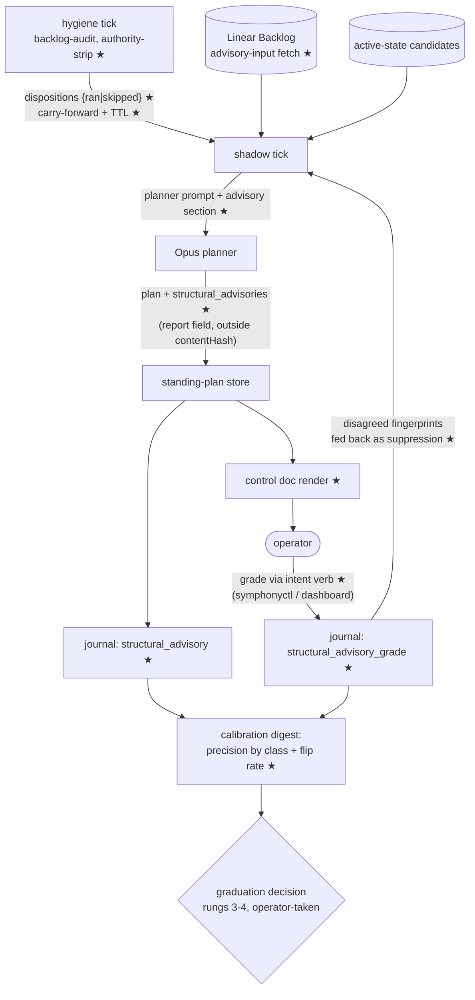
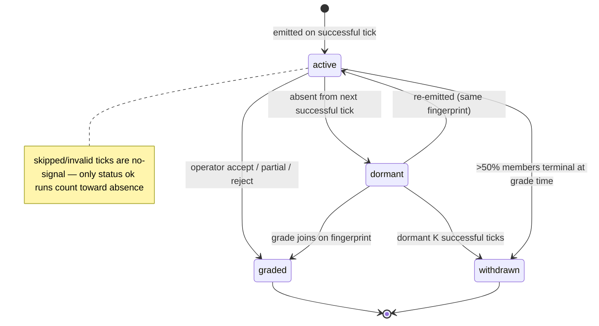
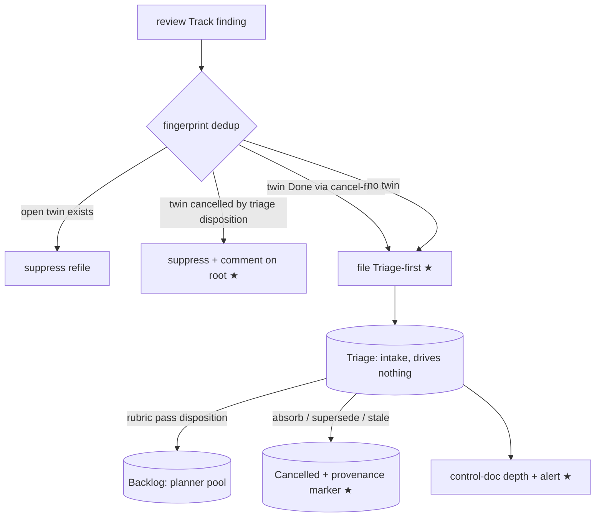

# Root-Cause-Aware Backlog Manager - Plan

## Goal Capsule

- **Objective:** Evolve the Queue Triage v2 backlog Manager from a pure scheduler into a measured, root-cause-aware triage system: fix the plumbing that keeps cull/supersession signal from the planner, give the planner a report-only structural-advisory voice, build the measurement spine (offline clustering benchmark + graded live advisories) that produces the precision evidence trust requires, and realign review-finding intake with the triage rubric's state contract.
- **Authority hierarchy:** This plan > repo conventions (`CLAUDE.md`) > implementer preference. The SYMPH-950 validation boundary (`src/domain/plan-batch.ts`) and SYMPH-966 cull invariants (`buildConservativeCullApplicationPlan`) are standing contracts this plan extends, never weakens.
- **Stop conditions:** Stop and surface if (a) a change would add a Linear mutation not enumerated in U8/U9, (b) a change would require modifying `PlanBatchSchema` (the advisory field is revision-level by design), or (c) the SYMPH-983 exclusion tests cannot be updated without weakening dispatch-facing exclusion.
- **Execution profile:** Report-only-first throughout. Nothing in this plan grants the planner or audit lane mutation authority beyond what SYMPH-966 already gates on operator agreement.

---

## Product Contract

### Summary

Give Symphony's backlog Manager the ability to say "these N tickets are symptoms of one root; this structural fix would supersede them" — as a report-only advisory, measured against a frozen golden set and a live operator-graded precision series — and stop review-generated symptom tickets from entering the planner pool ungated. Authority to act on advisories ramps only on observed precision, with the top rungs designed but deliberately not armed here.

### Problem Frame

The pipeline is a band-aid factory by omission, not by any single bug. Review Track findings file straight into Backlog with exact-fingerprint dedup only; the intake-triage rubric mandates root-cause clustering but is unenforced prose (the one logged pass: 50 keep, 1 absorb, 0 supersede-by-root-fix); the planner prompt contains no root-cause language and its output schema cannot express "supersede these"; the only code path that can mark a ticket `symptomatic_of_root` is stripped before the planner sees it (SYMPH-989) and skipped ticks erase even the surviving dispositions (SYMPH-1005). Meanwhile the calibration digest measures runtime triage precision but nothing measures clustering or disposition quality — so there is no evidence on which trust in autonomous triage could be built. SYMPH-948 deferred the "altitude root" pending model capability and SYMPH-968 defined the re-test bar, but that re-test artifact was deleted in the 2026-07-09 dead-code cull (PR #739) because it never had an invocation surface.

### Requirements

**Root-cause signal reaches the planner**

- R1. The planner emits optional, report-only `structural_advisories`: each names member issue identifiers, a root-cause hypothesis, the structural fix that would supersede the members, and a confidence note.
- R2. Hygiene-audit cull/supersession signal reaches the planner as advisory annotations (classification + root issue preserved; mutation authority still withheld) instead of being stripped (SYMPH-989).
- R3. A skipped or failed hygiene tick is never interpreted as a clean audit: dispositions carry forward from the last successful tick with bounded age, and a skip is a distinct status from "ran and found nothing" (SYMPH-1005).

**Measurement**

- R4. The SYMPH-968 altitude-reliability re-test is restored, runnable per-model through a real invocation surface, and its results land in a durable ledger — so the "capability arrived" bar that reopens SYMPH-948's deferral is actually checkable.
- R5. A clustering golden-set benchmark scores cluster recovery (pairwise precision/recall) and root-identification accuracy separately, against frozen versioned fixtures reconstructed as-of a snapshot cutoff, with the 2026-07-09 T0 pass as the negative control and N≥3 repeats per configuration.
- R6. The calibration digest reports a live advisory precision series: accepted/rejected/undecided by advisory class, plus a per-fingerprint flip-rate (oscillation) metric.

**Operator loop**

- R7. An authenticated operator surface records advisory grades — accept, partial accept (member subset), reject with reason — journaled and joined in the digest.
- R8. A rejected advisory fingerprint is suppressed from re-proposal unless its membership or evidence changes.
- R9. Hygiene proposal decisions become recordable in production through the same surface (today `recordBacklogHygieneProposalDecision` has no production caller).

**Intake**

- R10. Track findings file Triage-first (Backlog fallback for teams without a Triage state), matching the rubric's state contract.
- R11. Refiling a fingerprint whose prior issue was cancelled by a triage disposition (absorb/supersede/stale) is suppressed in favor of a comment on the surviving root — only while that root is non-terminal. Once the root is Done, a recurring fingerprint refiles fresh (regression signal), mirroring the `cancel-fixed`/Done-twin rule.
- R12. Triage queue depth and inflow are visible in the control doc, with an alert threshold on intake depth.

**Governance**

- R13. The authority ladder is documented with explicit arming criteria per rung; rungs 3 (auto-link `blockedBy`) and 4 (auto-create root + supersede) are designed here but not armed — arming thresholds are set from the full measured input set (precision-over-decided at a minimum decided count, flip rate, member-hallucination rate, and the capability re-test + clustering-benchmark scores as reviewed evidence), never guessed. Any future consumer that applies `cull_application` journal metadata to Linear is a de-facto rung-3 arming path and falls under these criteria.

### Scope Boundaries

- **Deferred to Follow-Up Work:** automating the recurring intake-triage rubric pass (owned by the SYMPH-1076 T0→T3 ramp; this plan supplies its measurement evidence and drain visibility, not the automated pass); arming ladder rungs 3–4; journaling advisories from the one-shot CLI (CLI renders them as preview only); comment-marker-based grading ergonomics — the intent verb lands first, but this item promotes back into scope if undecided-advisory age grows across 3 consecutive digests or the decided count stays below the R13 minimum (the precision denominator is the trust ramp's one human dependency, and the deferral needs an honest exit); a behavioral A/B prompt harness (SYMPH-940); replacing the always-pass `passingBacklogHygieneEvaluation` stub with a real evaluation feed (natural successor once U1 lands, tracked separately).
- **Outside this plan's identity:** why review agents generate so many defensive findings — Crucible-side filing behavior, owned by the MOB-604 ledger/relay workstream; god-file decomposition (SYMPH-947, deferred by design); granting the standing plan dispatch authority (shadow→active cutover, SYMPH-875).

---

## Planning Contract

### Key Technical Decisions

- **KTD-1 — Advisories are a revision-level report field, keyed on two hashes.** `structural_advisories` follows the `premises` optional-field pattern end-to-end and stays out of `computePlanContentHash` (report-refreshable, like `findings`), so advisory churn never rotates revisions or voids pending batch approvals. Identity is two-level: the **member-set hash** (sorted member identifiers only) keys rejection suppression and all lifecycle transitions (dormancy, flip, withdrawal) — LLM free text rewords naturally, and keying those on wording would let a rejected cluster evade suppression and let flip rate measure wording churn; the **advisory fingerprint** (member-set hash + normalized root-hypothesis slug: lowercase, punctuation stripped, whitespace collapsed, length-capped) is the grading and calibration-class axis. Journal records and grades join on these hashes, not `(revision, index)` — the only combination that survives both the revision-voiding rule and the calibration join. Never touches `PlanBatchSchema`.
- **KTD-2 — The shadow tick gains a Backlog advisory-input fetch.** The live shadow tick's candidate pool is the active-states set, not Backlog; only the CLI plans over Backlog. The band-aid pileup lives in Backlog, and a CLI-only advisory has no cadence, journal, or grading loop — so the shadow tick fetches Backlog issues as advisory-scan input (portfolio-held excluded), a deliberate carve-out from the count-only regression guard in `standing-plan-queue-health.ts`. Dispatch batching still draws only from the existing candidate pool.
- **KTD-3 — Grading rides the dashboard intent surface.** Advisory grades and hygiene proposal decisions travel through a new plan-control intent verb on the authenticated dashboard write surface (the path `symphonyctl` already uses), preserving auth and intent validation per the fragile-areas contract. One surface closes both dangling loops (R7 + R9). Grades bind to the advisory fingerprint and are exempt from the plan-revision comment-staleness gate (which correctly protects `release_batch`, not grading).
- **KTD-4 — The cull strip becomes an authority strip.** Hygiene mode preserves cull classification and `rootIssueIdentifier` as advisory metadata while continuing to withhold mutation authority. Kill-class dispositions switch from exclude-candidate to annotate-in-context for the advisory lane; exclusion is retained for anything dispatch-facing. The SYMPH-983 exclusion tests are updated deliberately, not weakened.
- **KTD-5 — Measure before authority.** Rungs 1–2 (advisory, operator-accept) are built here; rungs 3–4 are specified with arming criteria only. Rung 3's mutation mechanics already exist (`buildConservativeCullApplicationPlan` — agreed `symptomatic_of_root` → `blockedBy` link; agreed kill + stable marker → cancel); arming is a config decision taken after the precision series exists.
- **KTD-6 — Restore, don't rebuild, the re-test harness — and wire it.** `altitude-reliability.ts` is recovered from git (`git show a312d9c5:src/audit/altitude-reliability.ts`) and given the invocation + ledger surface whose absence got it culled. The clustering benchmark reuses the same runner shape and pins the production advisory prompt/context-assembly path so scores transfer.
- **KTD-7 — Intake flips Triage-first with provenance-gated refile suppression.** The state-preference flip is a one-line reorder mirroring the watchdog filer; the load-bearing change is dedup honoring triage dispositions across the Cancelled boundary (R11), gated on cancellation provenance so regression refiles stay alive. The provenance marker is a stable machine-readable comment posted at cancellation time — `<!-- triage-disposition:<disposition>:<fingerprint> -->`, mirroring the `stableCullMarker` precedent — plus a `supersededBy` relation to the root when one exists; suppression checks both.
- **KTD-8 — Golden set frozen as versioned fixtures with as-of-cutoff reconstruction and a re-adjudicated negative control.** Fixtures carry schema version, snapshot cutoff, and source-doc commit hash; the harness strips comments/relations/labels postdating the cutoff (the answer key's provenance lives on the issues themselves — disposition comments, `supersededBy` relations — and would otherwise leak into context). Primary metric: pairwise precision/recall over co-clustered pairs; secondary: root-identification accuracy. The crucible strategy-doc cluster set is the positive-rich key. The 50-keep/1-absorb T0 pass is the negative control **after re-adjudication**: the Problem Frame cites that same outcome as evidence the rubric went unenforced, and several T0 tickets entered already root-traced — so before freezing, known root relations are marked either as valid clusters in the key or as exclusions from the negative set, with the adjudication and rationale recorded in fixture provenance. Without this, the false-cluster metric penalizes a model for recovering real clusters the pass never attempted.

### High-Level Technical Design

The advisory loop, end to end (new components marked ★):

Advisory lifecycle per fingerprint:

Intake flow after realignment:

Authority ladder (rungs 1–2 built here; 3–4 design-only):

| Rung | Action | Authority | Status |
|---|---|---|---|
| 1 | Advisory rendered in plan output, control doc, journal | none (report-only) | built (U4/U6) |
| 2 | Operator accept / partial / reject via intent verb; decisions journaled; rejects suppress re-proposal | operator per-advisory | built (U8) |
| 3 | Accepted `symptomatic_of_root` → auto `blockedBy` link to root | armed by config after review of the full evidence set: precision-over-decided ≥ threshold at min decided count, low flip rate, low member-hallucination rate, and passing capability re-test + clustering-benchmark runs | design-only (mechanics exist in `buildConservativeCullApplicationPlan`) |
| 4 | Auto-create root ticket (after mandatory duplicate search per rubric) + supersede symptom members | armed last; thresholds from observed T1 data | design-only |

### Sources & Research

- Session investigation (2026-07-10): planner/intake/Linear-state maps; flow analysis; seam research. Load-bearing verified facts: shadow-tick candidate pool is active-states not Backlog; SYMPH-950 boundary implemented (`src/domain/plan-batch.ts`); `recordBacklogHygieneProposalDecision` has no production caller; altitude-reliability deleted in PR #739 (`c97ca671`), last good at `a312d9c5`; hygiene runtime tick passes no mode so `stripCullFindings` always fires; heartbeat-skip returns bare `[]` at `runtime-host.ts:6650-6655` while the SYMPH-983 guard covers only in-flight.
- `docs/intake-triage-rubric.md` — disposition vocabulary and state contract this plan operationalizes.
- `docs/plans/2026-07-09-operational-readiness-audit.md` §C.5 — the T0–T3 ramp and the "planner literally cannot propose kills" finding (SYMPH-989).
- `docs/design-briefs/2026-06-28-symph-946-planner-output-validation-boundary.md` — the boundary contract U4 must respect.
- `docs/plans/2026-06-28-backlog-intelligence-plan.md` — sibling plan (decision-rot/context density); not superseded by this plan.
- Golden-set answer key: crucible triage root-cause strategy doc (merged crucible PR #409, commit `843e996f`), cluster primaries 981/801/790/810/1040/1004/714/1041; negative control `docs/plans/2026-07-09-intake-triage-pass.md`.
- Linear: SYMPH-948/966/967/968 (Done — the reshape this plan reopens on evidence), SYMPH-989/1005 (open bugs fixed here), SYMPH-1076 (intake ramp, sibling), SYMPH-884 (workstream umbrella).

---

## Implementation Units

Phase A: measure first — U1 lands immediately; U5 completes the phase but is gated on U1 (owns the CLI it extends) and on U4's prompt/schema module landing, so it cannot start before U4. Phase B: plumbing (U2, U3). Phase C: advisory channel (U4, U6, U7, U8). Phase D: intake (U9, independent — can land any time).

### U1. Restore and wire the altitude-reliability re-test

- **Goal:** The SYMPH-968 capability detector runs again, per-model, with results in a durable ledger — the "capability arrived" check that sizes how aggressive the rest of this plan's ramp can be.
- **Requirements:** R4
- **Dependencies:** none (first unit)
- **Files:** `src/audit/altitude-reliability.ts` (restore from `a312d9c5`), `tests/audit/altitude-reliability.test.ts` (restore), new `src/cli/capability-retest.ts` + `package.json#bin` entry, `tests/cli/capability-retest.test.ts`, `docs/operations/` entry per template.
- **Approach:** Restore the module and corpus verbatim (SYMPH-941/944/958=kill, 956=keep, 957=reframe; bar minAccuracy 0.9, minKillPrecision 1, maxFalseKills 0). Add the missing invocation surface: a small CLI that accepts a model alias, drives `runVerdict` through the crabrunner path the planner uses, writes the `altitude_reliability_retest` ledger entry to the run journal, and prints `capabilityArrived`. The absent invocation surface is why PR #739 culled it — wiring is the unit's point, not an afterthought.
- **Patterns to follow:** `src/cli/manager-plan.ts` for CLI arg/exit-code conventions; `renderUsage()` + `pnpm docs:sync` for the operations doc's autogen block.
- **Test scenarios:** corpus scoring — a runVerdict stub returning the answer key yields `capabilityArrived: true`; one false kill (956→kill) fails the bar; a do-nothing model (all keep) scores kill-precision 0 and fails; ledger entry carries model + per-case verdicts; CLI exits non-zero when the bar fails and 1 on usage error.
- **Verification:** CLI run against a stubbed verdict function produces a scored ledger entry; restored tests pass unmodified.

### U2. SYMPH-989 — authority-strip instead of cull-strip

- **Goal:** Kill/supersession signal reaches the planner as annotations; mutation authority remains withheld.
- **Requirements:** R2
- **Dependencies:** none
- **Files:** `src/audit/backlog-audit.ts` (`stripCullFindings` → authority strip), `src/orchestrator/standing-plan-shadow.ts` (`buildShadowPlannerAuditDispositions`, disposition index: kill-class annotate-vs-exclude split), `tests/audit/backlog-audit.test.ts`, `tests/orchestrator/standing-plan-shadow.test.ts`.
- **Approach:** In hygiene mode, preserve `cull.classification` and `cull.rootIssueIdentifier` while stripping anything that could authorize mutation (kill reasons stay; application authority does not — `buildConservativeCullApplicationPlan`'s operator-agree + stable-marker gates are untouched). In the disposition index, kill-class entries annotate the candidate in planner context rather than excluding it; stale/supersession/duplicate keep today's semantics. The dispatch-side invariant has a named enforcement point: batch-eligibility filtering (or the SYMPH-950 validation boundary in `src/domain/plan-batch.ts`) rejects kill-annotated identifiers from proposed batches, so an annotated-but-visible candidate can never be dispatched. Update the SYMPH-983 exclusion tests to assert the new split explicitly.
- **Test scenarios:** hygiene-mode finding retains classification + root id but cannot produce a cull application plan; a kill-classified issue appears in planner context with a kill annotation rather than disappearing; a kill-annotated candidate is never eligible for a dispatch batch (the planner proposing one is rejected at the enforcement point); dispatch-facing exclusion still holds for supersession-by-completed; one test asserts the production wiring (no `mode` passed ⇒ hygiene ⇒ annotations present) so the fixture state is reachable, not synthetic.
- **Verification:** `standing-plan-shadow` tests show a cull-annotated candidate visible to the planner; hygiene lane still emits `hygiene:proposed` labels only.

### U3. SYMPH-1005 — skipped hygiene ticks are not clean audits

- **Goal:** Dispositions survive heartbeat skips; a skip is typed, bounded, and visible.
- **Requirements:** R3
- **Dependencies:** none
- **Files:** `src/orchestrator/runtime-host.ts` (`runBacklogHygieneProposalTickIfConfigured` return type + cache), `tests/orchestrator/runtime-host.test.ts`.
- **Approach:** Return a discriminant — ran (with proposals) / skipped / unavailable — instead of bare `[]`. On skip, reuse the last successful tick's proposals (cached beside `backlogHygieneProposalLastRunAtMs`); expire carried dispositions at the next successful tick and bound carry-forward age at 3 hygiene heartbeats (configurable) with a `degraded` marker in the shadow log. "Ran and found nothing" and "skipped" must be distinguishable in the journal.
- **Test scenarios:** heartbeat-skip second poll carries prior tick's dispositions into the shadow tick (extend the SYMPH-983 ordering test); error-catch path returns unavailable, not clean; carried dispositions expire on the next successful run; carry beyond the age bound drops with a degraded log; unconfigured path unchanged.
- **Verification:** the SYMPH-1005 reproduction (skip → killed issue re-enters shadow planner) fails before, passes after.

### U4. `structural_advisories` output channel

- **Goal:** The planner can express root-cause clusters; the field round-trips schema → store → render without touching the batch contract.
- **Requirements:** R1
- **Dependencies:** none (Phase C entry; U5 consumes its prompt/schema module)
- **Files:** `src/agent/triage-planner.ts` (prompt section, `PLANNER_OUTPUT_SCHEMA`, `parsePlannerOutput`, `buildPlanBody` normalization), `src/orchestrator/standing-plan-supersession.ts` (`PlanBody`, `rotateRevision`), `src/domain/standing-plan.ts` (`PlanRevision` optional field + read-edge back-compat), `src/orchestrator/standing-plan-store.ts` (report-hash inclusion, content-hash exclusion), `src/orchestrator/standing-plan-shadow.ts` (round-trip spread), `src/orchestrator/standing-plan-doc-render.ts` (render section), `src/cli/manager-plan.ts` (preview render). Tests: the mirrored file in `tests/` for each.
- **Approach:** Mirror the `premises` optional-field pattern at every layer (the exact precedent for adding an optional back-compat planner output field). Prompt gains an advisory instruction section — essentially the rubric's step-5 clustering language: scan candidates for symptom clusters; name the suspected root and the structural fix; advisories are non-binding. Normalization: empty → `[]` (no fallback synthesis); trim/bound free text. Excluded from `computePlanContentHash`, included in `planReportHash` (refreshes in place, never rotates revisions). Render in the control doc mirroring `renderReviewFindings`; CLI renders as preview with an explicit not-journaled note. Advisory free text passes through `sanitizeForLinear` (`src/shared/egress.ts`, SYMPH-421 — neutralizes fences/links, redacts credential-shaped strings) plus single-line collapse and length bounds before any trusted render, the same contract the Track-finding filing path already uses.
- **Execution note:** land schema/prompt as one commit so U5's benchmark pins a stable prompt+schema module.
- **Test scenarios:** parse round-trip with and without the field (back-compat: old revisions load); advisory-only change refreshes report hash without rotating revision (pending decisions survive); doc render shows members, root hypothesis, structural fix; oversized/degenerate advisory text is bounded, and fence-, link-, and option-marker-shaped advisory text renders neutralized; CLI `--prompt-only` includes the advisory instruction; consumer no-op assertion (`assertProjectedPlanValid` untouched by the field).
- **Verification:** a shadow tick with a stubbed planner emitting advisories produces a control doc with the advisory section and no revision rotation on advisory-only churn.

### U5. Clustering golden-set benchmark

- **Goal:** A scored, repeatable answer to "can this model recover human-identified root-cause clusters?" — precision evidence, not vibes.
- **Requirements:** R5
- **Dependencies:** U1 (owns `src/cli/capability-retest.ts`, which this unit extends), U4 (pins the production advisory prompt + context-assembly path)
- **Files:** new `src/audit/clustering-benchmark.ts`, `tests/audit/clustering-benchmark.test.ts`, fixtures under `tests/fixtures/clustering-golden-set/` (positive key from the crucible strategy doc's cluster primaries; negative control from the 2026-07-09 T0 pass), CLI surface added to `src/cli/capability-retest.ts`.
- **Approach:** Frozen fixtures carry `schema_version`, snapshot cutoff timestamp, and source-doc commit hash — never regenerated from live Linear. The harness reconstructs issues as-of cutoff: strip comments/relations/labels postdating it, specifically disposition-shaped mutation comments (the answer key's provenance is on the issues themselves; unstripped, the benchmark grades context-leakage, not capability). Scoring: pairwise precision/recall over co-clustered pairs excluding singletons (primary), root-identification accuracy (secondary — exact or absorbed-equivalent match). Report false-cluster rate on the negative control separately from recall on the positive key. N≥3 repeats per model/config; report spread. Runs through the same context assembly + prompt as the production emitter (per-U4 module) so scores transfer; invocable via the U1 CLI so it cannot be culled as surfaceless dead code.
- **Test scenarios:** scorer unit tests — perfect key recovery scores 1.0/1.0; one merged cluster (two keys joined) drops pairwise precision, not recall; one split cluster drops recall, not precision; singleton-only prediction on the negative control scores zero false clusters; fixture loader rejects a fixture missing cutoff or schema version; as-of reconstruction drops a post-cutoff disposition comment.
- **Verification:** one full benchmark run against the current planner model recorded in the ledger with per-repeat scores and spread; results cited on the graduation-criteria section of the control doc or issue.

### U6. Advisory lifecycle semantics

- **Goal:** Advisories have stable identity, validated membership, explicit states, and bounded volume — the properties grading and calibration depend on.
- **Requirements:** R1, R6 (identity + flip inputs)
- **Dependencies:** U2 (conflict tags read disposition annotations), U4
- **Files:** `src/agent/triage-planner.ts` or new `src/agent/advisory-lifecycle.ts` (fingerprint, member validation, states), `src/orchestrator/standing-plan-shadow.ts` (advisory-input fetch, lifecycle threading), `src/orchestrator/standing-plan-queue-health.ts` (carve-out from count-only guard), `src/orchestrator/runtime-host.ts` (Backlog advisory-input wiring), `src/config/config-resolver.ts` (parse `structural_advisories` in `resolveQueueTriageConfig` — unparsed YAML keys are silently dropped), `src/config/types.ts` (`WorkflowQueueTriageConfig` field), `pipeline-config/workflows/WORKFLOW-symphony.md` (set the key `true`), plus mirrored tests including `tests/config/`.
- **Approach:** Two-level identity per KTD-1: the member-set hash (sorted member identifiers) keys suppression and lifecycle; the advisory fingerprint (member-set hash + normalized slug) keys grading and calibration class. Member validation against the presented candidate set: any unknown member drops the whole advisory (never member-by-member — silent member drops change cluster meaning pre-grade) and journals an invalid-member event with counts (hallucination rate is itself a graduation input). Named root identifiers are validated against Linear; unresolvable roots render as proposed-new-root free text, never as a link target. States per the lifecycle diagram; only `status: ok` ticks count toward absence; dormant K successful ticks → withdrawn (K default 3, configurable under `queue_triage`); >50% members terminal at grade time → auto-withdraw. Lifecycle transitions (dormancy, flip, withdrawal) are computed over the full emitted advisory set before the render cap — truncation affects rendering only, and truncated advisories are journaled as emitted, so cap pressure never pollutes the flip metric. Advisories referencing a disposition-flagged issue render with a conflict tag and journal the conflict (two model lanes disagreeing is signal). Cap rendered advisories per tick mirroring `maxProposalsPerProductPerPoll` (default 3), truncating with a journal note. KTD-2's Backlog advisory-input fetch lands here: shadow tick fetches Backlog issues (portfolio-held excluded) as advisory-scan input only; dispatch batching unchanged — and the advisory-input issues render inside the per-run SYMPH-904 untrusted-data fence through the same collapse/bound candidate renderer the existing candidates use, never in the trusted instruction region. Overlapping clusters (one member, two advisories) are allowed at emission; the prompt nudges toward partitions.
- **Test scenarios:** same members across ticks → same member-set hash even when the root-hypothesis wording drifts (suppression and lifecycle unaffected by rewording); member set change → new member-set hash; advisory with one hallucinated member is dropped whole and journaled; advisory count above cap truncates with note, and a truncated advisory does not transition to dormant; skipped tick does not advance dormancy; auto-withdraw at majority-terminal members; conflict tag renders when a member carries a kill annotation; Backlog fetch feeds advisory input but never batch candidates (assert the pool separation); the advisory-input section appears between the per-run fence markers and never in the trusted instruction region; queue-health counts unaffected by the carve-out.
- **Verification:** two consecutive stubbed ticks demonstrate stable fingerprints, dormancy, and re-activation in the journal.

### U7. Advisory journaling + calibration family

- **Goal:** Advisories and grades are joinable journal records; the digest reports the precision series trust is built on.
- **Requirements:** R6
- **Dependencies:** U6
- **Files:** `src/domain/model.ts` (`DISPATCHER_RUN_JOURNAL_EVENT_KINDS` + two kinds: `structural_advisory`, `structural_advisory_grade`), `src/orchestrator/standing-plan-shadow.ts` or `runtime-host.ts` (emit advisory records where the shadow tick records revisions), `src/calibration/digest.ts` (join on `metadata.advisory_id` = fingerprint; precision rows by advisory class; flip-rate metric), `src/calibration/journal-reader.ts` (kind allowlist picks up automatically — assert), plus `tests/calibration/digest.test.ts`, `tests/orchestrator/decision-event-emission.test.ts`.
- **Approach:** Mirror the hygiene family exactly (`hygiene_proposal`/`hygiene_proposal_decision` is the template, including the digest's "precision by finding type" join). The run journal is append-only with idempotency-key dedup, so `structural_advisory` records are emitted on first emission and on each lifecycle transition only (active↔dormant, withdrawn, graded) — never per unchanged re-emission — and `firstSeen`/`lastSeen` plus flip counts are derived at digest read time by grouping records per fingerprint (the standing-plan store's journal-projection pattern). This keeps 15-minute re-emission from flooding `undecided` while leaving the transition records the flip metric reads. Class axis for precision keying: cluster-size bucket + root-hypothesis kind (existing-root vs proposed-new-root). Flip count per fingerprint (active↔dormant transitions) reported alongside precision. Reserve an `advisory_outcome` kind now (accepted advisory's root fix merged / symptom reopened) so downstream ground-truth joins need no journal migration — the `PlanOutcome` reserve-before-need precedent.
- **Test scenarios:** digest tallies accept/reject/undecided by class (template: the hygiene precision test); re-emitted fingerprint does not create a second undecided row; flip-rate computed from lifecycle transitions; unknown kinds still rejected by the reader; grade without matching advisory lands in an orphan bucket, not a crash.
- **Verification:** `symphony-calibration-digest` over a synthetic journal renders the advisory precision section.

### U8. Operator grading surface

- **Goal:** Grades flow from operator to journal over an authenticated path; rejects suppress re-proposal; the dangling hygiene decision path gets its production caller.
- **Requirements:** R7, R8, R9
- **Dependencies:** U7
- **Files:** `src/orchestrator/intent.ts` (new verb in the plan-control vocabulary plus a fingerprint-scoped grade payload type — the existing `PlanControlIntentPayload` is revision-bound by design and the dashboard schema assumes a `batch` payload on plan-control verbs, so the grade verb needs its own payload branch), `src/observability/` dashboard-server (validate, authenticate, route), `src/orchestrator/runtime-host.ts` (intent → `recordBacklogHygieneProposalDecision` / new advisory grade recorder; disagreed-fingerprint feed into planner context beside `auditDispositions`), `symphonyctl` command surface (grade-advisory accept|reject|partial), plus mirrored tests including the dashboard-server intent tests.
- **Approach:** One intent verb family covers advisory grades and hygiene proposal decisions (R9 is wiring the existing test-only API to this verb, not new semantics). Partial accept carries `acceptedIdentifiers ⊆ members`; calibration counts it as accept-with-member-delta and the delta feeds planner context as evidence. Decision idempotency: key per (fingerprint, actor); first decision immutable — pick this over last-write-wins and test it (the hygiene key includes the decision value, which makes reversal ambiguous; don't replicate that). At grade time re-validate members against live state, record `membersAtGrade` + drops. Rejected member-set hashes feed the planner context as suppression ("previously rejected — do not re-propose absent new members/evidence"); membership change mints a new member-set hash, scoping suppression to the exact rejected cluster. The evidence half of R8 has a mechanism: the rejection record snapshots member activity (latest comment/state timestamps) at grade time, and post-rejection activity on member issues lifts the render-time suppression, re-emitting the advisory tagged as previously-rejected-with-new-evidence. Grades carry `formatIntentAttribution`; no new unauthenticated write path (fragile-areas contract).
- **Test scenarios:** unauthenticated intent rejected; malformed grade rejected with typed error; accept/partial/reject each journal correctly (partial records the subset + delta); second decision by same actor on same fingerprint is a no-op with surfaced conflict; rejected fingerprint absent from next tick's advisory section while a changed-membership variant is allowed; hygiene decision via the verb produces the digest's accepted/rejected tally (closing the permanently-undecided gap).
- **Verification:** end-to-end: stub tick emits advisory → `symphonyctl` grades it → digest shows the decided row; hygiene proposal graded the same way.

### U9. Intake realignment

- **Goal:** Review findings enter through Triage per the rubric; triage dispositions survive the refile loop; the new queue is visible.
- **Requirements:** R10, R11, R12
- **Dependencies:** none (independent; sequence anywhere after U1)
- **Files:** `src/tracker/linear-client.ts` (`createTrackFindingIssue`: state preference reorder + doc comment; dedup terminal-state handling), `src/tracker/linear-queries.ts` (extend the title-marker search query or add a terminal-twin provenance query — the current marker-search selection returns no comments or relations, so the provenance check cannot be built without it), `src/orchestrator/standing-plan-doc-render.ts` + `src/orchestrator/runtime-host.ts` (control-doc intake section: triage depth/inflow + alert threshold on `triageIntake.depth`), `tests/tracker/linear-client.test.ts`, `tests/orchestrator/track-finding-filing.test.ts`, `tests/orchestrator/standing-plan-doc-render.test.ts`.
- **Approach:** Flip the preference array to `["Triage", "Backlog"]` (the watchdog filer at `linear-client.ts:1225` is the in-file mirror); update the doc comment and the test asserting Backlog-first. Refile suppression: on dedup-hit-terminal, check cancellation provenance — a triage-disposition marker (`<!-- triage-disposition:… -->` per KTD-7) or `supersededBy` root link suppresses the refile while the surviving root is non-terminal; once the root is Done, the fingerprint refiles fresh (regression signal), and a `cancel-fixed`/Done twin always refiles fresh. The root comment posts only on the first suppression of a given fingerprint per surviving root (detected via a fingerprint-marked comment before posting); subsequent suppressed refiles journal without commenting, and the comment body is a fixed template (fingerprint, refiling source, link to the suppressed twin) whose dynamic fields pass through `sanitizeForLinear`. Neither Backlog nor Triage is dispatchable (base template `active_states` = Todo/In Progress/In Review/Resume), so the flip is dispatch-inert — assert this in a test since `active_states` has burned three times. Control doc gains an intake line (depth, inflow, threshold breach) — `triageIntake.depth` is already computed. Note in the PR description: the triage drain is the operator-led rubric pass (SYMPH-1076 T0, weekly or per-N intake); this unit makes the pile visible and alertable, it does not automate the drain.
- **Test scenarios:** new finding lands in Triage when the team has one, Backlog otherwise; open-twin dedup unchanged; cancelled-by-disposition twin with an open root suppresses refile and comments the root; a second suppressed refile of the same fingerprint posts no second comment; cancelled-by-disposition twin whose root is Done refiles fresh; Done-via-cancel-fixed twin refiles; dispatch candidate fetch never returns Triage/Backlog issues (the inertness assertion); control doc renders depth + alert state; threshold breach journals.
- **Verification:** filing-path integration test demonstrates the three dedup regimes; control doc snapshot shows the intake section.

---

## Verification Contract

| Gate | Command | Applies to |
|---|---|---|
| Full suite (baseline 4,372 pass / 5 skip) | `pnpm test` | every unit |
| Build | `pnpm build` | every unit |
| Types | `pnpm typecheck` | every unit |
| Lint | `pnpm lint` | every unit |
| Docs autogen sync (CLI help blocks) | `pnpm docs:sync` + the vitest drift gate | U1 (new CLI), U5 |
| Benchmark evidence | one scored ledger run, N≥3 repeats with spread | U1, U5 |
| Flag-arming proof | the exact keys that arm each new path are named and set (see below) | U4, U6, U8 |

**Arming keys (production-inert-wiring trap):** advisory emission + Backlog advisory-input fetch arm via a new `queue_triage.structural_advisories` key in `pipeline-config/workflows/WORKFLOW-symphony.md`. The key's parsing ships with U6 (code without the key is not deployed capability), but it is set `true` only after the Phase-A gate: U1 records `capabilityArrived: true` and U5 records a benchmark run at or above the floor documented in the graduation criteria. A failing run lands the code dark and returns an explicit ship/hold decision to the operator — "measure first" is a written decision rule, not an implied one. the hygiene lane remains gated by `SYMPHONY_QUEUE_AUDIT_BASE_URL` + `SYMPHONY_QUEUE_AUDIT_MODEL` (unchanged); the grading verb ships enabled on the authenticated dashboard surface (auth is the gate, not a flag). The deploy checklist in `docs/operations/05-deploy.md` applies — the pipeline runs from `dist/`.

---

## Definition of Done

- All nine units landed with their test scenarios green; full verify gates pass at each landing.
- SYMPH-989 and SYMPH-1005 reproductions demonstrably fixed (U2/U3 verification cases).
- A live shadow tick on production config renders at least one advisory section in the control doc (or an explicit empty state), with journal records present.
- One graded advisory round-trips to the calibration digest; one hygiene proposal decision recorded in production (the first ever).
- Capability re-test + clustering benchmark each have at least one recorded scored run against the current planner model; scores and spread cited wherever the graduation criteria are documented, and the `structural_advisories` arming decision consumed them per the Verification Contract's Phase-A gate.
- Rungs 3–4 remain unarmed; their arming criteria are written down with the measured quantities they await.
- New/changed docs indexed per `docs/README.md` conventions; the operations doc for the re-test CLI exists with a synced usage block.
- No abandoned experimental code in the final diffs; deleted precedents (altitude-reliability) restored only with their invocation surfaces.

---

## Risks & Dependencies

- **Prompt growth and token cost (KTD-2).** The Backlog advisory-input fetch enlarges the planner prompt. Ship report-only, measure per-tick token deltas from the existing usage ledgers before considering any cap — no guessed limits.
- **Advisory noise / oscillation.** Mitigated by the per-tick cap, dormancy states, flip-rate metric, and rejection suppression; a high flip rate blocks graduation regardless of precision.
- **Benchmark leakage.** The strategy doc is merged and potentially in-context or in-training; as-of-cutoff reconstruction removes on-issue provenance, and the fixture records the doc's merge date — treat pre-merge-snapshot benchmarks as the only clean ones going forward.
- **Operator grading burden.** Undecided share is tracked in the digest; if grading stalls, precision has no denominator — surface undecided age in the digest rather than nagging.
- **Two model lanes can disagree** (hygiene dispositions vs planner advisories). Rendered as conflict tags and journaled; precedence for anything dispatch-facing stays with hygiene dispositions.
- **Dependency:** grading rides the dashboard write surface — preserve authentication, intent validation, and runtime-host routing (`symphonyctl` and `release_batch` share it).
