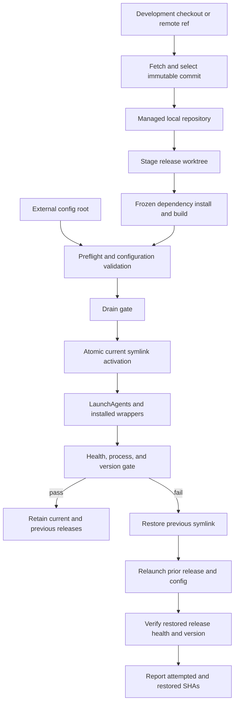
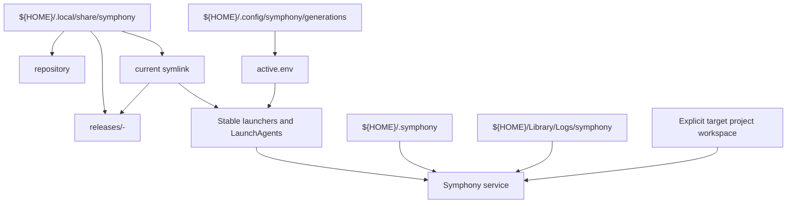

# Install Symphony into a managed local runtime

## Goal Capsule

- **Objective:** Run Symphony and its supported companion jobs from a Git-backed installation under `${HOME}/.local/share/symphony`, with no production dependency on a development checkout.
- **Authority:** `SPEC.mobilyze.md` and the canonical orchestration-spine design govern runtime behavior; this plan governs deployment layout and operations; `SPEC.upstream.md` remains the compatibility baseline.
- **Execution profile:** Replace both existing production-root models with one staged-release model, migrate configuration and launchd jobs, cut over during a drained window, and prove rollback and restart behavior.
- **Stop conditions:** Do not activate a release unless its source SHA, build stamp, configuration, workflow, dependencies, owner host, and service health can be proven. Restore the prior release automatically when activation or post-start verification fails.
- **Tail ownership:** The implementation owns scripts, launchd generation, wrappers, tests, migration, rollback, and active operations documentation. It does not relocate target product repositories or broadly redesign Symphony policy configuration.

---

## Product Contract

### Summary

Symphony currently conflates its development checkout, build root, service working directory, configuration source, maintenance checkout, and installed command surface. The live `com.symphony.symphony` LaunchAgent points its binary, workflow, and working directory into the project checkout; `com.symphony.fence-sync` carries the same root; the installed manager-plan command is a symlink into the repository. The two documented deployment flows then preserve competing root models: routine deployment mutates the development checkout in place, while the deploy train uses a disposable Codex worktree.

The new deployment contract uses a private Git repository and immutable release worktrees under `${HOME}/.local/share/symphony`, an atomic `current` symlink, external configuration and mutable state, stable commands under `${HOME}/.local/bin`, and LaunchAgents generated from the active installed release. The development checkout remains a place to author and initiate releases, but it is not read or mutated by a running service.

### Problem Frame

The current arrangement makes ordinary development actions production-sensitive: switching branches, leaving tracked changes, deleting `dist/`, changing `.env`, or moving the checkout can affect the running service. It also makes deployment safety inconsistent. `ops/deploy-train.sh` has drain, moving-main, and live-version gates, while the canonical `ops/symphony-deploy` path does not. Root inference through script location and `process.cwd()` further risks changing target-repository behavior when the service working directory moves.

This is a root-model migration, not a path substitution. A correct change must separate source, release, configuration, state, target workspace, and logs; preserve Git-backed version evidence; retain single-host ownership; and migrate every installed process or wrapper that reaches into the project directory.

### Requirements

#### Installed release layout

- R1. Production code runs only from a managed installation rooted at `${HOME}/.local/share/symphony`.
- R2. Each release is an immutable Git worktree or equivalent complete checkout identified by its full source commit and a unique build generation, with compiled output, frozen-lockfile dependencies, and `dist/.build-sha` produced before activation. A same-commit rebuild creates a new generation rather than mutating an existing release.
- R3. `${HOME}/.local/share/symphony/current` changes atomically between validated releases and identifies the exact release used by LaunchAgents and installed commands.
- R4. The installation retains a last-known-good release and its compatible configuration generation, and supports automatic and explicit rollback without fetching or rebuilding during the rollback window.
- R5. Normal service activity does not dirty an installed release.

#### Root and context separation

- R6. Deployment distinguishes the development/source checkout, installed repository, staged release, active release, target project workspace, configuration root, state root, and log root.
- R7. Service lifecycle commands operate on the active installed release; repository-maintenance commands require an explicit development/source root and never prune or mutate release worktrees.
- R8. Target-project selection continues to come from workflow and explicit target-repository settings, not from the installed service working directory.
- R9. Installed commands work from arbitrary current directories and report the resolved active release and source SHA where relevant.

#### Configuration, state, and provenance

- R10. Durable service environment is generated outside releases under `${HOME}/.config/symphony`; secrets are never copied into a release, plist, deployment manifest, or retained verification output.
- R11. Mutable service state remains under the established `${HOME}/.symphony` surfaces; target-workspace `.symphony` artifacts remain owned by those target workspaces. Relocating service state is outside this migration.
- R12. Startup and status version evidence is derived from the active release, not an ambient Git checkout. The active release commit, `dist/.build-sha`, expected deploy commit, runtime-content digests, and reported `symphony_version` must agree.
- R13. Every release records non-secret provenance sufficient to audit and reproduce activation: source commit, credential-free canonical remote identity, lockfile digest, Node and pnpm versions, build timestamp, runtime-content digests, configuration schema/generation, and prior release.

#### Deployment and rollback

- R14. One canonical deploy path performs fetch, stage, frozen install, build, preflight, drain, atomic activation, restart, health/version verification, and cleanup.
- R15. A build or preflight failure leaves the old service and active symlink untouched.
- R16. An activation or post-start failure restores the prior release and compatible configuration generation, restarts it, and runs the same health/version gate before reporting failure. A failed rollback gate stops after one restoration attempt, leaves `current` on the prior release, preserves both diagnostic sets, and reports an explicit manual-recovery command.
- R17. Deployment fails closed if `origin/main` moves after the expected commit is selected, unless an operator explicitly selected an immutable commit.
- R18. The existing three-consecutive-check drain contract, owner-host guard, and single-orchestrator invariant remain enforced.

#### Installed processes and commands

- R19. The main orchestrator, fence-sync, Slack bridge when installed, token report job, manager-plan command, and supported package CLIs resolve installed code and external configuration without a project-checkout dependency.
- R20. Report serving remains on its already-independent report directory; migration verifies it but does not relocate it.
- R21. Installed LaunchAgents, scheduled jobs, and `${HOME}/.local/bin` entries contain no Symphony development-root reference after cutover. Target product paths in channel/project mappings are not mistaken for runtime coupling.
- R22. Install and uninstall are idempotent. Uninstall removes managed code, wrappers, and jobs while preserving configuration, state, reports, and logs by default.

#### Documentation and compatibility

- R23. Active documentation presents the installed runtime as the sole production model and distinguishes development, deploy, control, rollback, and repository-maintenance commands.
- R24. Fork behavior remains consistent with `SPEC.mobilyze.md`; unchanged upstream behavior remains consistent with `SPEC.upstream.md`.
- R25. The migration coordinates with SYMPH-1074: this work externalizes path-bearing service environment and secrets, while broad council/crabrunner/policy configuration externalization retains its separately designed compatibility window.

### Acceptance Examples

- AE1. Given a healthy installed release and a dirty or renamed development checkout, when launchd restarts Symphony, then the service starts at the installed SHA and polls normally without reading the development checkout.
- AE2. Given a new commit whose build fails, when deployment runs, then `current`, the loaded plist, and the running process remain on the prior healthy release.
- AE3. Given a staged release that starts but fails its health or version gate, when activation completes, then deployment switches back to the prior release, restarts it, verifies it, and exits unsuccessfully with both attempted and restored SHAs.
- AE4. Given a successful cutover, when all user LaunchAgents, the user crontab, and installed wrappers are inspected, then no Symphony runtime path points into a development checkout.
- AE5. Given an agent invokes manager-plan, backlog audit, `symphonyctl`, or status from an unrelated directory, then each command uses the installed code while preserving the explicitly selected target project.
- AE6. Given a release is active, when its Git HEAD, build stamp, deployment manifest, runtime-content digests, configuration generation, status API, and startup log are compared, then they identify the same artifact.
- AE7. Given mutable runtime activity and a later upgrade, when the active release is inspected, then it remains Git-clean and state, reports, journals, and logs survive the release switch.

### Success Criteria

- The main service and every installed companion surface remain healthy after the development checkout is temporarily renamed for a controlled proof.
- A static host census finds no unintended `projects/symphony-ts` reference in LaunchAgents, cron, installed wrappers, or process command lines.
- Upgrade, failed-upgrade rollback, manual rollback, logout/login launchd bootstrap, and arbitrary-directory CLI scenarios pass.
- The development checkout is unchanged by deploy and runtime operations.

### Scope Boundaries

- Broad policy/config restructuring described by SYMPH-1074 is not duplicated here; only the configuration boundary required to remove runtime dependence on the checkout is included.
- Product repositories named by workflow configuration or channel mappings remain in their existing locations.
- Existing macOS log and report locations remain unless a concrete collision prevents clean release isolation.
- This plan does not containerize Symphony, publish an npm release, or introduce a system-wide daemon.

### Sources

- `ops/symphony-deploy`, `ops/deploy-train.sh`, and `ops/symphony-ctl` define the current competing root and safety models.
- `docs/operations/05-deploy.md` documents the current root-resolution contract and its known drain/version gap.
- `docs/plans/2026-07-09-operational-readiness-audit.md` identifies SYMPH-888, SYMPH-1074, environment drift, and the incorrect Slack bridge template.
- `handoffs/2026-06-11-symphony-incident-isolation-handoff.md` records owner-host, single-instance, logged-verification, and deploy-is-not-merge constraints.

---

## Planning Contract

### Key Technical Decisions

- KTD1. **Use immutable Git-backed build generations with atomic activation.** Keep a private repository under `${HOME}/.local/share/symphony/repository` and materialize releases under `releases/<full-sha>-<build-id>`. Point `current` at a validated generation. This preserves Git-derived provenance, allows safe same-commit rebuilds, and prevents failed builds or partial updates from corrupting the active runtime.
- KTD2. **Replace both current deployment models.** Fold deploy-train safety into the canonical deploy command and retire the in-place project-root and `.codex/worktrees` production models. Compatibility aliases may forward to the canonical command for one transition, but they may not retain separate behavior.
- KTD3. **Make root roles explicit.** Use separately resolved source, install, active release, config, state, log, and target-workspace roots. Do not reuse `SYMPHONY_ROOT` as both a service root and a development repository maintenance root.
- KTD4. **Keep the active release Git-clean.** Direct service-owned mutable output to external state. Preserve target-workspace-relative `.symphony` behavior only where it is intentionally scoped to a target repository.
- KTD5. **Externalize and version effective service configuration.** Treat the tracked encrypted environment as release input where applicable, generate an owner-only configuration generation under `${HOME}/.config/symphony/generations`, validate it before activation, and atomically switch a stable `active.env` link with the release. Generated plists contain no secrets; they invoke a stable launcher that loads the permission-restricted active environment immediately before `exec`. Retain the previous compatible configuration generation for rollback.
- KTD6. **Bind version and integrity evidence to the active artifact.** Resolve Git SHA with an explicit active-release working directory or embed the build SHA. Do not rely on the caller's ambient `cwd`. Require Git HEAD, build stamp, manifest, runtime report, and digests of the built runtime and installed dependency realization to agree.
- KTD7. **Install location-independent wrappers.** Generate stable `${HOME}/.local/bin` launchers for lifecycle and supported CLI commands. Wrappers resolve `current`, do not self-build, and expose enough status to let operators and agents confirm which release and target root they will mutate.
- KTD8. **Use the same gate for deploy and rollback.** Both paths validate owner host, process count, service health, logs, API status, and expected SHA. Rollback is a first-class operation, not an emergency shell recipe.

### High-Level Technical Design

The structure below is directional. Exact helper names and manifest encoding remain implementation choices.

### Sequencing

1. Establish root/provenance contracts and characterize `cwd` behavior before changing deploy scripts.
2. Add installed layout, staging, and manifest support while the existing service remains untouched.
3. Externalize the service environment and mutable state paths required for clean releases.
4. Consolidate deployment and rollback, then migrate command wrappers and ancillary jobs.
5. Perform an explicit cutover with preserved old plist and release evidence.
6. Remove obsolete root models and rewrite active documentation only after cutover and reboot proof pass.

### Alternatives Considered

- **Versioned artifact directories without Git metadata:** This reduces worktree lifecycle complexity, but it requires replacing the current Git-derived version contract and auditing additional runtime Git assumptions. The chosen Git-backed release model keeps those semantics explicit while still isolating production from development. If U1 proves Git metadata is not required beyond version display, implementation may simplify the storage mechanism only while preserving immutable build generations, content digests, atomic activation, and rollback behavior.
- **One mutable installed checkout:** This is simpler than release generations but exposes the active runtime to partial builds and makes rollback depend on rebuilding. It does not meet the failure-isolation requirements.

### Risks and Mitigations

- **Ambient `cwd` changes behavior:** Characterize every service-reachable `process.cwd()` fallback and test target-workspace parity from arbitrary and installed directories.
- **Git worktree lifecycle dirties or invalidates releases:** Keep the managed repository and its release worktrees wholly inside the install root; prohibit general worktree-pruning commands from operating there; prune only inactive managed releases through deployment-owned logic.
- **Secrets leak into release artifacts:** Generate plaintext environment only in the config root with restrictive permissions and scan release/manifest output for known secret-bearing files and values.
- **Config generation is written unsafely:** Require an owner-controlled real config directory with mode `0700`; reject symlinks and unexpected ownership; write each environment generation as an owner-owned regular file with mode `0600` through a same-directory temporary file, restrictive umask, validation, and atomic rename; remove temporary plaintext on every exit path.
- **Provenance records credentials:** Canonicalize remote identity before manifest persistence and reject or redact URL userinfo and sensitive query parameters.
- **Installed link or wrapper is replaced:** Validate ownership, modes, regular-file type, and realpath containment of `current`, configuration links, and stable launchers before activation and start.
- **launchd keeps stale definitions:** Use bootout/bootstrap for root-contract changes, verify `launchctl print`, process command line, and effective working directory, and retain the prior plist until post-login proof.
- **Ancillary job is path-correct but semantically wrong:** Validate process identity and intended entrypoint, especially the existing Slack bridge template, rather than performing blind string replacement.
- **Self-triggered dashboard deploy mutates its own active release:** Make dashboard deploy invoke the stable installed deploy wrapper, which stages a different release and activates only after preflight.
- **Concurrent deploys race on `current`:** Serialize deploy and rollback under an install-root lock and include the selected expected commit in the lock-owned state.

---

## Implementation Units

### U1. Define installed-root and provenance contracts

- **Goal:** Introduce explicit root resolution and artifact identity without changing the live service root.
- **Requirements:** R1-R9, R12-R13.
- **Files:** `ops/symphony-ctl`, `ops/symphony-deploy`, `ops/deploy-train.sh`, `src/version.ts`, `src/cli/main.ts`, `src/config/workflow-loader.ts`, `src/orchestrator/runtime-host.ts`, `config/architecture/env-registry.json`.
- **Approach:** Define source/install/release/config/state/log/target roles; make version lookup active-release-aware; inventory service-reachable `cwd` fallbacks and replace only those that accidentally conflate runtime and target workspace. Split lifecycle commands from source-repository maintenance commands.
- **Test scenarios:**
  - Resolve the default installed root with no source checkout in the current directory.
  - Resolve an explicit source root for branch/worktree maintenance without changing the active service root.
  - Report the same target repository and planner grounding commit when launched from the installed release and an unrelated directory.
  - Reject maintenance operations when no explicit source root can be proven.
  - Report a version from the active release when ambient `cwd` is another Git repository.
- **Verification:** Extend `tests/ops/symphony-ctl-env.test.ts`, `tests/ops/symphony-ctl-worktrees.test.ts`, CLI tests, planner-grounding tests, and version tests.

### U2. Build and retain immutable installed releases

- **Goal:** Stage reproducible Git-backed releases under `${HOME}/.local/share/symphony` without touching the running service.
- **Requirements:** R1-R5, R12-R17.
- **Files:** `ops/symphony-deploy`, a focused helper under `ops/` if needed, `tests/ops/symphony-deploy-dist-staleness.test.ts`, `tests/ops/symphony-deploy-preflight.test.ts`.
- **Approach:** Initialize or refresh the managed repository, select an immutable commit, materialize a build-qualified release generation, install dependencies with the frozen lockfile, build, write the build stamp and credential-free non-secret manifest, compute runtime and dependency digests, validate cleanliness, and retain prior releases according to a bounded policy.
- **Test scenarios:**
  - Fresh install from an empty install root produces a release whose HEAD and build stamp equal the selected commit.
  - Same-SHA deploy stages a new build generation when compiled entrypoint, build stamp, or content digest is missing or stale, without modifying the active generation.
  - Build failure leaves `current` and the running service unchanged.
  - A moving `origin/main` aborts before activation; an explicitly selected immutable commit remains valid.
  - Manifest contains required provenance, canonicalizes credential-bearing remote URLs, and contains no plaintext environment or known secret values.
  - Pre-activation and rollback reject a runtime or dependency tree whose digest differs from its manifest.
  - Normal release cleanup preserves `current`, previous, and any release referenced by rollback state.
- **Verification:** Hermetic temporary-repository tests plus a dry-run output contract that names source, staged, current, previous, and expected commits.

### U3. Externalize service configuration and mutable state

- **Goal:** Ensure releases are immutable and secrets/configuration survive release replacement.
- **Requirements:** R5, R10-R11, R25.
- **Files:** `ops/symphony-deploy`, `ops/symphony-ctl`, `ops/slack-bridge-ctl`, `ops/fence-sync`, `src/orchestrator/runtime-host.ts`, `.env.example`, `config/architecture/env-registry.json`.
- **Approach:** Generate versioned service environments under `${HOME}/.config/symphony/generations`, atomically select `active.env`, preserve the encrypted-source workflow, and keep service-owned state under `${HOME}/.symphony`. Stable launchers load configuration before executing installed code; plists contain only non-secret launch metadata. Document and test the boundary between service state and target-workspace artifacts. Coordinate config key ownership with SYMPH-1074 rather than adding a competing policy format.
- **Test scenarios:**
  - Decrypt or refresh configuration without writing plaintext into a release.
  - Reject missing, unreadable, overly permissive, symlinked, incorrectly owned, or invalid service configuration before activation.
  - Failed decrypt or interrupted replacement leaves the prior environment generation active and removes temporary plaintext.
  - Reinstall a plist only when effective environment or root contract changes.
  - Collect closeout secret values from explicit config and target workspace without depending on release-local `.env`.
  - Exercise representative runtime activity and confirm the release remains Git-clean.
  - Upgrade while preserving journals, reports, state, and logs.
  - Rollback restores the configuration generation and release that were previously verified together.
- **Verification:** Extend deploy preflight and runtime-host tests; add a release-cleanliness integration test.

### U4. Consolidate deploy, activation, and rollback

- **Goal:** Replace routine and detached flows with one guarded release lifecycle.
- **Requirements:** R3-R4, R12-R18.
- **Files:** `ops/symphony-deploy`, `ops/deploy-train.sh`, `ops/symphony-ctl`, `tests/ops/deploy-train.test.ts`, `tests/ops/symphony-deploy-preflight.test.ts`.
- **Approach:** Port the drain, expected-SHA, moving-main, recovery, and live-version gates into the canonical deploy path; serialize deployment; activate the release and configuration generation as one recorded transaction; make rollback switch to the already-built release/configuration pair; retain a forwarding compatibility entry only if necessary for operator transition.
- **Test scenarios:**
  - Three consecutive drained samples permit activation; running or retrying lanes reset the count.
  - Failed preflight does not stop the service.
  - Successful activation restarts once and proves process count, owner host, health, logs, status API, exact SHA, runtime-content digests, and configuration generation.
  - Health, version, integrity, or configuration mismatch restores the previous release/configuration pair and proves the restored SHA.
  - Failure of the restored release gate does not recurse; it preserves both diagnostic sets, leaves the prior pair selected, and reports manual recovery.
  - Manual rollback uses no network and no build step.
  - Concurrent deployment attempts serialize or fail with clear lock ownership.
  - Dry-run changes no repository, symlink, plist, or process state.
- **Verification:** Consolidated deploy tests must preserve every existing deploy-train safety assertion and remove assertions that defend dual serve roots.

### U5. Install command surfaces and migrate companion jobs

- **Goal:** Make all supported production commands and jobs resolve the active installed release.
- **Requirements:** R19-R22.
- **Files:** `ops/symphony-ctl`, `ops/slack-bridge-ctl`, `ops/fence-sync`, `ops/token-report.sh`, `ops/token-report.mjs`, `scripts/symphony-manager-plan`, `src/observability/dashboard-server.ts`, `tests/observability/dashboard-deploy.test.ts`, `ops/com.symphony.example.plist`, `ops/com.slack-bridge.plist`, `ops/com.symphony.token-report.plist`, package CLI metadata if required.
- **Approach:** Install stable wrappers for deploy/control and supported CLIs; make the dashboard deploy resolver invoke the stable deploy wrapper; generate secret-free plists rather than shipping user-specific paths; correct companion entrypoints semantically; keep report-server's independent root; make install/uninstall idempotent and preserve user data by default.
- **Test scenarios:**
  - Every installed command runs from an unrelated directory after the development checkout is unavailable.
  - Manager-plan does not self-build or resolve its script through the development checkout.
  - Fence-sync invokes the active installed `symphonyctl` with explicit config.
  - Slack bridge plist points to the Slack server entrypoint and excludes unused configuration.
  - Token report job uses installed code and preserves `${HOME}/.symphony` data.
  - Uninstall removes managed wrappers/jobs/runtime while preserving configuration, state, reports, and logs.
- **Verification:** Extend `tests/ops/fence-sync.test.ts` and `tests/ops/token-report.test.ts`; add hermetic install-wrapper and generated-plist tests.

### U6. Cut over launchd and prove host independence

- **Goal:** Migrate the live host without losing rollback evidence or creating a second orchestrator.
- **Requirements:** R14-R22, AE1-AE7.
- **Files:** `ops/symphony-ctl`, `ops/symphony-deploy`, generated user LaunchAgents, and an operator migration checklist in `docs/operations/05-deploy.md`.
- **Approach:** Prebuild the installed release and external config; preserve the current plist and active SHA; install companion wrappers/jobs; confirm owner host and drain state; atomically replace the main plist; verify process identity and runtime; temporarily make the development checkout unavailable; then perform logout/login or equivalent bootstrap proof. Inspect other hosts for stale enabled orchestrators before declaring completion.
- **Test scenarios:**
  - Cutover never runs two orchestrators concurrently.
  - A forced migration failure restores the old plist/root and healthy process.
  - Successful cutover survives launchd restart and user-session bootstrap.
  - Renaming the development checkout does not affect main service, fence-sync, reports, or installed commands.
  - Static census distinguishes legitimate target-project paths from prohibited Symphony runtime paths.
- **Verification:** Capture a redacted `launchctl` definition and state summary, process command line/count, health/status responses, startup version, Git/build/manifest SHA and digest agreement, configuration generation, recent redacted logs, and a zero-hit prohibited-path census. Do not persist secret-bearing launchd environment output.

### U7. Rewrite active operations and development documentation

- **Goal:** Make the installed runtime the only documented production model.
- **Requirements:** R23-R25.
- **Files:** `README.md`, `docs/README.md`, `docs/DEV_GUIDE.md`, `docs/operations/02-symphony-manager-plan.md`, `docs/operations/04-symphony-worktree-reaper.md`, `docs/operations/05-deploy.md`, `docs/operations/06-cli-reference.md`, `.env.example`, reference plists under `ops/`.
- **Approach:** Separate development setup from production installation; replace the defended dual-root narrative; document layout, install, deploy, status, rollback, uninstall, config/state ownership, host census, and recovery. Keep source-repository maintenance instructions explicit and independent from service control.
- **Test scenarios:**
  - Documentation path examples contain no user-specific home or production development-root assumption.
  - Documented commands match generated help and installed wrapper names.
  - Active docs describe one production root model and preserve owner-host/drain/version requirements.
- **Verification:** Run docs synchronization/checks and a targeted stale-root text census across active docs and templates.

---

## Verification Contract

| Gate | Coverage | Done signal |
|---|---|---|
| Targeted ops tests | U1-U6 | Root, build, preflight, drain, activation, rollback, wrapper, plist, fence, and token-report scenarios pass in temporary homes and repositories. |
| `pnpm typecheck` | U1, U3 | TypeScript changes compile without errors. |
| `pnpm lint` | All repo changes | Biome reports no new violations. |
| `pnpm test` | All units | Full Vitest suite passes, including skill-install pretest. |
| `pnpm docs:check` | U7 | Generated and active documentation are synchronized. |
| `pnpm architecture:check` | U1, U3 | Environment registry and architecture guards accept new root/config reads. |
| Fork contract review | All units | Changed behavior is consistent with `SPEC.mobilyze.md`; unchanged upstream behavior remains consistent with `SPEC.upstream.md`. |
| Installed-runtime smoke | U2-U6 | Fresh install, upgrade, failed activation rollback, failed restored-release gate, manual rollback, arbitrary-cwd CLIs, and reboot/bootstrap proof succeed. |
| Independence proof | U6 | Service remains healthy while the development checkout is unavailable and the prohibited-path census is empty. |

Use `scripts/symphony-run-logged.mjs` for noisy repository verification and inspect the persisted log, because prior operator-shell behavior has rewritten visible output and exit codes.

---

## Definition of Done

- The sole active Symphony orchestrator runs from `${HOME}/.local/share/symphony/current` at an artifact proven consistently by Git, build stamp, runtime-content digests, configuration generation, manifest, logs, and API status.
- The canonical deploy path stages immutable releases, preserves drain and moving-main gates, activates atomically, and automatically restores the last-known-good release on failed verification.
- Configuration, secrets, mutable state, reports, and logs live outside immutable releases with documented ownership and safe permissions.
- Main and companion LaunchAgents, cron entries, process commands, and installed wrappers have no unintended dependency on a Symphony development checkout.
- Installed commands work from arbitrary directories, preserve explicit target-project context, and expose active-release identity before mutations.
- The development checkout can be dirty, moved, or temporarily unavailable without affecting the running system or rollback.
- Install, upgrade, rollback, restart/bootstrap, and uninstall behaviors have automated coverage and live-host evidence.
- Active documentation describes one installed production model and no longer recommends running from the project directory or a Codex worktree.
- All abandoned compatibility experiments, stale dual-root branches, and superseded documentation introduced during implementation are removed from the final diff.
